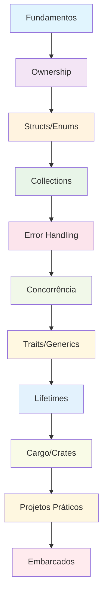

# 🦀 Curso Completo de Rust: Fundamentos, Avançado e Embarcados

**Professor:** Jackson Sá  
**Instituição:** Escola Técnica de Campinas - ETEC Bento Quirino  
**Baseado em:** "The Rust Programming Language" e materiais oficiais

---

## 🎯 Objetivo

Este repositório contém material completo de estudos para o desenvolvimento em Rust, estruturado de forma didática com exemplos práticos, diagramas e atividades. O curso abrange desde os fundamentos básicos até tópicos avançados, incluindo um módulo especial para desenvolvimento embarcado com Arduino, ESP32 e Raspberry Pi.

## 📚 Estrutura do Curso

### Módulo 1: [Fundamentos da Linguagem Rust](./modulo-01-fundamentos-rust/README.md)

- Instalação e configuração
- Sintaxe básica e variáveis
- Tipos de dados primitivos
- Funções e controle de fluxo
- **Atividade:** Calculadora básica

### Módulo 2: [Ownership e Borrowing](./modulo-02-ownership-borrowing/README.md)

- Sistema de ownership
- Referências e borrowing
- Slices
- **Atividade:** Gerenciador de strings

### Módulo 3: [Structs, Enums e Pattern Matching](./modulo-03-structs-enums/README.md)

- Definindo structs
- Enums e suas variantes
- Pattern matching com match
- **Atividade:** Sistema de biblioteca

### Módulo 4: [Collections e Iterators](./modulo-04-collections-iterators/README.md)

- Vector, HashMap, HashSet
- Iterators e closures
- Algoritmos funcionais
- **Atividade:** Sistema de gerenciamento de dados

### Módulo 5: [Error Handling e Result](./modulo-05-error-handling/README.md)

- Panic vs Result
- Propagação de erros
- Custom error types
- **Atividade:** Sistema de arquivos

### Módulo 6: [Concorrência e Threads](./modulo-06-concorrencia/README.md)

- Threads e channels
- Mutex e Arc
- Async/await
- **Atividade:** Servidor web simples

### Módulo 7: [Traits e Generics](./modulo-07-traits-generics/README.md)

- Definindo traits
- Implementação de traits
- Generics e lifetime bounds
- **Atividade:** Biblioteca de algoritmos

### Módulo 8: [Lifetimes e Advanced Types](./modulo-08-lifetimes-advanced/README.md)

- Lifetime annotations
- Advanced types (Box, Rc, RefCell)
- Smart pointers
- **Atividade:** Sistema de cache

### Módulo 9: [Cargo e Crates](./modulo-09-cargo-crates/README.md)

- Gerenciamento de dependências
- Criação de bibliotecas
- Testing e documentation
- **Atividade:** Biblioteca personalizada

### Módulo 10: [Projetos Práticos](./modulo-10-projetos-praticos/README.md)

- Projeto 1: Sistema de banco de dados simples
- Projeto 2: Cliente HTTP
- Projeto 3: Jogo da vida
- **Atividade:** Projeto final integrado

### Módulo Especial: [Rust para Embarcados](./modulo-embarcados/README.md)

- Arduino com Rust
- ESP32 e ESP8266
- Raspberry Pi
- **Atividade:** Sistema IoT completo

## 🛠️ Pré-requisitos

- Conhecimento básico de programação
- Rust (versão 1.70 ou superior)
- Cargo (gerenciador de pacotes)
- Editor de código (VS Code recomendado)
- Git

## 🚀 Como Começar

1. Clone este repositório
2. Instale o Rust: `curl --proto '=https' --tlsv1.2 -sSf https://sh.rustup.rs | sh`
3. Verifique a instalação: `rustc --version`
4. Siga os módulos em ordem sequencial

## 🎮 Projetos Práticos

Cada módulo contém projetos práticos que você pode executar:

- **Calculadora** - Primeiro contato com Rust
- **Sistema de Biblioteca** - Structs e enums
- **Gerenciador de Dados** - Collections e iterators
- **Sistema de Arquivos** - Error handling
- **Servidor Web** - Concorrência
- **Biblioteca de Algoritmos** - Traits e generics
- **Sistema de Cache** - Lifetimes e smart pointers
- **Biblioteca Personalizada** - Cargo e crates
- **Sistema IoT** - Desenvolvimento embarcado

## 🎓 Metodologia

- **Teoria** → **Exemplo** → **Prática** → **Atividade**
- Diagramas Mermaid para visualização de conceitos
- Código comentado e explicado
- Exercícios progressivos
- Projetos reais aplicáveis

## 🦀 Por que Rust?

Rust é uma linguagem de programação moderna que oferece:

- **Segurança de memória** sem garbage collector
- **Performance** comparável a C/C++
- **Concorrência** segura por design
- **Ecosystem** rico e crescente
- **Aplicações** em sistemas, web, embarcados e blockchain
- **Crescimento** acelerado no mercado de trabalho

## 📊 Estrutura de Dados em Rust

O curso aborda implementações eficientes de:

- **Arrays e Slices** - Estruturas lineares
- **Linked Lists** - Listas encadeadas
- **Stacks e Queues** - Estruturas LIFO/FIFO
- **Trees** - Árvores binárias e AVL
- **Hash Tables** - Tabelas de hash
- **Graphs** - Grafos e algoritmos
- **Heaps** - Filas de prioridade

## 🔧 Ferramentas e Recursos

### Editores Recomendados

- **VS Code** com extensão rust-analyzer
- **IntelliJ IDEA** com plugin Rust
- **Vim/Neovim** com configurações Rust

### Ferramentas Essenciais

- **rustup** - Gerenciador de versões
- **cargo** - Gerenciador de pacotes e build
- **rustfmt** - Formatador de código
- **clippy** - Linter para Rust
- **cargo test** - Framework de testes

### Recursos de Aprendizado

- **The Rust Book** - Documentação oficial
- **Rust by Example** - Exemplos práticos
- **Rustlings** - Exercícios interativos
- **Crates.io** - Repositório de bibliotecas

## 🎯 Objetivos de Aprendizagem

Ao final do curso, você será capaz de:

- **Dominar** os conceitos fundamentais de Rust
- **Implementar** estruturas de dados eficientes
- **Desenvolver** aplicações concorrentes e seguras
- **Criar** bibliotecas reutilizáveis
- **Programar** sistemas embarcados (Arduino, ESP32, Raspberry Pi)
- **Resolver** problemas complexos com Rust
- **Construir** projetos profissionais completos

## 📱 Aplicações Práticas

Rust é usado em diversos domínios:

- **Sistemas Operacionais** (Redox OS)
- **Web Development** (Actix, Rocket)
- **Blockchain** (Solana, Polkadot)
- **Gaming** (Game engines)
- **Embarcados** (IoT, microcontroladores)
- **CLI Tools** (ripgrep, fd)

## 📞 Contato

**Professor Jackson Sá**  
ETEC Bento Quirino - Campinas/SP  
Email: jackson.sa@etec.sp.gov.br

---

## 🚀 Começando Agora

```bash
# Instalar Rust
curl --proto '=https' --tlsv1.2 -sSf https://sh.rustup.rs | sh

# Verificar instalação
rustc --version
cargo --version

# Criar primeiro projeto
cargo new hello_world
cd hello_world
cargo run
```

## 📈 Progressão do Curso Completo



---

_Curso completo desenvolvido para fins educacionais baseado na documentação oficial do Rust e melhores práticas da comunidade_
