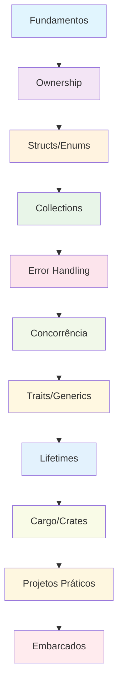

# 🦀 Curso Completo de Rust: Fundamentos, Avançado e Embarcados

**Professor:** Jackson Sá  
**Instituição:** ETEC Bento Quirino - Campinas/SP  
**Baseado em:** "The Rust Programming Language" e materiais oficiais

---

## 📋 **Índice Central**

### **🚀 Navegação Rápida**
- [**Tutoriais Detalhados**](#-tutoriais-detalhados) - Guia completo de tutoriais
- [**Pré-requisitos**](#-pré-requisitos) - O que você precisa saber antes de começar
- [**Como Começar**](#-como-começar) - Setup inicial e primeiro projeto
- [**Estrutura do Curso**](#-estrutura-do-curso-completo) - Visão geral de todos os módulos
- [**Projetos Práticos**](#-projetos-práticos) - Projetos para cada módulo
- [**Recursos de Aprendizado**](#-recursos-de-aprendizado) - Links úteis e documentação
- [**Comunidade e Suporte**](#-comunidade-e-suporte) - Onde encontrar ajuda

### **📚 Módulos do Curso**
- [**Módulo 1: Fundamentos**](./modulo-01-fundamentos-rust/README.md) - Sintaxe básica e variáveis
- [**Módulo 2: Ownership**](./modulo-02-ownership-borrowing/README.md) - Sistema de ownership e borrowing
- [**Módulo 3: Structs/Enums**](./modulo-03-structs-enums/README.md) - Structs, enums e pattern matching
- [**Módulo 4: Collections**](./modulo-04-collections-iterators/README.md) - Vec, HashMap e iterators
- [**Módulo 5: Error Handling**](./modulo-05-error-handling/README.md) - Result, Option e tratamento de erros
- [**Módulo 6: Concorrência**](./modulo-06-concorrencia/README.md) - Threads, channels e async/await
- [**Módulo 7: Traits/Generics**](./modulo-07-traits-generics/README.md) - Traits e generics
- [**Módulo 8: Lifetimes**](./modulo-08-lifetimes-advanced/README.md) - Lifetimes e advanced types
- [**Módulo 9: Cargo/Crates**](./modulo-09-cargo-crates/README.md) - Gerenciamento de dependências
- [**Módulo 10: Projetos**](./modulo-10-projetos-praticos/README.md) - Projetos práticos integrados
- [**Módulo Embarcados**](./modulo-embarcados/README.md) - Arduino, ESP32 e Raspberry Pi

---

## 🎯 **Objetivo do Curso**

Este repositório contém material completo de estudos para o desenvolvimento em Rust, estruturado de forma didática com exemplos práticos, diagramas e atividades. O curso abrange desde os fundamentos básicos até tópicos avançados, incluindo um módulo especial para desenvolvimento embarcado com Arduino, ESP32 e Raspberry Pi.

## 📚 **Tutoriais Detalhados**

Para tutoriais passo-a-passo de cada módulo, consulte o [**Guia de Tutoriais**](./TUTORIAIS.md) que contém:
- Projetos práticos completos
- Exemplos de código comentados
- Exercícios de fixação
- Recursos de aprendizado específicos

## 📚 **Estrutura do Curso Completo**

### **Módulo 1: 🦀 Fundamentos da Linguagem Rust**
- ✅ Instalação e configuração
- ✅ Sintaxe básica e variáveis
- ✅ Tipos de dados primitivos
- ✅ Funções e controle de fluxo
- **Projeto:** Calculadora básica

### **Módulo 2: 🔐 Ownership e Borrowing**
- ✅ Sistema de ownership
- ✅ Referências e borrowing
- ✅ Slices
- **Projeto:** Gerenciador de strings

### **Módulo 3: 🏗️ Structs, Enums e Pattern Matching**
- ✅ Definindo structs
- ✅ Enums e suas variantes
- ✅ Pattern matching com match
- **Projeto:** Sistema de biblioteca

### **Módulo 4: 📦 Collections e Iterators**
- ✅ Vector, HashMap, HashSet
- ✅ Iterators e closures
- ✅ Algoritmos funcionais
- **Projeto:** Sistema de gerenciamento de dados

### **Módulo 5: ⚠️ Error Handling e Result**
- ✅ Panic vs Result
- ✅ Propagação de erros
- ✅ Custom error types
- **Projeto:** Sistema de arquivos

### **Módulo 6: 🔄 Concorrência e Threads**
- ✅ Threads e channels
- ✅ Mutex e Arc
- ✅ Async/await
- **Projeto:** Servidor web simples

### **Módulo 7: 🎭 Traits e Generics**
- ✅ Definindo traits
- ✅ Implementação de traits
- ✅ Generics e lifetime bounds
- **Projeto:** Biblioteca de algoritmos

### **Módulo 8: ⏰ Lifetimes e Advanced Types**
- ✅ Lifetime annotations
- ✅ Advanced types (Box, Rc, RefCell)
- ✅ Smart pointers
- **Projeto:** Sistema de cache

### **Módulo 9: 📦 Cargo e Crates**
- ✅ Gerenciamento de dependências
- ✅ Criação de bibliotecas
- ✅ Testing e documentation
- **Projeto:** Biblioteca personalizada

### **Módulo 10: 🎯 Projetos Práticos**
- ✅ Projeto 1: Sistema de banco de dados simples
- ✅ Projeto 2: Cliente HTTP
- ✅ Projeto 3: Jogo da vida
- **Projeto Final:** Sistema integrado completo

### **Módulo Especial: 🔧 Rust para Embarcados**
- ✅ Arduino com Rust
- ✅ ESP32 e ESP8266
- ✅ Raspberry Pi
- **Projeto:** Sistema IoT completo

## 🛠️ **Pré-requisitos**

### **Obrigatórios**
- ✅ **Conhecimento básico de programação** - Variáveis, funções, estruturas de controle
- ✅ **Rust (versão 1.70 ou superior)** - [Instalar Rust](https://rustup.rs/)
- ✅ **Cargo (gerenciador de pacotes)** - Instalado automaticamente com Rust
- ✅ **Editor de código** - [VS Code com rust-analyzer](https://marketplace.visualstudio.com/items?itemName=rust-lang.rust-analyzer) recomendado
- ✅ **Git** - Para controle de versão

### **Recomendados**
- ✅ **Familiaridade com linha de comando** - Terminal/CMD básico
- ✅ **Conceitos básicos de programação funcional** - Funções, imutabilidade
- ✅ **Experiência com outras linguagens** - C/C++, Python, JavaScript, etc.
- ✅ **Conceitos de sistemas operacionais** - Memória, processos, threads

### **Recursos de Preparação**
- [**Rustlings**](https://github.com/rust-lang/rustlings) - Exercícios interativos para iniciantes
- [**The Rust Book**](https://doc.rust-lang.org/book/) - Documentação oficial completa
- [**Rust by Example**](https://doc.rust-lang.org/rust-by-example/) - Exemplos práticos
- [**Rust Playground**](https://play.rust-lang.org/) - Ambiente online para experimentar

## 🚀 **Como Começar**

### **1. Instalação do Rust**
```bash
# Linux/macOS
curl --proto '=https' --tlsv1.2 -sSf https://sh.rustup.rs | sh

# Windows
# Baixe e execute rustup-init.exe de https://rustup.rs/

# Verificar instalação
rustc --version
cargo --version
```

### **2. Configuração do Editor (VS Code)**
```json
{
    "rust-analyzer.checkOnSave.command": "clippy",
    "rust-analyzer.checkOnSave.allTargets": false,
    "rust-analyzer.cargo.features": "all"
}
```

### **3. Primeiro Projeto**
```bash
# Clone este repositório
git clone <url-do-repositorio>
cd Curso-Completo-de-Rust-Fundamentos

# Criar primeiro projeto
cargo new hello_world
cd hello_world
cargo run
```

### **4. Siga os Módulos em Ordem**
1. Comece pelo [**Módulo 1: Fundamentos**](./modulo-01-fundamentos-rust/README.md)
2. Siga sequencialmente até o [**Módulo 10: Projetos**](./modulo-10-projetos-praticos/README.md)
3. Explore o [**Módulo Embarcados**](./modulo-embarcados/README.md) para IoT

## 🎮 **Projetos Práticos**

Cada módulo contém projetos práticos que você pode executar:

- ✅ **Calculadora** - Primeiro contato com Rust
- ✅ **Sistema de Biblioteca** - Structs e enums
- ✅ **Gerenciador de Dados** - Collections e iterators
- ✅ **Sistema de Arquivos** - Error handling
- ✅ **Servidor Web** - Concorrência
- ✅ **Biblioteca de Algoritmos** - Traits e generics
- ✅ **Sistema de Cache** - Lifetimes e smart pointers
- ✅ **Biblioteca Personalizada** - Cargo e crates
- ✅ **Sistema IoT** - Desenvolvimento embarcado

## 🎓 **Metodologia**

### **Abordagem Pedagógica**
- ✅ **Teoria** → **Exemplo** → **Prática** → **Projeto**
- ✅ Diagramas Mermaid para visualização de conceitos
- ✅ Código comentado e explicado
- ✅ Exercícios progressivos
- ✅ Projetos reais aplicáveis

## 🦀 **Por que Rust?**

Rust é uma linguagem de programação moderna que oferece:

- ✅ **Segurança de memória** sem garbage collector
- ✅ **Performance** comparável a C/C++
- ✅ **Concorrência** segura por design
- ✅ **Ecosystem** rico e crescente
- ✅ **Aplicações** em sistemas, web, embarcados e blockchain
- ✅ **Crescimento** acelerado no mercado de trabalho

## 📊 **Estrutura de Dados em Rust**

O curso aborda implementações eficientes de:

- ✅ **Arrays e Slices** - Estruturas lineares
- ✅ **Linked Lists** - Listas encadeadas
- ✅ **Stacks e Queues** - Estruturas LIFO/FIFO
- ✅ **Trees** - Árvores binárias e AVL
- ✅ **Hash Tables** - Tabelas de hash
- ✅ **Graphs** - Grafos e algoritmos
- ✅ **Heaps** - Filas de prioridade

## 🔧 **Ferramentas e Recursos**

### **Editores Recomendados**
- ✅ **VS Code** com extensão rust-analyzer
- ✅ **IntelliJ IDEA** com plugin Rust
- ✅ **Vim/Neovim** com configurações Rust

### **Ferramentas Essenciais**
- ✅ **rustup** - Gerenciador de versões
- ✅ **cargo** - Gerenciador de pacotes e build
- ✅ **rustfmt** - Formatador de código
- ✅ **clippy** - Linter para Rust
- ✅ **cargo test** - Framework de testes

## 📚 **Recursos de Aprendizado**

### **Documentação Oficial**
- [**The Rust Book**](https://doc.rust-lang.org/book/) - Documentação oficial completa
- [**Rust by Example**](https://doc.rust-lang.org/rust-by-example/) - Exemplos práticos
- [**Rustlings**](https://github.com/rust-lang/rustlings) - Exercícios interativos
- [**Cargo Book**](https://doc.rust-lang.org/cargo/) - Guia do Cargo
- [**Rust Reference**](https://doc.rust-lang.org/reference/) - Referência da linguagem

### **Comunidades e Fóruns**
- [**Reddit r/rust**](https://reddit.com/r/rust) - Comunidade ativa
- [**Rust Users Forum**](https://users.rust-lang.org/) - Fórum oficial
- [**Stack Overflow**](https://stackoverflow.com/questions/tagged/rust) - Perguntas e respostas
- [**Rust Discord**](https://discord.gg/rust-lang) - Chat em tempo real

### **Recursos Específicos**
- [**Crates.io**](https://crates.io/) - Repositório de bibliotecas
- [**Rust Playground**](https://play.rust-lang.org/) - Ambiente online
- [**Rust Analyzer**](https://rust-analyzer.github.io/) - LSP para Rust
- [**Rustup Components**](https://rust-lang.github.io/rustup/concepts/components.html) - Componentes adicionais

## 🎯 **Objetivos de Aprendizagem**

Ao final do curso, você será capaz de:

### **Técnicas**
- ✅ **Dominar** os conceitos fundamentais de Rust
- ✅ **Implementar** estruturas de dados eficientes
- ✅ **Desenvolver** aplicações concorrentes e seguras
- ✅ **Criar** bibliotecas reutilizáveis
- ✅ **Programar** sistemas embarcados (Arduino, ESP32, Raspberry Pi)

### **Práticas**
- ✅ **Resolver** problemas complexos com Rust
- ✅ **Construir** projetos profissionais completos
- ✅ **Aplicar** boas práticas de programação
- ✅ **Colaborar** em projetos Rust
- ✅ **Manter** e documentar código

## 📱 **Aplicações Práticas**

Rust é usado em diversos domínios:

- ✅ **Sistemas Operacionais** (Redox OS)
- ✅ **Web Development** (Actix, Rocket)
- ✅ **Blockchain** (Solana, Polkadot)
- ✅ **Gaming** (Game engines)
- ✅ **Embarcados** (IoT, microcontroladores)
- ✅ **CLI Tools** (ripgrep, fd)

## 🆘 **Comunidade e Suporte**

### **Recursos de Ajuda**
- **Documentação Oficial:** [The Rust Book](https://doc.rust-lang.org/book/)
- **Rust by Example:** [Exemplos Práticos](https://doc.rust-lang.org/rust-by-example/)
- **Rustlings:** [Exercícios Interativos](https://github.com/rust-lang/rustlings)
- **Stack Overflow:** Para dúvidas específicas
- **GitHub:** Para exemplos de código

### **Comunidades**
- **Reddit:** r/rust
- **Discord:** Rust Community
- **Forum:** users.rust-lang.org
- **Twitter:** #rustlang

### **Contato**
**Professor Jackson Sá**  
ETEC Bento Quirino - Campinas/SP  
Email: jackson.sa@etec.sp.gov.br

---

## 🚀 **Começando Agora**

```bash
# Instalar Rust
curl --proto '=https' --tlsv1.2 -sSf https://sh.rustup.rs | sh

# Verificar instalação
rustc --version
cargo --version

# Criar primeiro projeto
cargo new hello_world
cd hello_world
cargo run
```

## 📈 **Progressão do Curso Completo**



---

## 🧭 **Navegação**

### **📚 Material de Apoio**
- [**Tutoriais Detalhados**](./TUTORIAIS.md) - Guia completo de tutoriais
- [**Módulo 1: Fundamentos**](./modulo-01-fundamentos-rust/README.md) - Comece aqui
- [**Módulo 2: Ownership**](./modulo-02-ownership-borrowing/README.md) - Próximo módulo
- [**Módulo Embarcados**](./modulo-embarcados/README.md) - Desenvolvimento IoT

### **🔗 Links Úteis**
- [Comunidade Rust Brasil](https://github.com/rust-br)
- [Documentação Oficial](https://doc.rust-lang.org/)
- [Rust Playground](https://play.rust-lang.org/)
- [Crates.io](https://crates.io/)

### **📖 Documentação Oficial**
- [The Rust Book](https://doc.rust-lang.org/book/)
- [Rust by Example](https://doc.rust-lang.org/rust-by-example/)
- [Rustlings](https://github.com/rust-lang/rustlings)
- [Cargo Book](https://doc.rust-lang.org/cargo/)

---

**Desenvolvido com ❤️ para a comunidade Rust brasileira**

*ETEC Bento Quirino - Curso Completo de Rust: Fundamentos, Avançado e Embarcados*
