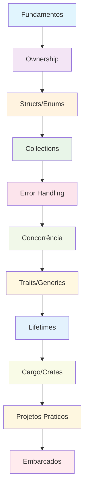

# 📚 Tutoriais - Curso Completo de Rust: Fundamentos, Avançado e Embarcados

## 🎯 **Guia de Tutoriais Práticos**

Este documento contém tutoriais detalhados para cada módulo do curso, com exemplos práticos e projetos completos.

---

## 📋 **Navegação Principal**

### **🚀 Links Rápidos**
- [**README Principal**](./README.md) - Visão geral do curso
- [**Pré-requisitos**](#-pré-requisitos) - O que você precisa saber
- [**Como Usar Este Guia**](#-como-usar-este-guia) - Como navegar pelos tutoriais
- [**Recursos de Aprendizado**](#-recursos-de-aprendizado) - Links úteis e documentação
- [**Comunidade e Suporte**](#-comunidade-e-suporte) - Onde encontrar ajuda

### **📚 Módulos do Curso**
- [**Módulo 1: Fundamentos**](#-módulo-1-fundamentos-da-linguagem-rust) - Sintaxe básica e variáveis
- [**Módulo 2: Ownership**](#-módulo-2-ownership-e-borrowing) - Sistema de ownership e borrowing
- [**Módulo 3: Structs/Enums**](#-módulo-3-structs-enums-e-pattern-matching) - Structs, enums e pattern matching
- [**Módulo 4: Collections**](#-módulo-4-collections-e-iterators) - Vec, HashMap e iterators
- [**Módulo 5: Error Handling**](#-módulo-5-error-handling-e-result) - Result, Option e tratamento de erros
- [**Módulo 6: Concorrência**](#-módulo-6-concorrência-e-threads) - Threads, channels e async/await
- [**Módulo 7: Traits/Generics**](#-módulo-7-traits-e-generics) - Traits e generics
- [**Módulo 8: Lifetimes**](#-módulo-8-lifetimes-e-advanced-types) - Lifetimes e advanced types
- [**Módulo 9: Cargo/Crates**](#-módulo-9-cargo-e-crates) - Gerenciamento de dependências
- [**Módulo 10: Projetos**](#-módulo-10-projetos-práticos) - Projetos práticos integrados
- [**Módulo Embarcados**](#-módulo-especial-embarcados) - Arduino, ESP32 e Raspberry Pi

---

## 📋 **Índice de Tutoriais**

### **Módulo 1: 🦀 Fundamentos da Linguagem Rust**
- [Tutorial 1.1: Calculadora Interativa](#tutorial-11-calculadora-interativa)
- [Tutorial 1.2: Sistema de Variáveis](#tutorial-12-sistema-de-variáveis)
- [Tutorial 1.3: Controle de Fluxo](#tutorial-13-controle-de-fluxo)

### **Módulo 2: 🔐 Ownership e Borrowing**
- [Tutorial 2.1: Gerenciador de Strings](#tutorial-21-gerenciador-de-strings)
- [Tutorial 2.2: Sistema de Referências](#tutorial-22-sistema-de-referências)
- [Tutorial 2.3: Slices e Arrays](#tutorial-23-slices-e-arrays)

### **Módulo 3: 🏗️ Structs, Enums e Pattern Matching**
- [Tutorial 3.1: Sistema de Biblioteca](#tutorial-31-sistema-de-biblioteca)
- [Tutorial 3.2: Enums Avançados](#tutorial-32-enums-avançados)
- [Tutorial 3.3: Pattern Matching](#tutorial-33-pattern-matching)

### **Módulo 4: 📦 Collections e Iterators**
- [Tutorial 4.1: Gerenciador de Dados](#tutorial-41-gerenciador-de-dados)
- [Tutorial 4.2: Iterators Funcionais](#tutorial-42-iterators-funcionais)
- [Tutorial 4.3: Algoritmos Avançados](#tutorial-43-algoritmos-avançados)

### **Módulo 5: ⚠️ Error Handling e Result**
- [Tutorial 5.1: Sistema de Arquivos](#tutorial-51-sistema-de-arquivos)
- [Tutorial 5.2: Error Propagation](#tutorial-52-error-propagation)
- [Tutorial 5.3: Custom Error Types](#tutorial-53-custom-error-types)

### **Módulo 6: 🔄 Concorrência e Threads**
- [Tutorial 6.1: Servidor Web Simples](#tutorial-61-servidor-web-simples)
- [Tutorial 6.2: Threads e Channels](#tutorial-62-threads-e-channels)
- [Tutorial 6.3: Async/Await](#tutorial-63-asyncawait)

### **Módulo 7: 🎭 Traits e Generics**
- [Tutorial 7.1: Biblioteca de Algoritmos](#tutorial-71-biblioteca-de-algoritmos)
- [Tutorial 7.2: Traits Avançados](#tutorial-72-traits-avançados)
- [Tutorial 7.3: Generics Complexos](#tutorial-73-generics-complexos)

### **Módulo 8: ⏰ Lifetimes e Advanced Types**
- [Tutorial 8.1: Sistema de Cache](#tutorial-81-sistema-de-cache)
- [Tutorial 8.2: Smart Pointers](#tutorial-82-smart-pointers)
- [Tutorial 8.3: Lifetime Annotations](#tutorial-83-lifetime-annotations)

### **Módulo 9: 📦 Cargo e Crates**
- [Tutorial 9.1: Biblioteca Personalizada](#tutorial-91-biblioteca-personalizada)
- [Tutorial 9.2: Cargo Workspaces](#tutorial-92-cargo-workspaces)
- [Tutorial 9.3: Publishing Crates](#tutorial-93-publishing-crates)

### **Módulo 10: 🎯 Projetos Práticos**
- [Tutorial 10.1: Sistema de Banco de Dados](#tutorial-101-sistema-de-banco-de-dados)
- [Tutorial 10.2: Cliente HTTP](#tutorial-102-cliente-http)
- [Tutorial 10.3: Jogo da Vida](#tutorial-103-jogo-da-vida)

### **Módulo Especial: 🔧 Rust para Embarcados**
- [Tutorial E.1: Arduino com Rust](#tutorial-e1-arduino-com-rust)
- [Tutorial E.2: ESP32 IoT](#tutorial-e2-esp32-iot)
- [Tutorial E.3: Raspberry Pi](#tutorial-e3-raspberry-pi)

---

## 📋 **Pré-requisitos**

### **Obrigatórios**
- ✅ **Rust (versão 1.70 ou superior)** - [Instalar Rust](https://rustup.rs/)
- ✅ **Cargo (gerenciador de pacotes)** - Instalado automaticamente com Rust
- ✅ **Editor de código** - [VS Code com rust-analyzer](https://marketplace.visualstudio.com/items?itemName=rust-lang.rust-analyzer) recomendado
- ✅ **Git** - Para controle de versão
- ✅ **Conhecimento básico de programação** - Variáveis, funções, estruturas de controle

### **Recomendados**
- ✅ **Familiaridade com linha de comando** - Terminal/CMD básico
- ✅ **Conceitos básicos de programação funcional** - Funções, imutabilidade
- ✅ **Experiência com outras linguagens** - C/C++, Python, JavaScript, etc.
- ✅ **Conceitos de sistemas operacionais** - Memória, processos, threads

### **Recursos de Preparação**
- [**Rustlings**](https://github.com/rust-lang/rustlings) - Exercícios interativos para iniciantes
- [**The Rust Book**](https://doc.rust-lang.org/book/) - Documentação oficial completa
- [**Rust by Example**](https://doc.rust-lang.org/rust-by-example/) - Exemplos práticos
- [**Rust Playground**](https://play.rust-lang.org/) - Ambiente online para experimentar

## 📖 **Como Usar Este Guia**

### **Estrutura dos Tutoriais**

Cada tutorial segue esta estrutura:

1. **📋 Configuração do Projeto** - Setup inicial e dependências
2. **📁 Estrutura de Pastas** - Organização do código
3. **💻 Implementação Passo a Passo** - Código detalhado e comentado
4. **🧪 Testes e Validação** - Verificação do funcionamento
5. **🎯 Exercícios de Extensão** - Desafios adicionais
6. **📚 Recursos Adicionais** - Links úteis e documentação

### **Ordem Recomendada**

1. **Siga os módulos em ordem sequencial** - Cada módulo constrói sobre o anterior
2. **Complete os tutoriais práticos** - Aplique o conhecimento em projetos reais
3. **Experimente as variações** - Crie suas próprias versões dos projetos
4. **Participe da comunidade** - Compartilhe seus projetos e dúvidas

### **Dicas de Estudo**

- **Pratique regularmente** - Faça pelo menos um projeto por semana
- **Documente seu progresso** - Mantenha um log dos projetos que você criou
- **Leia código de outros** - Explore projetos open source para aprender padrões avançados
- **Não tenha medo de errar** - Erros são parte do processo de aprendizado

---

## 🦀 Módulo 1: Fundamentos da Linguagem Rust

### Projeto: Calculadora Interativa

**Objetivo:** Criar uma calculadora completa que demonstre variáveis, funções e controle de fluxo.

**Funcionalidades:**

- Operações básicas (+, -, *, /)
- Operações científicas (√, x², %)
- Histórico de cálculos
- Interface de menu interativa

**Tecnologias:** Rust, std::io

**Tempo estimado:** 2-3 horas

[Ver Tutorial Completo](./modulo-01-fundamentos-rust/README.md#tutorial-prático-calculadora-básica)

---

## 🦀 Módulo 2: Ownership e Borrowing

### Projeto: Gerenciador de Strings

**Objetivo:** Implementar um sistema que demonstre ownership, borrowing e slices.

**Funcionalidades:**

- Adicionar e remover strings
- Busca e filtros
- Concatenação segura
- Estatísticas de uso

**Tecnologias:** Rust, Vec, String

**Tempo estimado:** 3-4 horas

[Ver Tutorial Completo](./modulo-02-ownership-borrowing/README.md#tutorial-prático-gerenciador-de-strings)

---

## 🦀 Módulo 3: Structs, Enums e Pattern Matching

### Projeto: Sistema de Biblioteca

**Objetivo:** Criar um sistema completo usando structs, enums e pattern matching.

**Funcionalidades:**

- Gerenciamento de livros
- Sistema de usuários
- Empréstimos e devoluções
- Relatórios e estatísticas

**Tecnologias:** Rust, Structs, Enums, Match

**Tempo estimado:** 4-5 horas

[Ver Tutorial Completo](./modulo-03-structs-enums/README.md#tutorial-prático-sistema-de-biblioteca)

---

## 🦀 Módulo 4: Collections e Iterators

### Projeto: Sistema de Gerenciamento de Dados

**Objetivo:** Implementar estruturas de dados eficientes usando collections.

**Funcionalidades:**

- Listas dinâmicas
- Tabelas de hash
- Conjuntos
- Algoritmos de busca e ordenação

**Tecnologias:** Rust, Vec, HashMap, HashSet

**Tempo estimado:** 5-6 horas

[Ver Tutorial Completo](./modulo-04-collections-iterators/README.md#tutorial-prático-sistema-de-gerenciamento-de-dados)

---

## 🦀 Módulo 5: Error Handling e Result

### Projeto: Sistema de Arquivos

**Objetivo:** Criar um sistema robusto de manipulação de arquivos com tratamento de erros.

**Funcionalidades:**

- Leitura e escrita de arquivos
- Tratamento de erros personalizado
- Validação de dados
- Logging de operações

**Tecnologias:** Rust, Result, Option, std::fs

**Tempo estimado:** 4-5 horas

[Ver Tutorial Completo](./modulo-05-error-handling/README.md#tutorial-prático-sistema-de-arquivos)

---

## 🦀 Módulo 6: Concorrência e Threads

### Projeto: Servidor Web Simples

**Objetivo:** Implementar um servidor web multithreaded usando concorrência segura.

**Funcionalidades:**

- Servidor HTTP básico
- Thread pool
- Comunicação entre threads
- Tratamento de requisições simultâneas

**Tecnologias:** Rust, Tokio, Threads, Channels

**Tempo estimado:** 6-8 horas

[Ver Tutorial Completo](./modulo-06-concorrencia/README.md#tutorial-prático-servidor-web-simples)

---

## 🦀 Módulo 7: Traits e Generics

### Projeto: Biblioteca de Algoritmos

**Objetivo:** Criar uma biblioteca reutilizável usando traits e generics.

**Funcionalidades:**

- Algoritmos de ordenação
- Estruturas de dados genéricas
- Traits customizadas
- Implementações polimórficas

**Tecnologias:** Rust, Traits, Generics, Impl

**Tempo estimado:** 5-6 horas

[Ver Tutorial Completo](./modulo-07-traits-generics/README.md#tutorial-prático-biblioteca-de-algoritmos)

---

## 🦀 Módulo 8: Lifetimes e Advanced Types

### Projeto: Sistema de Cache

**Objetivo:** Implementar um sistema de cache eficiente usando lifetimes e smart pointers.

**Funcionalidades:**

- Cache LRU
- Gerenciamento de memória
- Referências seguras
- Otimizações de performance

**Tecnologias:** Rust, Lifetimes, Box, Rc, RefCell

**Tempo estimado:** 6-8 horas

[Ver Tutorial Completo](./modulo-08-lifetimes-advanced/README.md#tutorial-prático-sistema-de-cache)

---

## 🦀 Módulo 9: Cargo e Crates

### Projeto: Biblioteca Personalizada

**Objetivo:** Criar e publicar uma biblioteca completa no ecossistema Rust.

**Funcionalidades:**

- Biblioteca modular
- Testes automatizados
- Documentação completa
- Publicação no crates.io

**Tecnologias:** Rust, Cargo, Crates, Docs

**Tempo estimado:** 4-5 horas

[Ver Tutorial Completo](./modulo-09-cargo-crates/README.md#tutorial-prático-biblioteca-personalizada)

---

## 🦀 Módulo 10: Projetos Práticos

### Projeto: Sistema Completo Integrado

**Objetivo:** Criar uma aplicação completa integrando todas as tecnologias aprendidas.

**Funcionalidades:**

- Sistema de banco de dados
- Cliente HTTP
- Jogo da vida
- Interface de usuário

**Tecnologias:** Rust, Todas as tecnologias anteriores

**Tempo estimado:** 8-10 horas

[Ver Tutorial Completo](./modulo-10-projetos-praticos/README.md#tutorial-prático-sistema-completo-integrado)

---

## 🦀 Módulo Especial: Embarcados

### Projeto: Sistema IoT Completo

**Objetivo:** Criar um sistema IoT completo para diferentes plataformas embarcadas.

**Funcionalidades:**

- Arduino: Controle de motores
- ESP32: Servidor web com sensores
- Raspberry Pi: Monitoramento de sistema
- Comunicação entre dispositivos

**Tecnologias:** Rust, Arduino, ESP32, Raspberry Pi

**Tempo estimado:** 10-12 horas

[Ver Tutorial Completo](./modulo-embarcados/README.md#tutorial-prático-sistema-iot-completo)

---

## 🛠️ Ferramentas e Recursos

### Editores Recomendados

- **VS Code** com extensão rust-analyzer
- **IntelliJ IDEA** com plugin Rust
- **Vim/Neovim** com configurações Rust

### Ferramentas Essenciais

- **rustup** - Gerenciador de versões
- **cargo** - Gerenciador de pacotes e build
- **rustfmt** - Formatador de código
- **clippy** - Linter para Rust
- **cargo test** - Framework de testes

### Para Desenvolvimento Embarcado

- **probe-rs** - Debugger para microcontroladores
- **cargo-flash** - Programador de firmware
- **cargo-generate** - Templates de projeto
- **embedded-hal** - Abstração de hardware

---

## 📚 Dicas de Estudo

### 1. Siga a Ordem dos Módulos

Cada módulo constrói sobre o anterior. Não pule etapas.

### 2. Pratique Regularmente

Faça pelo menos um projeto por semana para manter o conhecimento.

### 3. Experimente Variações

Após completar cada tutorial, tente criar suas próprias versões.

### 4. Documente Seu Progresso

Mantenha um log dos projetos que você criou e o que aprendeu.

### 5. Participe da Comunidade

Junte-se a grupos de Rust e compartilhe seus projetos.

### 6. Leia Código de Outros

Explore projetos open source para aprender padrões avançados.

---

## 🆘 Suporte e Ajuda

### Recursos de Ajuda

- **Documentação Oficial:** [The Rust Book](https://doc.rust-lang.org/book/)
- **Rust by Example:** [Exemplos Práticos](https://doc.rust-lang.org/rust-by-example/)
- **Rustlings:** [Exercícios Interativos](https://github.com/rust-lang/rustlings)
- **Stack Overflow:** Para dúvidas específicas
- **GitHub:** Para exemplos de código

### Comunidades

- **Reddit:** r/rust
- **Discord:** Rust Community
- **Forum:** users.rust-lang.org
- **Twitter:** #rustlang

### Contato

**Professor Jackson Sá**  
Email: jackson.sa@etec.sp.gov.br  
ETEC Bento Quirino - Campinas/SP

---

## 🎓 Certificação

Ao completar todos os tutoriais e projetos, você estará preparado para:

- Desenvolver aplicações Rust completas
- Trabalhar com sistemas embarcados
- Criar bibliotecas e crates
- Contribuir para projetos open source
- Trabalhar em equipes de desenvolvimento Rust

## 🚀 Projetos de Portfólio

### Projetos Básicos
1. **Calculadora Científica** - Fundamentos
2. **Gerenciador de Tarefas** - Ownership e Borrowing
3. **Sistema de Biblioteca** - Structs e Enums

### Projetos Intermediários
4. **Sistema de Arquivos** - Error Handling
5. **Servidor Web** - Concorrência
6. **Biblioteca de Algoritmos** - Traits e Generics

### Projetos Avançados
7. **Sistema de Cache** - Lifetimes e Smart Pointers
8. **Biblioteca Publicada** - Cargo e Crates
9. **Sistema IoT** - Embarcados

### Projetos de Especialização
10. **Game Engine** - Gráficos e Performance
11. **Database Engine** - Sistemas de Baixo Nível
12. **Blockchain** - Criptografia e Consenso

---

## 📈 Progressão de Aprendizado

---

## 🧭 **Navegação**

### **📚 Material de Apoio**
- [**README Principal**](./README.md) - Visão geral do curso
- [**Módulo 1: Fundamentos**](./modulo-01-fundamentos-rust/README.md) - Comece aqui
- [**Módulo 2: Ownership**](./modulo-02-ownership-borrowing/README.md) - Próximo módulo
- [**Módulo Embarcados**](./modulo-embarcados/README.md) - Desenvolvimento IoT

### **🔗 Links Úteis**
- [Comunidade Rust Brasil](https://github.com/rust-br)
- [Documentação Oficial](https://doc.rust-lang.org/)
- [Rust Playground](https://play.rust-lang.org/)
- [Crates.io](https://crates.io/)

### **📖 Documentação Oficial**
- [The Rust Book](https://doc.rust-lang.org/book/)
- [Rust by Example](https://doc.rust-lang.org/rust-by-example/)
- [Rustlings](https://github.com/rust-lang/rustlings)
- [Cargo Book](https://doc.rust-lang.org/cargo/)

---

**Desenvolvido com ❤️ para a comunidade Rust brasileira**

*ETEC Bento Quirino - Curso Completo de Rust: Fundamentos, Avançado e Embarcados*
