# 📚 Tutoriais Passo a Passo - Curso Completo de Rust

**Professor:** Jackson Sá  
**ETEC Bento Quirino - Campinas/SP

---

## 🎯 Como Usar Este Material

Este documento contém tutoriais práticos para cada módulo do curso. Cada tutorial guia você através da criação de um projeto completo, aplicando os conceitos aprendidos.

### 📋 Pré-requisitos

- Rust (versão 1.70 ou superior)
- Cargo (gerenciador de pacotes)
- Editor de código (VS Code recomendado)
- Git

### 🚀 Estrutura dos Tutoriais

Cada tutorial segue esta estrutura:

1. **Configuração do Projeto** - Setup inicial
2. **Estrutura de Pastas** - Organização do código
3. **Implementação Passo a Passo** - Código detalhado
4. **Testes e Validação** - Verificação do funcionamento
5. **Exercícios de Extensão** - Desafios adicionais

---

## 🦀 Módulo 1: Fundamentos da Linguagem Rust

### Projeto: Calculadora Interativa

**Objetivo:** Criar uma calculadora completa que demonstre variáveis, funções e controle de fluxo.

**Funcionalidades:**

- Operações básicas (+, -, *, /)
- Operações científicas (√, x², %)
- Histórico de cálculos
- Interface de menu interativa

**Tecnologias:** Rust, std::io

**Tempo estimado:** 2-3 horas

[Ver Tutorial Completo](./modulo-01-fundamentos-rust/README.md#tutorial-prático-calculadora-básica)

---

## 🦀 Módulo 2: Ownership e Borrowing

### Projeto: Gerenciador de Strings

**Objetivo:** Implementar um sistema que demonstre ownership, borrowing e slices.

**Funcionalidades:**

- Adicionar e remover strings
- Busca e filtros
- Concatenação segura
- Estatísticas de uso

**Tecnologias:** Rust, Vec, String

**Tempo estimado:** 3-4 horas

[Ver Tutorial Completo](./modulo-02-ownership-borrowing/README.md#tutorial-prático-gerenciador-de-strings)

---

## 🦀 Módulo 3: Structs, Enums e Pattern Matching

### Projeto: Sistema de Biblioteca

**Objetivo:** Criar um sistema completo usando structs, enums e pattern matching.

**Funcionalidades:**

- Gerenciamento de livros
- Sistema de usuários
- Empréstimos e devoluções
- Relatórios e estatísticas

**Tecnologias:** Rust, Structs, Enums, Match

**Tempo estimado:** 4-5 horas

[Ver Tutorial Completo](./modulo-03-structs-enums/README.md#tutorial-prático-sistema-de-biblioteca)

---

## 🦀 Módulo 4: Collections e Iterators

### Projeto: Sistema de Gerenciamento de Dados

**Objetivo:** Implementar estruturas de dados eficientes usando collections.

**Funcionalidades:**

- Listas dinâmicas
- Tabelas de hash
- Conjuntos
- Algoritmos de busca e ordenação

**Tecnologias:** Rust, Vec, HashMap, HashSet

**Tempo estimado:** 5-6 horas

[Ver Tutorial Completo](./modulo-04-collections-iterators/README.md#tutorial-prático-sistema-de-gerenciamento-de-dados)

---

## 🦀 Módulo 5: Error Handling e Result

### Projeto: Sistema de Arquivos

**Objetivo:** Criar um sistema robusto de manipulação de arquivos com tratamento de erros.

**Funcionalidades:**

- Leitura e escrita de arquivos
- Tratamento de erros personalizado
- Validação de dados
- Logging de operações

**Tecnologias:** Rust, Result, Option, std::fs

**Tempo estimado:** 4-5 horas

[Ver Tutorial Completo](./modulo-05-error-handling/README.md#tutorial-prático-sistema-de-arquivos)

---

## 🦀 Módulo 6: Concorrência e Threads

### Projeto: Servidor Web Simples

**Objetivo:** Implementar um servidor web multithreaded usando concorrência segura.

**Funcionalidades:**

- Servidor HTTP básico
- Thread pool
- Comunicação entre threads
- Tratamento de requisições simultâneas

**Tecnologias:** Rust, Tokio, Threads, Channels

**Tempo estimado:** 6-8 horas

[Ver Tutorial Completo](./modulo-06-concorrencia/README.md#tutorial-prático-servidor-web-simples)

---

## 🦀 Módulo 7: Traits e Generics

### Projeto: Biblioteca de Algoritmos

**Objetivo:** Criar uma biblioteca reutilizável usando traits e generics.

**Funcionalidades:**

- Algoritmos de ordenação
- Estruturas de dados genéricas
- Traits customizadas
- Implementações polimórficas

**Tecnologias:** Rust, Traits, Generics, Impl

**Tempo estimado:** 5-6 horas

[Ver Tutorial Completo](./modulo-07-traits-generics/README.md#tutorial-prático-biblioteca-de-algoritmos)

---

## 🦀 Módulo 8: Lifetimes e Advanced Types

### Projeto: Sistema de Cache

**Objetivo:** Implementar um sistema de cache eficiente usando lifetimes e smart pointers.

**Funcionalidades:**

- Cache LRU
- Gerenciamento de memória
- Referências seguras
- Otimizações de performance

**Tecnologias:** Rust, Lifetimes, Box, Rc, RefCell

**Tempo estimado:** 6-8 horas

[Ver Tutorial Completo](./modulo-08-lifetimes-advanced/README.md#tutorial-prático-sistema-de-cache)

---

## 🦀 Módulo 9: Cargo e Crates

### Projeto: Biblioteca Personalizada

**Objetivo:** Criar e publicar uma biblioteca completa no ecossistema Rust.

**Funcionalidades:**

- Biblioteca modular
- Testes automatizados
- Documentação completa
- Publicação no crates.io

**Tecnologias:** Rust, Cargo, Crates, Docs

**Tempo estimado:** 4-5 horas

[Ver Tutorial Completo](./modulo-09-cargo-crates/README.md#tutorial-prático-biblioteca-personalizada)

---

## 🦀 Módulo 10: Projetos Práticos

### Projeto: Sistema Completo Integrado

**Objetivo:** Criar uma aplicação completa integrando todas as tecnologias aprendidas.

**Funcionalidades:**

- Sistema de banco de dados
- Cliente HTTP
- Jogo da vida
- Interface de usuário

**Tecnologias:** Rust, Todas as tecnologias anteriores

**Tempo estimado:** 8-10 horas

[Ver Tutorial Completo](./modulo-10-projetos-praticos/README.md#tutorial-prático-sistema-completo-integrado)

---

## 🦀 Módulo Especial: Embarcados

### Projeto: Sistema IoT Completo

**Objetivo:** Criar um sistema IoT completo para diferentes plataformas embarcadas.

**Funcionalidades:**

- Arduino: Controle de motores
- ESP32: Servidor web com sensores
- Raspberry Pi: Monitoramento de sistema
- Comunicação entre dispositivos

**Tecnologias:** Rust, Arduino, ESP32, Raspberry Pi

**Tempo estimado:** 10-12 horas

[Ver Tutorial Completo](./modulo-embarcados/README.md#tutorial-prático-sistema-iot-completo)

---

## 🛠️ Ferramentas e Recursos

### Editores Recomendados

- **VS Code** com extensão rust-analyzer
- **IntelliJ IDEA** com plugin Rust
- **Vim/Neovim** com configurações Rust

### Ferramentas Essenciais

- **rustup** - Gerenciador de versões
- **cargo** - Gerenciador de pacotes e build
- **rustfmt** - Formatador de código
- **clippy** - Linter para Rust
- **cargo test** - Framework de testes

### Para Desenvolvimento Embarcado

- **probe-rs** - Debugger para microcontroladores
- **cargo-flash** - Programador de firmware
- **cargo-generate** - Templates de projeto
- **embedded-hal** - Abstração de hardware

---

## 📚 Dicas de Estudo

### 1. Siga a Ordem dos Módulos

Cada módulo constrói sobre o anterior. Não pule etapas.

### 2. Pratique Regularmente

Faça pelo menos um projeto por semana para manter o conhecimento.

### 3. Experimente Variações

Após completar cada tutorial, tente criar suas próprias versões.

### 4. Documente Seu Progresso

Mantenha um log dos projetos que você criou e o que aprendeu.

### 5. Participe da Comunidade

Junte-se a grupos de Rust e compartilhe seus projetos.

### 6. Leia Código de Outros

Explore projetos open source para aprender padrões avançados.

---

## 🆘 Suporte e Ajuda

### Recursos de Ajuda

- **Documentação Oficial:** [The Rust Book](https://doc.rust-lang.org/book/)
- **Rust by Example:** [Exemplos Práticos](https://doc.rust-lang.org/rust-by-example/)
- **Rustlings:** [Exercícios Interativos](https://github.com/rust-lang/rustlings)
- **Stack Overflow:** Para dúvidas específicas
- **GitHub:** Para exemplos de código

### Comunidades

- **Reddit:** r/rust
- **Discord:** Rust Community
- **Forum:** users.rust-lang.org
- **Twitter:** #rustlang

### Contato

**Professor Jackson Sá**  
Email: jackson.sa@etec.sp.gov.br  
ETEC Bento Quirino - Campinas/SP

---

## 🎓 Certificação

Ao completar todos os tutoriais e projetos, você estará preparado para:

- Desenvolver aplicações Rust completas
- Trabalhar com sistemas embarcados
- Criar bibliotecas e crates
- Contribuir para projetos open source
- Trabalhar em equipes de desenvolvimento Rust

## 🚀 Projetos de Portfólio

### Projetos Básicos
1. **Calculadora Científica** - Fundamentos
2. **Gerenciador de Tarefas** - Ownership e Borrowing
3. **Sistema de Biblioteca** - Structs e Enums

### Projetos Intermediários
4. **Sistema de Arquivos** - Error Handling
5. **Servidor Web** - Concorrência
6. **Biblioteca de Algoritmos** - Traits e Generics

### Projetos Avançados
7. **Sistema de Cache** - Lifetimes e Smart Pointers
8. **Biblioteca Publicada** - Cargo e Crates
9. **Sistema IoT** - Embarcados

### Projetos de Especialização
10. **Game Engine** - Gráficos e Performance
11. **Database Engine** - Sistemas de Baixo Nível
12. **Blockchain** - Criptografia e Consenso

---

## 📈 Progressão de Aprendizado

```mermaid
graph TD
    A[Fundamentos] --> B[Ownership]
    B --> C[Structs/Enums]
    C --> D[Collections]
    D --> E[Error Handling]
    E --> F[Concorrência]
    F --> G[Traits/Generics]
    G --> H[Lifetimes]
    H --> I[Cargo/Crates]
    I --> J[Projetos Práticos]
    J --> K[Embarcados]
    
    style A fill:#e1f5fe
    style B fill:#f3e5f5
    style C fill:#fff3e0
    style D fill:#e8f5e8
    style E fill:#fce4ec
    style F fill:#f1f8e9
    style G fill:#fff8e1
    style H fill:#e3f2fd
    style I fill:#f9fbe7
    style J fill:#fef7e0
    style K fill:#ffebee
```

---

**Boa sorte e bons estudos! 🦀**
