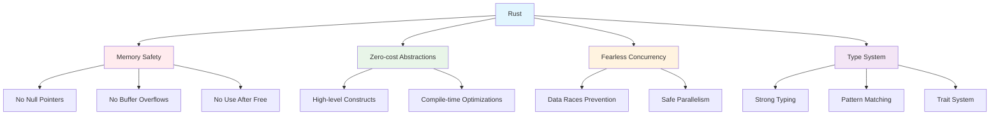

# Módulo 1: Fundamentos da Linguagem Rust

## 🎯 Objetivos de Aprendizagem

Ao final deste módulo, você será capaz de:

- Instalar e configurar o ambiente Rust
- Compreender a sintaxe básica da linguagem
- Trabalhar com tipos de dados primitivos
- Criar e usar funções
- Implementar estruturas de controle de fluxo
- Escrever seu primeiro programa em Rust

## 📚 Conteúdo Teórico

### 1.1 Por que Rust?

Rust foi criado pela Mozilla para resolver problemas comuns em linguagens de sistemas:

- **Segurança de memória** sem garbage collector
- **Performance** comparável a C/C++
- **Concorrência** segura por design
- **Produtividade** com ferramentas modernas

### 1.2 Características Únicas do Rust



### 1.3 Instalação e Configuração

#### Instalação via rustup (Recomendado)

```bash
# Linux/macOS
curl --proto '=https' --tlsv1.2 -sSf https://sh.rustup.rs | sh

# Windows
# Baixe e execute rustup-init.exe de https://rustup.rs/

# Verificar instalação
rustc --version
cargo --version
```

#### Configuração do Editor

**VS Code com rust-analyzer:**
```json
{
    "rust-analyzer.checkOnSave.command": "clippy",
    "rust-analyzer.checkOnSave.allTargets": false
}
```

### 1.4 Primeiro Programa em Rust

```rust
fn main() {
    println!("Hello, world!");
}
```

**Análise do código:**
- `fn` - Palavra-chave para definir função
- `main()` - Função principal do programa
- `println!` - Macro para imprimir texto
- `!` - Indica que é uma macro, não uma função

### 1.5 Sistema de Build - Cargo

Cargo é o gerenciador de pacotes e sistema de build do Rust:

```bash
# Criar novo projeto
cargo new nome_do_projeto

# Executar projeto
cargo run

# Compilar projeto
cargo build

# Executar testes
cargo test

# Formatar código
cargo fmt

# Verificar código
cargo check

# Lint do código
cargo clippy
```

## 💻 Exemplos Práticos

### Exemplo 1: Variáveis e Mutabilidade

```rust
// exemplos/variaveis.rs
fn main() {
    // Variável imutável (padrão)
    let x = 5;
    println!("O valor de x é: {}", x);
    
    // Variável mutável
    let mut y = 10;
    println!("O valor inicial de y é: {}", y);
    
    y = 15;
    println!("O valor final de y é: {}", y);
    
    // Shadowing (sombreamento)
    let z = 5;
    let z = z + 1;
    let z = z * 2;
    println!("O valor de z é: {}", z);
}
```

### Exemplo 2: Tipos de Dados Primitivos

```rust
// exemplos/tipos_dados.rs
fn main() {
    // Inteiros
    let inteiro_8: i8 = -128;
    let inteiro_32: i32 = 1000;
    let inteiro_64: i64 = 999999;
    let inteiro_sem_sinal: u32 = 42;
    
    // Ponto flutuante
    let flutuante_32: f32 = 3.14;
    let flutuante_64: f64 = 2.718281828;
    
    // Booleano
    let verdadeiro: bool = true;
    let falso: bool = false;
    
    // Caractere (Unicode)
    let caractere: char = 'A';
    let emoji: char = '🦀';
    
    // Tupla
    let tupla: (i32, f64, bool) = (42, 3.14, true);
    let (x, y, z) = tupla;
    
    // Array
    let array: [i32; 5] = [1, 2, 3, 4, 5];
    let primeiro = array[0];
    
    println!("Inteiros: {}, {}, {}, {}", inteiro_8, inteiro_32, inteiro_64, inteiro_sem_sinal);
    println!("Flutuantes: {}, {}", flutuante_32, flutuante_64);
    println!("Booleanos: {}, {}", verdadeiro, falso);
    println!("Caracteres: {}, {}", caractere, emoji);
    println!("Tupla: {:?}", tupla);
    println!("Desestruturação: x={}, y={}, z={}", x, y, z);
    println!("Array: {:?}, primeiro elemento: {}", array, primeiro);
}
```

### Exemplo 3: Funções

```rust
// exemplos/funcoes.rs
fn main() {
    let resultado = somar(5, 3);
    println!("5 + 3 = {}", resultado);
    
    let quadrado = elevar_ao_quadrado(4);
    println!("4² = {}", quadrado);
    
    imprimir_saudacao("Rust");
    
    let (soma, produto) = operacoes(6, 7);
    println!("Soma: {}, Produto: {}", soma, produto);
}

// Função com parâmetros e retorno
fn somar(a: i32, b: i32) -> i32 {
    a + b
}

// Função com retorno implícito
fn elevar_ao_quadrado(x: i32) -> i32 {
    x * x
}

// Função sem retorno (unit type)
fn imprimir_saudacao(nome: &str) {
    println!("Olá, {}!", nome);
}

// Função que retorna múltiplos valores
fn operacoes(a: i32, b: i32) -> (i32, i32) {
    (a + b, a * b)
}
```

### Exemplo 4: Controle de Fluxo

```rust
// exemplos/controle_fluxo.rs
fn main() {
    // If/else
    let numero = 7;
    if numero < 5 {
        println!("Condição era verdadeira");
    } else if numero < 10 {
        println!("Número está entre 5 e 9");
    } else {
        println!("Condição era falsa");
    }
    
    // If como expressão
    let condicao = true;
    let numero = if condicao { 5 } else { 6 };
    println!("O valor do número é: {}", numero);
    
    // Loop infinito
    let mut contador = 0;
    loop {
        contador += 1;
        if contador == 3 {
            break;
        }
    }
    println!("Contador: {}", contador);
    
    // While
    let mut numero = 3;
    while numero != 0 {
        println!("{}!", numero);
        numero -= 1;
    }
    println!("LIFTOFF!!!");
    
    // For
    let array = [10, 20, 30, 40, 50];
    for elemento in array.iter() {
        println!("O valor é: {}", elemento);
    }
    
    // Range
    for numero in (1..4).rev() {
        println!("{}!", numero);
    }
    println!("LIFTOFF!!!");
}
```

## 🎯 Tutorial Prático: Calculadora Básica

### Passo 1: Configuração do Projeto

```bash
cargo new calculadora
cd calculadora
```

### Passo 2: Estrutura do Projeto

```
src/
├── main.rs
├── calculadora.rs
└── operacoes.rs
```

### Passo 3: Implementação da Calculadora

```rust
// src/main.rs
mod calculadora;
mod operacoes;

use std::io;

fn main() {
    println!("=== Calculadora Rust ===");
    
    loop {
        println!("\nEscolha uma operação:");
        println!("1. Soma");
        println!("2. Subtração");
        println!("3. Multiplicação");
        println!("4. Divisão");
        println!("5. Sair");
        
        let mut escolha = String::new();
        io::stdin()
            .read_line(&mut escolha)
            .expect("Falha ao ler entrada");
        
        let escolha: u32 = match escolha.trim().parse() {
            Ok(num) => num,
            Err(_) => {
                println!("Por favor, digite um número válido!");
                continue;
            }
        };
        
        match escolha {
            1 => calculadora::executar_operacao(operacoes::somar),
            2 => calculadora::executar_operacao(operacoes::subtrair),
            3 => calculadora::executar_operacao(operacoes::multiplicar),
            4 => calculadora::executar_operacao(operacoes::dividir),
            5 => {
                println!("Obrigado por usar a calculadora!");
                break;
            }
            _ => println!("Opção inválida!"),
        }
    }
}
```

```rust
// src/calculadora.rs
use std::io;

pub fn ler_numero() -> f64 {
    loop {
        let mut entrada = String::new();
        io::stdin()
            .read_line(&mut entrada)
            .expect("Falha ao ler entrada");
        
        match entrada.trim().parse() {
            Ok(num) => return num,
            Err(_) => println!("Por favor, digite um número válido:"),
        }
    }
}

pub fn executar_operacao(operacao: fn(f64, f64) -> f64) {
    println!("Digite o primeiro número:");
    let a = ler_numero();
    
    println!("Digite o segundo número:");
    let b = ler_numero();
    
    let resultado = operacao(a, b);
    println!("Resultado: {}", resultado);
}
```

```rust
// src/operacoes.rs
pub fn somar(a: f64, b: f64) -> f64 {
    a + b
}

pub fn subtrair(a: f64, b: f64) -> f64 {
    a - b
}

pub fn multiplicar(a: f64, b: f64) -> f64 {
    a * b
}

pub fn dividir(a: f64, b: f64) -> f64 {
    if b != 0.0 {
        a / b
    } else {
        println!("Erro: Divisão por zero!");
        0.0
    }
}

pub fn potencia(base: f64, expoente: f64) -> f64 {
    base.powf(expoente)
}

pub fn raiz_quadrada(numero: f64) -> f64 {
    if numero >= 0.0 {
        numero.sqrt()
    } else {
        println!("Erro: Raiz quadrada de número negativo!");
        0.0
    }
}
```

### Passo 4: Executando o Projeto

```bash
cargo run
```

### Passo 5: Testes

```rust
// src/operacoes.rs
#[cfg(test)]
mod tests {
    use super::*;

    #[test]
    fn test_somar() {
        assert_eq!(somar(2.0, 3.0), 5.0);
    }

    #[test]
    fn test_subtrair() {
        assert_eq!(subtrair(5.0, 3.0), 2.0);
    }

    #[test]
    fn test_multiplicar() {
        assert_eq!(multiplicar(4.0, 5.0), 20.0);
    }

    #[test]
    fn test_dividir() {
        assert_eq!(dividir(10.0, 2.0), 5.0);
    }

    #[test]
    fn test_potencia() {
        assert_eq!(potencia(2.0, 3.0), 8.0);
    }
}
```

## 🎯 Atividades Práticas

### Atividade 1: Conversor de Temperaturas

Crie um programa que converta entre Celsius e Fahrenheit:

**Requisitos:**
- Menu interativo
- Fórmulas: F = C × 9/5 + 32, C = (F - 32) × 5/9
- Validação de entrada
- Histórico de conversões

### Atividade 2: Jogo de Adivinhação

Implemente o jogo clássico de adivinhação:

**Funcionalidades:**
- Número aleatório entre 1 e 100
- Dicas (maior/menor)
- Contador de tentativas
- Sistema de pontuação

### Atividade 3: Calculadora Científica

Desenvolva uma calculadora com operações avançadas:

**Características:**
- Operações básicas (+, -, *, /)
- Operações científicas (sin, cos, tan, log, ln)
- Constantes matemáticas (π, e)
- Memória (M+, M-, MR, MC)

## 📝 Exercícios de Fixação

1. **Pergunta:** Por que Rust é considerado uma linguagem segura?
   - Resposta: Porque previne erros de memória em tempo de compilação, eliminando null pointers, buffer overflows e use-after-free

2. **Pergunta:** Qual a diferença entre `let` e `let mut`?
   - Resposta: `let` cria variáveis imutáveis (padrão), `let mut` cria variáveis mutáveis

3. **Pergunta:** O que é shadowing em Rust?
   - Resposta: É a capacidade de declarar uma nova variável com o mesmo nome de uma anterior, efetivamente "sombreando" a anterior

4. **Pergunta:** Como funciona o sistema de ownership em Rust?
   - Resposta: Cada valor em Rust tem um proprietário, e quando o proprietário sai de escopo, o valor é automaticamente liberado

## 🔗 Próximos Passos

No próximo módulo, você aprenderá a:

- Dominar o sistema de ownership
- Trabalhar com referências e borrowing
- Entender o conceito de lifetimes
- Usar slices eficientemente

## 📚 Recursos Adicionais

- [The Rust Book](https://doc.rust-lang.org/book/)
- [Rust by Example](https://doc.rust-lang.org/rust-by-example/)
- [Rustlings](https://github.com/rust-lang/rustlings)
- [Cargo Book](https://doc.rust-lang.org/cargo/)

---

**Professor:** Jackson Sá  
**ETEC Bento Quirino - Campinas/SP**
