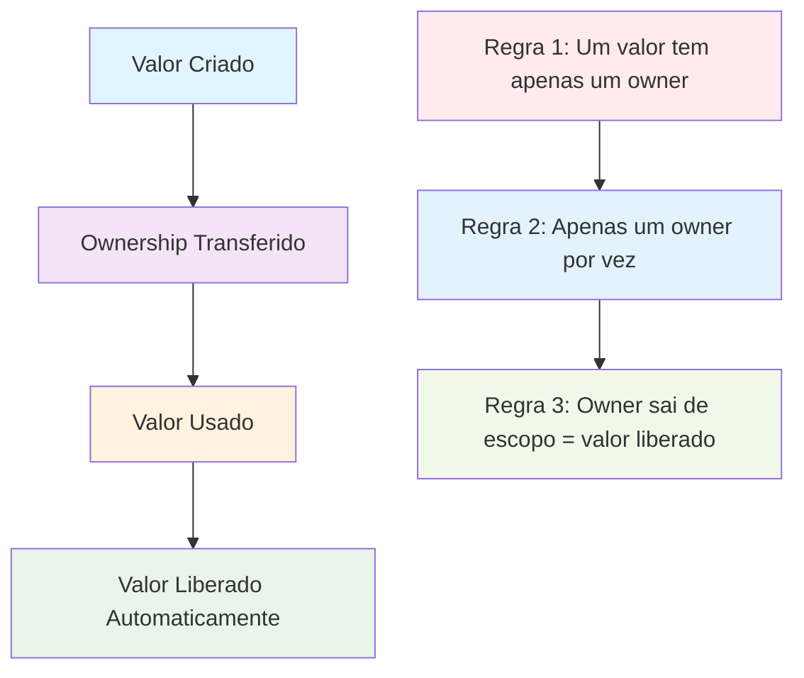
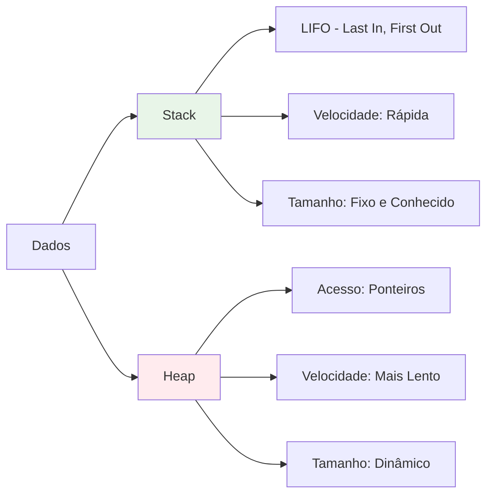
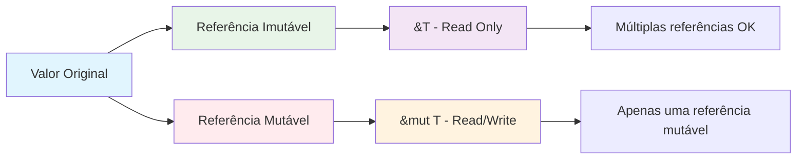

# Módulo 2: Ownership e Borrowing

## 🎯 Objetivos de Aprendizagem

Ao final deste módulo, você será capaz de:

- ✅ Compreender o sistema de ownership do Rust
- ✅ Trabalhar com referências e borrowing
- ✅ Entender o conceito de lifetimes
- ✅ Usar slices eficientemente
- ✅ Evitar erros comuns de ownership
- ✅ Aplicar as regras de ownership na prática

## 📋 **Pré-requisitos**

### **Obrigatórios**
- ✅ **Conhecimento básico de programação** - Variáveis, funções, estruturas de controle
- ✅ **Rust (versão 1.70 ou superior)** - [Instalar Rust](https://rustup.rs/)
- ✅ **Cargo (gerenciador de pacotes)** - Instalado automaticamente com Rust
- ✅ **Editor de código** - [VS Code com rust-analyzer](https://marketplace.visualstudio.com/items?itemName=rust-lang.rust-analyzer) recomendado
- ✅ **Git** - Para controle de versão
- ✅ **Conclusão do Módulo 1** - [Fundamentos da Linguagem Rust](../modulo-01-fundamentos-rust/README.md)

### **Recomendados**
- ✅ **Familiaridade com linha de comando** - Terminal/CMD básico
- ✅ **Conceitos básicos de programação funcional** - Funções, imutabilidade
- ✅ **Experiência com outras linguagens** - C/C++, Python, JavaScript, etc.
- ✅ **Conceitos de sistemas operacionais** - Memória, processos, threads

### **Recursos de Preparação**
- [**Rustlings**](https://github.com/rust-lang/rustlings) - Exercícios interativos para iniciantes
- [**The Rust Book**](https://doc.rust-lang.org/book/) - Documentação oficial completa
- [**Rust by Example**](https://doc.rust-lang.org/rust-by-example/) - Exemplos práticos
- [**Rust Playground**](https://play.rust-lang.org/) - Ambiente online para experimentar

## 📚 **Recursos de Aprendizado**

### **Documentação Oficial**
- [**The Rust Book - Understanding Ownership**](https://doc.rust-lang.org/book/ch04-00-understanding-ownership.html)
- [**Rust by Example - Ownership**](https://doc.rust-lang.org/rust-by-example/scope/move.html)
- [**Rustlings - Ownership**](https://github.com/rust-lang/rustlings) - Exercícios interativos
- [**Rust Reference - Ownership**](https://doc.rust-lang.org/reference/ownership.html)

### **Comunidades e Fóruns**
- [**Reddit r/rust**](https://reddit.com/r/rust) - Comunidade ativa
- [**Rust Users Forum**](https://users.rust-lang.org/) - Fórum oficial
- [**Stack Overflow**](https://stackoverflow.com/questions/tagged/rust) - Perguntas e respostas
- [**Rust Discord**](https://discord.gg/rust-lang) - Chat em tempo real

## 📖 **Índice do Módulo**

- [**Objetivos de Aprendizagem**](#-objetivos-de-aprendizagem)
- [**Pré-requisitos**](#-pré-requisitos)
- [**Recursos de Aprendizado**](#-recursos-de-aprendizado)
- [**Conteúdo Teórico**](#-conteúdo-teórico)
- [**Exemplos Práticos**](#-exemplos-práticos)
- [**Tutorial Prático**](#-tutorial-prático-gerenciador-de-strings)
- [**Atividades Práticas**](#-atividades-práticas)
- [**Exercícios de Fixação**](#-exercícios-de-fixação)
- [**Próximos Passos**](#-próximos-passos)
- [**Navegação**](#-navegação)

## 📚 Conteúdo Teórico

### 2.1 O Sistema de Ownership

O ownership é o recurso mais exclusivo do Rust que permite segurança de memória sem garbage collector.



**As Três Regras do Ownership:**

1. **Cada valor em Rust tem um owner**
2. **Apenas um owner por vez**
3. **Quando o owner sai de escopo, o valor é liberado**

### 2.2 Stack vs Heap



**Stack:**
- Estrutura LIFO (Last In, First Out)
- Velocidade: muito rápida
- Tamanho: fixo e conhecido em tempo de compilação
- Tipos: inteiros, floats, booleans, chars, tuplas, arrays

**Heap:**
- Acesso através de ponteiros
- Velocidade: mais lenta que stack
- Tamanho: dinâmico, pode crescer/diminuir
- Tipos: String, Vec, Box, etc.

### 2.3 Movimento de Ownership

```mermaid
graph TD
    A[let s1 = String::from("hello")] --> B[s1 é owner do valor]
    B --> C[let s2 = s1]
    C --> D[s1 não é mais válido]
    D --> E[s2 é o novo owner]
    E --> F[s2 sai de escopo]
    F --> G[Memória liberada automaticamente]
    
    style A fill:#e1f5fe
    style B fill:#f3e5f5
    style C fill:#fff3e0
    style D fill:#ffebee
    style E fill:#e8f5e8
    style F fill:#fce4ec
    style G fill:#f1f8e9
```

### 2.4 Referências e Borrowing



**Regras do Borrowing:**

1. **Pode ter múltiplas referências imutáveis OU uma mutável**
2. **Referências devem sempre ser válidas**
3. **Não pode misturar referências imutáveis e mutáveis**

### 2.5 Slices

Slices são referências a uma sequência contígua de elementos:

```mermaid
graph TD
    A[Array: [1,2,3,4,5]] --> B[Slice: &[1,2,3]]
    A --> C[String: "Hello World"] --> D[String Slice: &str]
    
    B --> E[Referência a parte do array]
    D --> F[Referência a parte da string]
    
    style A fill:#e1f5fe
    style B fill:#f3e5f5
    style C fill:#fff3e0
    style D fill:#e8f5e8
```

## 💻 Exemplos Práticos

### Exemplo 1: Ownership Básico

```rust
// exemplos/ownership_basico.rs
fn main() {
    println!("=== Exemplo: Ownership Básico ===");
    
    // Ownership com String (heap)
    let s1 = String::from("hello");
    println!("s1: {}", s1);
    
    // Movimento de ownership
    let s2 = s1; // s1 é movido para s2
    // println!("s1: {}", s1); // ❌ ERRO! s1 não é mais válido
    println!("s2: {}", s2);
    
    // Clone (cópia profunda)
    let s3 = s2.clone();
    println!("s2: {}", s2); // s2 ainda é válido
    println!("s3: {}", s3);
    
    // Ownership com tipos primitivos (stack)
    let x = 5;
    let y = x; // Cópia automática (Copy trait)
    println!("x: {}, y: {}", x, y); // Ambos válidos
    
    // Demonstração de escopo
    let s4 = String::from("escopo");
    {
        let s5 = String::from("interno");
        println!("s5: {}", s5);
        // s5 sai de escopo aqui e é liberado
    }
    println!("s4: {}", s4);
    // s4 sai de escopo aqui e é liberado
}
```

### Exemplo 2: Funções e Ownership

```rust
// exemplos/funcoes_ownership.rs
fn main() {
    println!("=== Exemplo: Funções e Ownership ===");
    
    let s = String::from("hello");
    
    // Passagem por valor (move)
    toma_ownership(s);
    // println!("s: {}", s); // ❌ ERRO! s foi movido
    
    let x = 5;
    
    // Passagem por valor (cópia)
    faz_copia(x);
    println!("x: {}", x); // OK! x ainda é válido
    
    // Retorno de ownership
    let s1 = String::from("hello");
    let s2 = retorna_ownership(s1);
    println!("s2: {}", s2);
    
    // Função que recebe e retorna ownership
    let s3 = String::from("hello");
    let s4 = pega_e_retorna_ownership(s3);
    println!("s4: {}", s4);
}

fn toma_ownership(uma_string: String) {
    println!("Recebeu: {}", uma_string);
    // uma_string sai de escopo aqui e é liberada
}

fn faz_copia(um_inteiro: i32) {
    println!("Recebeu: {}", um_inteiro);
    // um_inteiro sai de escopo aqui, mas é apenas uma cópia
}

fn retorna_ownership(uma_string: String) -> String {
    println!("Processando: {}", uma_string);
    uma_string // Retorna ownership
}

fn pega_e_retorna_ownership(uma_string: String) -> String {
    uma_string // Recebe e retorna ownership
}
```

### Exemplo 3: Referências e Borrowing

```rust
// exemplos/borrowing.rs
fn main() {
    println!("=== Exemplo: Referências e Borrowing ===");
    
    let s1 = String::from("hello");
    
    // Empréstimo (borrowing) com referência imutável
    let tamanho = calcula_tamanho(&s1);
    println!("O tamanho de '{}' é {}.", s1, tamanho); // s1 ainda é válido
    
    // Referência mutável
    let mut s2 = String::from("hello");
    modifica_string(&mut s2);
    println!("s2 modificado: {}", s2);
    
    // Múltiplas referências imutáveis
    let s3 = String::from("hello world");
    let r1 = &s3;
    let r2 = &s3;
    println!("r1: {}, r2: {}", r1, r2);
    
    // Referência mutável (apenas uma por vez)
    let mut s4 = String::from("hello");
    let r3 = &mut s4;
    // let r4 = &mut s4; // ❌ ERRO! Não pode ter duas referências mutáveis
    println!("r3: {}", r3);
    
    // Referência mutável após uso
    let mut s5 = String::from("hello");
    let r5 = &s5; // Referência imutável
    let r6 = &s5; // Outra referência imutável
    println!("r5: {}, r6: {}", r5, r6);
    
    let r7 = &mut s5; // Referência mutável após uso das imutáveis
    println!("r7: {}", r7);
}

fn calcula_tamanho(s: &String) -> usize {
    s.len()
    // s sai de escopo aqui, mas não libera a memória
    // porque é apenas uma referência
}

fn modifica_string(s: &mut String) {
    s.push_str(", world!");
}
```

### Exemplo 4: Slices

```rust
// exemplos/slices.rs
fn main() {
    println!("=== Exemplo: Slices ===");
    
    // String slice
    let s = String::from("hello world");
    let hello = &s[0..5];
    let world = &s[6..11];
    
    println!("String completa: {}", s);
    println!("Slice 1: {}", hello);
    println!("Slice 2: {}", world);
    
    // Slice com range até o final
    let slice_fim = &s[6..];
    println!("Slice até o fim: {}", slice_fim);
    
    // Slice do início
    let slice_inicio = &s[..5];
    println!("Slice do início: {}", slice_inicio);
    
    // Slice completo
    let slice_completo = &s[..];
    println!("Slice completo: {}", slice_completo);
    
    // Array slices
    let array = [1, 2, 3, 4, 5];
    let slice_array = &array[1..4];
    println!("Array: {:?}", array);
    println!("Slice do array: {:?}", slice_array);
    
    // Função que recebe slice
    let minha_string = String::from("hello world");
    let palavra = primeira_palavra(&minha_string);
    println!("Primeira palavra: {}", palavra);
    
    // Slice como parâmetro
    let meu_array = [1, 2, 3, 4, 5];
    let soma = somar_slice(&meu_array);
    println!("Soma do array: {}", soma);
}

fn primeira_palavra(s: &str) -> &str {
    let bytes = s.as_bytes();
    
    for (i, &item) in bytes.iter().enumerate() {
        if item == b' ' {
            return &s[0..i];
        }
    }
    
    &s[..]
}

fn somar_slice(slice: &[i32]) -> i32 {
    let mut soma = 0;
    for &item in slice {
        soma += item;
    }
    soma
}
```

## 🎯 Tutorial Prático: Gerenciador de Strings

### Passo 1: Configuração do Projeto

```bash
cargo new gerenciador_strings
cd gerenciador_strings
```

### Passo 2: Estrutura do Projeto

```
src/
├── main.rs
├── string_manager.rs
└── utils.rs
```

### Passo 3: Implementação do Gerenciador

```rust
// src/main.rs
mod string_manager;
mod utils;

use std::io;

fn main() {
    println!("=== Gerenciador de Strings ===");
    
    let mut manager = string_manager::StringManager::new();
    
    loop {
        mostrar_menu();
        
        let escolha = ler_escolha();
        
        match escolha {
            1 => adicionar_string(&mut manager),
            2 => buscar_string(&manager),
            3 => listar_strings(&manager),
            4 => concatenar_strings(&mut manager),
            5 => remover_string(&mut manager),
            6 => {
                println!("Obrigado por usar o gerenciador!");
                break;
            }
            _ => println!("Opção inválida!"),
        }
    }
}

fn mostrar_menu() {
    println!("\nEscolha uma operação:");
    println!("1. Adicionar string");
    println!("2. Buscar string");
    println!("3. Listar todas as strings");
    println!("4. Concatenar strings");
    println!("5. Remover string");
    println!("6. Sair");
    print!("Digite sua escolha (1-6): ");
}

fn ler_escolha() -> u32 {
    let mut entrada = String::new();
    io::stdin()
        .read_line(&mut entrada)
        .expect("Falha ao ler entrada");
    
    entrada.trim().parse().unwrap_or(0)
}

fn adicionar_string(manager: &mut string_manager::StringManager) {
    println!("Digite a string para adicionar:");
    let mut entrada = String::new();
    io::stdin()
        .read_line(&mut entrada)
        .expect("Falha ao ler entrada");
    
    let string = entrada.trim().to_string();
    manager.adicionar(string);
    println!("String adicionada com sucesso!");
}

fn buscar_string(manager: &string_manager::StringManager) {
    println!("Digite a string para buscar:");
    let mut entrada = String::new();
    io::stdin()
        .read_line(&mut entrada)
        .expect("Falha ao ler entrada");
    
    let busca = entrada.trim();
    if manager.buscar(busca) {
        println!("String encontrada!");
    } else {
        println!("String não encontrada!");
    }
}

fn listar_strings(manager: &string_manager::StringManager) {
    println!("Strings armazenadas:");
    for (i, string) in manager.listar().iter().enumerate() {
        println!("{}. {}", i + 1, string);
    }
}

fn concatenar_strings(manager: &mut string_manager::StringManager) {
    println!("Digite o índice da primeira string:");
    let idx1 = ler_indice();
    
    println!("Digite o índice da segunda string:");
    let idx2 = ler_indice();
    
    if let Some(resultado) = manager.concatenar(idx1, idx2) {
        println!("Resultado da concatenação: {}", resultado);
    } else {
        println!("Índices inválidos!");
    }
}

fn remover_string(manager: &mut string_manager::StringManager) {
    println!("Digite o índice da string para remover:");
    let idx = ler_indice();
    
    if manager.remover(idx) {
        println!("String removida com sucesso!");
    } else {
        println!("Índice inválido!");
    }
}

fn ler_indice() -> usize {
    let mut entrada = String::new();
    io::stdin()
        .read_line(&mut entrada)
        .expect("Falha ao ler entrada");
    
    entrada.trim().parse().unwrap_or(0)
}
```

```rust
// src/string_manager.rs
use crate::utils;

pub struct StringManager {
    strings: Vec<String>,
}

impl StringManager {
    pub fn new() -> Self {
        StringManager {
            strings: Vec::new(),
        }
    }
    
    pub fn adicionar(&mut self, string: String) {
        self.strings.push(string);
    }
    
    pub fn buscar(&self, busca: &str) -> bool {
        self.strings.iter().any(|s| s.contains(busca))
    }
    
    pub fn listar(&self) -> &Vec<String> {
        &self.strings
    }
    
    pub fn concatenar(&mut self, idx1: usize, idx2: usize) -> Option<String> {
        if idx1 < self.strings.len() && idx2 < self.strings.len() {
            let s1 = &self.strings[idx1];
            let s2 = &self.strings[idx2];
            Some(format!("{}{}", s1, s2))
        } else {
            None
        }
    }
    
    pub fn remover(&mut self, idx: usize) -> bool {
        if idx < self.strings.len() {
            self.strings.remove(idx);
            true
        } else {
            false
        }
    }
    
    pub fn tamanho(&self) -> usize {
        self.strings.len()
    }
    
    pub fn estatisticas(&self) -> (usize, usize, usize) {
        let total_strings = self.strings.len();
        let total_chars: usize = self.strings.iter().map(|s| s.len()).sum();
        let strings_vazias = self.strings.iter().filter(|s| s.is_empty()).count();
        
        (total_strings, total_chars, strings_vazias)
    }
}
```

```rust
// src/utils.rs
pub fn formatar_string(s: &str) -> String {
    s.trim().to_lowercase()
}

pub fn validar_string(s: &str) -> bool {
    !s.trim().is_empty() && s.len() <= 100
}

pub fn contar_palavras(s: &str) -> usize {
    s.split_whitespace().count()
}

pub fn inverter_string(s: &str) -> String {
    s.chars().rev().collect()
}

pub fn remover_duplicatas(strings: &[String]) -> Vec<String> {
    let mut unicas = Vec::new();
    for string in strings {
        if !unicas.contains(string) {
            unicas.push(string.clone());
        }
    }
    unicas
}

#[cfg(test)]
mod tests {
    use super::*;

    #[test]
    fn test_formatar_string() {
        assert_eq!(formatar_string("  HELLO WORLD  "), "hello world");
    }

    #[test]
    fn test_validar_string() {
        assert!(validar_string("hello"));
        assert!(!validar_string(""));
        assert!(!validar_string("   "));
    }

    #[test]
    fn test_contar_palavras() {
        assert_eq!(contar_palavras("hello world"), 2);
        assert_eq!(contar_palavras(""), 0);
    }

    #[test]
    fn test_inverter_string() {
        assert_eq!(inverter_string("hello"), "olleh");
    }
}
```

## 🎯 Atividades Práticas

### Atividade 1: Sistema de Cache

Implemente um sistema de cache que gerencie ownership de dados:

**Requisitos:**
- Armazenar chave-valor
- LRU (Least Recently Used)
- Gerenciamento de memória eficiente
- API thread-safe

### Atividade 2: Processador de Texto

Crie um processador de texto que trabalhe com slices:

**Funcionalidades:**
- Busca e substituição
- Formatação de texto
- Estatísticas de palavras
- Exportação de dados

### Atividade 3: Gerenciador de Arquivos

Desenvolva um gerenciador de arquivos em memória:

**Características:**
- Hierarquia de diretórios
- Operações CRUD
- Navegação por referências
- Backup e restore

## 📝 Exercícios de Fixação

1. **Pergunta:** O que acontece quando você move uma String para outra variável?
   - Resposta: O ownership é transferido e a variável original não é mais válida

2. **Pergunta:** Qual a diferença entre `&T` e `&mut T`?
   - Resposta: `&T` é referência imutável (read-only), `&mut T` é referência mutável (read/write)

3. **Pergunta:** Por que Rust não precisa de garbage collector?
   - Resposta: Porque o sistema de ownership libera automaticamente a memória quando o owner sai de escopo

4. **Pergunta:** O que é um slice em Rust?
   - Resposta: Uma referência a uma sequência contígua de elementos em uma coleção

## 🔗 Próximos Passos

No próximo módulo, você aprenderá a:

- Definir e usar structs
- Trabalhar com enums e suas variantes
- Aplicar pattern matching com match
- Criar tipos de dados customizados

## 🧭 **Navegação**

### **📚 Material de Apoio**
- [**README Principal**](../../README.md) - Visão geral do curso
- [**Tutoriais Detalhados**](../../TUTORIAIS.md) - Guia completo de tutoriais
- [**Módulo 1: Fundamentos**](../modulo-01-fundamentos-rust/README.md) - Módulo anterior
- [**Módulo 3: Structs/Enums**](../modulo-03-structs-enums/README.md) - Próximo módulo
- [**Módulo Embarcados**](../modulo-embarcados/README.md) - Desenvolvimento IoT

### **🔗 Links Úteis**
- [Comunidade Rust Brasil](https://github.com/rust-br)
- [Documentação Oficial](https://doc.rust-lang.org/)
- [Rust Playground](https://play.rust-lang.org/)
- [Crates.io](https://crates.io/)

### **📖 Documentação Oficial**
- [The Rust Book](https://doc.rust-lang.org/book/)
- [Rust by Example](https://doc.rust-lang.org/rust-by-example/)
- [Rustlings](https://github.com/rust-lang/rustlings)
- [Cargo Book](https://doc.rust-lang.org/cargo/)

---

**Professor:** Jackson Sá  
**ETEC Bento Quirino - Campinas/SP**
