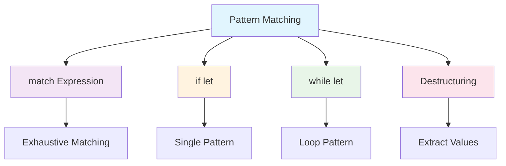
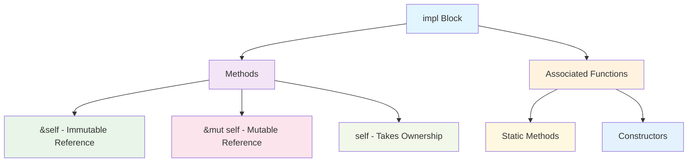

# Módulo 3: Structs, Enums e Pattern Matching

## 🎯 Objetivos de Aprendizagem

Ao final deste módulo, você será capaz de:

- ✅ Definir e usar structs para criar tipos customizados
- ✅ Trabalhar com enums e suas variantes
- ✅ Aplicar pattern matching com match e if let
- ✅ Implementar métodos para structs e enums
- ✅ Usar associated functions
- ✅ Criar tipos de dados complexos e expressivos

## 📋 **Pré-requisitos**

### **Obrigatórios**
- ✅ **Conhecimento básico de programação** - Variáveis, funções, estruturas de controle
- ✅ **Rust (versão 1.70 ou superior)** - [Instalar Rust](https://rustup.rs/)
- ✅ **Cargo (gerenciador de pacotes)** - Instalado automaticamente com Rust
- ✅ **Editor de código** - [VS Code com rust-analyzer](https://marketplace.visualstudio.com/items?itemName=rust-lang.rust-analyzer) recomendado
- ✅ **Git** - Para controle de versão
- ✅ **Conclusão do Módulo 2** - [Ownership e Borrowing](../modulo-02-ownership-borrowing/README.md)

### **Recomendados**
- ✅ **Familiaridade com linha de comando** - Terminal/CMD básico
- ✅ **Conceitos básicos de programação funcional** - Funções, imutabilidade
- ✅ **Experiência com outras linguagens** - C/C++, Python, JavaScript, etc.
- ✅ **Conceitos de sistemas operacionais** - Memória, processos, threads

### **Recursos de Preparação**
- [**Rustlings**](https://github.com/rust-lang/rustlings) - Exercícios interativos para iniciantes
- [**The Rust Book**](https://doc.rust-lang.org/book/) - Documentação oficial completa
- [**Rust by Example**](https://doc.rust-lang.org/rust-by-example/) - Exemplos práticos
- [**Rust Playground**](https://play.rust-lang.org/) - Ambiente online para experimentar

## 📚 **Recursos de Aprendizado**

### **Documentação Oficial**
- [**The Rust Book - Structs**](https://doc.rust-lang.org/book/ch05-00-structs.html)
- [**The Rust Book - Enums**](https://doc.rust-lang.org/book/ch06-00-enums.html)
- [**Rust by Example - Structs**](https://doc.rust-lang.org/rust-by-example/custom_types/structs.html)
- [**Rust by Example - Enums**](https://doc.rust-lang.org/rust-by-example/custom_types/enum.html)

### **Comunidades e Fóruns**
- [**Reddit r/rust**](https://reddit.com/r/rust) - Comunidade ativa
- [**Rust Users Forum**](https://users.rust-lang.org/) - Fórum oficial
- [**Stack Overflow**](https://stackoverflow.com/questions/tagged/rust) - Perguntas e respostas
- [**Rust Discord**](https://discord.gg/rust-lang) - Chat em tempo real

## 📖 **Índice do Módulo**

- [**Objetivos de Aprendizagem**](#-objetivos-de-aprendizagem)
- [**Pré-requisitos**](#-pré-requisitos)
- [**Recursos de Aprendizado**](#-recursos-de-aprendizado)
- [**Conteúdo Teórico**](#-conteúdo-teórico)
- [**Exemplos Práticos**](#-exemplos-práticos)
- [**Tutorial Prático**](#-tutorial-prático-sistema-de-biblioteca)
- [**Atividades Práticas**](#-atividades-práticas)
- [**Exercícios de Fixação**](#-exercícios-de-fixação)
- [**Próximos Passos**](#-próximos-passos)
- [**Navegação**](#-navegação)

## 📚 Conteúdo Teórico

### 3.1 Structs - Estruturas de Dados

Structs permitem agrupar dados relacionados em um tipo personalizado.

```mermaid
graph TD
    A[Struct] --> B[Tuple Structs]
    A --> C[Unit Structs]
    A --> D[Named Structs]
    
    B --> E[struct Point(i32, i32)]
    C --> F[struct AlwaysEqual;]
    D --> G[struct User { name: String, age: u32 }]
    
    style A fill:#e1f5fe
    style B fill:#f3e5f5
    style C fill:#fff3e0
    style D fill:#e8f5e8
```

**Tipos de Structs:**

1. **Named Structs** - Campos nomeados
2. **Tuple Structs** - Campos posicionais
3. **Unit Structs** - Sem campos (útil para traits)

### 3.2 Enums - Tipos de Dados Enumerados

Enums permitem definir um tipo que pode ter um de vários valores possíveis.

```mermaid
graph TD
    A[Enum] --> B[Simple Variants]
    A --> C[Data Variants]
    A --> D[Mixed Variants]
    
    B --> E[enum Color { Red, Green, Blue }]
    C --> F[enum Message { Quit, Move{x, y}, Write{text} }]
    D --> G[enum Option<T> { Some(T), None }]
    
    style A fill:#e1f5fe
    style B fill:#f3e5f5
    style C fill:#fff3e0
    style D fill:#e8f5e8
```

### 3.3 Pattern Matching

Pattern matching é uma forma poderosa de decompor valores em suas partes constituintes.



### 3.4 Métodos e Associated Functions



## 💻 Exemplos Práticos

### Exemplo 1: Structs Básicos

```rust
// exemplos/structs_basicos.rs
#[derive(Debug)]
struct User {
    username: String,
    email: String,
    sign_in_count: u64,
    active: bool,
}

#[derive(Debug)]
struct Point {
    x: f64,
    y: f64,
}

#[derive(Debug)]
struct Rectangle {
    width: f64,
    height: f64,
}

impl Rectangle {
    fn area(&self) -> f64 {
        self.width * self.height
    }
    
    fn can_hold(&self, other: &Rectangle) -> bool {
        self.width > other.width && self.height > other.height
    }
    
    fn square(size: f64) -> Rectangle {
        Rectangle {
            width: size,
            height: size,
        }
    }
}

fn main() {
    println!("=== Exemplo: Structs Básicos ===");
    
    // Criando uma instância de User
    let mut user1 = User {
        email: String::from("alice@example.com"),
        username: String::from("alice"),
        active: true,
        sign_in_count: 1,
    };
    
    println!("Usuário: {:?}", user1);
    
    // Modificando campos
    user1.email = String::from("alice.new@example.com");
    user1.sign_in_count += 1;
    
    println!("Usuário atualizado: {:?}", user1);
    
    // Usando função construtora
    let user2 = build_user(
        String::from("bob@example.com"),
        String::from("bob"),
    );
    println!("Novo usuário: {:?}", user2);
    
    // Struct update syntax
    let user3 = User {
        email: String::from("charlie@example.com"),
        username: String::from("charlie"),
        ..user1 // Copia os outros campos de user1
    };
    println!("Usuário com update syntax: {:?}", user3);
    
    // Trabalhando com Rectangle
    let rect1 = Rectangle {
        width: 30.0,
        height: 50.0,
    };
    
    let rect2 = Rectangle {
        width: 10.0,
        height: 40.0,
    };
    
    println!("Área do retângulo 1: {}", rect1.area());
    println!("Área do retângulo 2: {}", rect2.area());
    println!("Rect1 pode conter rect2? {}", rect1.can_hold(&rect2));
    
    // Associated function
    let square = Rectangle::square(10.0);
    println!("Quadrado: {:?}, Área: {}", square, square.area());
    
    // Tuple structs
    let point = Point { x: 0.0, y: 0.0 };
    println!("Ponto: {:?}", point);
}

fn build_user(email: String, username: String) -> User {
    User {
        email,
        username,
        active: true,
        sign_in_count: 1,
    }
}
```

### Exemplo 2: Enums

```rust
// exemplos/enums.rs
#[derive(Debug)]
enum IpAddr {
    V4(u8, u8, u8, u8),
    V6(String),
}

#[derive(Debug)]
enum Message {
    Quit,
    Move { x: i32, y: i32 },
    Write(String),
    ChangeColor(i32, i32, i32),
}

#[derive(Debug)]
enum Coin {
    Penny,
    Nickel,
    Dime,
    Quarter,
}

impl Message {
    fn call(&self) {
        println!("Chamando mensagem: {:?}", self);
    }
}

fn main() {
    println!("=== Exemplo: Enums ===");
    
    // Usando enums simples
    let home = IpAddr::V4(127, 0, 0, 1);
    let loopback = IpAddr::V6(String::from("::1"));
    
    println!("Home IP: {:?}", home);
    println!("Loopback IP: {:?}", loopback);
    
    // Usando enums com dados
    let quit = Message::Quit;
    let move_msg = Message::Move { x: 10, y: 20 };
    let write_msg = Message::Write(String::from("Hello"));
    let color_msg = Message::ChangeColor(255, 0, 0);
    
    quit.call();
    move_msg.call();
    write_msg.call();
    color_msg.call();
    
    // Trabalhando com Option
    let some_number = Some(5);
    let some_string = Some("hello");
    let absent_number: Option<i32> = None;
    
    println!("Some number: {:?}", some_number);
    println!("Some string: {:?}", some_string);
    println!("Absent number: {:?}", absent_number);
    
    // Usando Result
    let success: Result<i32, String> = Ok(42);
    let error: Result<i32, String> = Err(String::from("Algo deu errado"));
    
    println!("Success: {:?}", success);
    println!("Error: {:?}", error);
    
    // Função que retorna enum
    let coin = Coin::Quarter;
    println!("Valor da moeda: {}", value_in_cents(coin));
}

fn value_in_cents(coin: Coin) -> u8 {
    match coin {
        Coin::Penny => 1,
        Coin::Nickel => 5,
        Coin::Dime => 10,
        Coin::Quarter => 25,
    }
}
```

### Exemplo 3: Pattern Matching

```rust
// exemplos/pattern_matching.rs
#[derive(Debug)]
enum UsState {
    Alabama,
    Alaska,
    California,
    NewYork,
}

#[derive(Debug)]
enum Coin {
    Penny,
    Nickel,
    Dime,
    Quarter(UsState),
}

#[derive(Debug)]
struct Point {
    x: i32,
    y: i32,
}

fn main() {
    println!("=== Exemplo: Pattern Matching ===");
    
    // Match com enums
    let coin = Coin::Quarter(UsState::California);
    println!("Valor da moeda: {}", value_in_cents(coin));
    
    // Match com Option
    let some_number = Some(5);
    let absent_number: Option<i32> = None;
    
    println!("Some number: {}", plus_one(some_number));
    println!("Absent number: {}", plus_one(absent_number));
    
    // Match com ranges
    let number = 5;
    match number {
        1..=5 => println!("Número entre 1 e 5"),
        6..=10 => println!("Número entre 6 e 10"),
        _ => println!("Outro número"),
    }
    
    // Match com structs
    let point = Point { x: 0, y: 7 };
    match point {
        Point { x, y: 0 } => println!("No eixo X em {}", x),
        Point { x: 0, y } => println!("No eixo Y em {}", y),
        Point { x, y } => println!("Em ({}, {})", x, y),
    }
    
    // Match com guards
    let pair = (4, 5);
    match pair {
        (x, y) if x == y => println!("Iguais"),
        (x, y) if x + y == 10 => println!("Soma é 10"),
        (x, y) => println!("Outros valores: ({}, {})", x, y),
    }
    
    // If let
    let config_max = Some(3u8);
    if let Some(max) = config_max {
        println!("Máximo configurado: {}", max);
    }
    
    // While let
    let mut stack = Vec::new();
    stack.push(1);
    stack.push(2);
    stack.push(3);
    
    println!("Desempilhando:");
    while let Some(top) = stack.pop() {
        println!("{}", top);
    }
    
    // For loops (também usam pattern matching)
    let v = vec!['a', 'b', 'c'];
    for (index, value) in v.iter().enumerate() {
        println!("{} está no índice {}", value, index);
    }
}

fn value_in_cents(coin: Coin) -> u8 {
    match coin {
        Coin::Penny => {
            println!("Moeda da sorte!");
            1
        }
        Coin::Nickel => 5,
        Coin::Dime => 10,
        Coin::Quarter(state) => {
            println!("Moeda do estado {:?}!", state);
            25
        }
    }
}

fn plus_one(x: Option<i32>) -> i32 {
    match x {
        None => 0,
        Some(i) => i + 1,
    }
}
```

## 🎯 Tutorial Prático: Sistema de Biblioteca

### Passo 1: Configuração do Projeto

```bash
cargo new sistema_biblioteca
cd sistema_biblioteca
```

### Passo 2: Estrutura do Projeto

```
src/
├── main.rs
├── livro.rs
├── usuario.rs
├── emprestimo.rs
└── biblioteca.rs
```

### Passo 3: Implementação do Sistema

```rust
// src/main.rs
mod livro;
mod usuario;
mod emprestimo;
mod biblioteca;

use std::io;
use biblioteca::Biblioteca;

fn main() {
    println!("=== Sistema de Biblioteca ===");
    
    let mut biblioteca = Biblioteca::new();
    
    // Adicionando alguns livros de exemplo
    biblioteca.adicionar_livro(
        "O Senhor dos Anéis",
        "J.R.R. Tolkien",
        "978-0-547-92822-7",
        1954,
    );
    
    biblioteca.adicionar_livro(
        "1984",
        "George Orwell",
        "978-0-452-28423-4",
        1949,
    );
    
    biblioteca.adicionar_livro(
        "Duna",
        "Frank Herbert",
        "978-0-441-17271-9",
        1965,
    );
    
    loop {
        mostrar_menu();
        
        let escolha = ler_escolha();
        
        match escolha {
            1 => adicionar_livro(&mut biblioteca),
            2 => listar_livros(&biblioteca),
            3 => buscar_livro(&biblioteca),
            4 => adicionar_usuario(&mut biblioteca),
            5 => listar_usuarios(&biblioteca),
            6 => emprestar_livro(&mut biblioteca),
            7 => devolver_livro(&mut biblioteca),
            8 => listar_emprestimos(&biblioteca),
            9 => {
                println!("Obrigado por usar o sistema!");
                break;
            }
            _ => println!("Opção inválida!"),
        }
    }
}

fn mostrar_menu() {
    println!("\n=== MENU ===");
    println!("1. Adicionar livro");
    println!("2. Listar livros");
    println!("3. Buscar livro");
    println!("4. Adicionar usuário");
    println!("5. Listar usuários");
    println!("6. Emprestar livro");
    println!("7. Devolver livro");
    println!("8. Listar empréstimos");
    println!("9. Sair");
    print!("Escolha uma opção: ");
}

fn ler_escolha() -> u32 {
    let mut entrada = String::new();
    io::stdin()
        .read_line(&mut entrada)
        .expect("Falha ao ler entrada");
    
    entrada.trim().parse().unwrap_or(0)
}

fn adicionar_livro(biblioteca: &mut Biblioteca) {
    println!("Digite o título:");
    let titulo = ler_string();
    
    println!("Digite o autor:");
    let autor = ler_string();
    
    println!("Digite o ISBN:");
    let isbn = ler_string();
    
    println!("Digite o ano:");
    let ano = ler_numero();
    
    biblioteca.adicionar_livro(&titulo, &autor, &isbn, ano);
    println!("Livro adicionado com sucesso!");
}

fn listar_livros(biblioteca: &Biblioteca) {
    println!("\n=== LIVROS ===");
    for livro in biblioteca.listar_livros() {
        println!("{}", livro);
    }
}

fn buscar_livro(biblioteca: &Biblioteca) {
    println!("Digite o termo de busca:");
    let termo = ler_string();
    
    let resultados = biblioteca.buscar_livros(&termo);
    if resultados.is_empty() {
        println!("Nenhum livro encontrado.");
    } else {
        println!("\n=== RESULTADOS ===");
        for livro in resultados {
            println!("{}", livro);
        }
    }
}

fn adicionar_usuario(biblioteca: &mut Biblioteca) {
    println!("Digite o nome:");
    let nome = ler_string();
    
    println!("Digite o email:");
    let email = ler_string();
    
    biblioteca.adicionar_usuario(&nome, &email);
    println!("Usuário adicionado com sucesso!");
}

fn listar_usuarios(biblioteca: &Biblioteca) {
    println!("\n=== USUÁRIOS ===");
    for usuario in biblioteca.listar_usuarios() {
        println!("{}", usuario);
    }
}

fn emprestar_livro(biblioteca: &mut Biblioteca) {
    println!("Digite o ID do livro:");
    let livro_id = ler_numero() as usize;
    
    println!("Digite o ID do usuário:");
    let usuario_id = ler_numero() as usize;
    
    match biblioteca.emprestar_livro(livro_id, usuario_id) {
        Ok(emprestimo) => println!("Livro emprestado: {}", emprestimo),
        Err(e) => println!("Erro: {}", e),
    }
}

fn devolver_livro(biblioteca: &mut Biblioteca) {
    println!("Digite o ID do empréstimo:");
    let emprestimo_id = ler_numero() as usize;
    
    match biblioteca.devolver_livro(emprestimo_id) {
        Ok(()) => println!("Livro devolvido com sucesso!"),
        Err(e) => println!("Erro: {}", e),
    }
}

fn listar_emprestimos(biblioteca: &Biblioteca) {
    println!("\n=== EMPRÉSTIMOS ===");
    for emprestimo in biblioteca.listar_emprestimos() {
        println!("{}", emprestimo);
    }
}

fn ler_string() -> String {
    let mut entrada = String::new();
    io::stdin()
        .read_line(&mut entrada)
        .expect("Falha ao ler entrada");
    entrada.trim().to_string()
}

fn ler_numero() -> u32 {
    let mut entrada = String::new();
    io::stdin()
        .read_line(&mut entrada)
        .expect("Falha ao ler entrada");
    entrada.trim().parse().unwrap_or(0)
}
```

```rust
// src/livro.rs
#[derive(Debug, Clone)]
pub struct Livro {
    pub id: usize,
    pub titulo: String,
    pub autor: String,
    pub isbn: String,
    pub ano: u32,
    pub disponivel: bool,
}

impl Livro {
    pub fn new(id: usize, titulo: String, autor: String, isbn: String, ano: u32) -> Self {
        Livro {
            id,
            titulo,
            autor,
            isbn,
            ano,
            disponivel: true,
        }
    }
    
    pub fn emprestar(&mut self) -> Result<(), String> {
        if self.disponivel {
            self.disponivel = false;
            Ok(())
        } else {
            Err(format!("Livro '{}' não está disponível", self.titulo))
        }
    }
    
    pub fn devolver(&mut self) {
        self.disponivel = true;
    }
    
    pub fn status(&self) -> &str {
        if self.disponivel {
            "Disponível"
        } else {
            "Emprestado"
        }
    }
}

impl std::fmt::Display for Livro {
    fn fmt(&self, f: &mut std::fmt::Formatter<'_>) -> std::fmt::Result {
        write!(
            f,
            "ID: {} | {} - {} ({}) | ISBN: {} | Status: {}",
            self.id,
            self.titulo,
            self.autor,
            self.ano,
            self.isbn,
            self.status()
        )
    }
}
```

```rust
// src/usuario.rs
#[derive(Debug, Clone)]
pub struct Usuario {
    pub id: usize,
    pub nome: String,
    pub email: String,
    pub ativo: bool,
}

impl Usuario {
    pub fn new(id: usize, nome: String, email: String) -> Self {
        Usuario {
            id,
            nome,
            email,
            ativo: true,
        }
    }
    
    pub fn desativar(&mut self) {
        self.ativo = false;
    }
    
    pub fn ativar(&mut self) {
        self.ativo = true;
    }
    
    pub fn status(&self) -> &str {
        if self.ativo {
            "Ativo"
        } else {
            "Inativo"
        }
    }
}

impl std::fmt::Display for Usuario {
    fn fmt(&self, f: &mut std::fmt::Formatter<'_>) -> std::fmt::Result {
        write!(
            f,
            "ID: {} | {} ({}) | Status: {}",
            self.id,
            self.nome,
            self.email,
            self.status()
        )
    }
}
```

```rust
// src/emprestimo.rs
use chrono::{DateTime, Utc};

#[derive(Debug, Clone)]
pub struct Emprestimo {
    pub id: usize,
    pub livro_id: usize,
    pub usuario_id: usize,
    pub data_emprestimo: DateTime<Utc>,
    pub data_devolucao: Option<DateTime<Utc>>,
    pub ativo: bool,
}

impl Emprestimo {
    pub fn new(id: usize, livro_id: usize, usuario_id: usize) -> Self {
        Emprestimo {
            id,
            livro_id,
            usuario_id,
            data_emprestimo: Utc::now(),
            data_devolucao: None,
            ativo: true,
        }
    }
    
    pub fn devolver(&mut self) {
        self.ativo = false;
        self.data_devolucao = Some(Utc::now());
    }
    
    pub fn status(&self) -> &str {
        if self.ativo {
            "Ativo"
        } else {
            "Devolvido"
        }
    }
}

impl std::fmt::Display for Emprestimo {
    fn fmt(&self, f: &mut std::fmt::Formatter<'_>) -> std::fmt::Result {
        write!(
            f,
            "ID: {} | Livro: {} | Usuário: {} | Empréstimo: {} | Status: {}",
            self.id,
            self.livro_id,
            self.usuario_id,
            self.data_emprestimo.format("%d/%m/%Y %H:%M"),
            self.status()
        )
    }
}
```

```rust
// src/biblioteca.rs
use crate::livro::Livro;
use crate::usuario::Usuario;
use crate::emprestimo::Emprestimo;

pub struct Biblioteca {
    livros: Vec<Livro>,
    usuarios: Vec<Usuario>,
    emprestimos: Vec<Emprestimo>,
    proximo_livro_id: usize,
    proximo_usuario_id: usize,
    proximo_emprestimo_id: usize,
}

impl Biblioteca {
    pub fn new() -> Self {
        Biblioteca {
            livros: Vec::new(),
            usuarios: Vec::new(),
            emprestimos: Vec::new(),
            proximo_livro_id: 1,
            proximo_usuario_id: 1,
            proximo_emprestimo_id: 1,
        }
    }
    
    pub fn adicionar_livro(&mut self, titulo: &str, autor: &str, isbn: &str, ano: u32) {
        let livro = Livro::new(
            self.proximo_livro_id,
            titulo.to_string(),
            autor.to_string(),
            isbn.to_string(),
            ano,
        );
        self.livros.push(livro);
        self.proximo_livro_id += 1;
    }
    
    pub fn listar_livros(&self) -> &Vec<Livro> {
        &self.livros
    }
    
    pub fn buscar_livros(&self, termo: &str) -> Vec<&Livro> {
        self.livros
            .iter()
            .filter(|livro| {
                livro.titulo.to_lowercase().contains(&termo.to_lowercase())
                    || livro.autor.to_lowercase().contains(&termo.to_lowercase())
            })
            .collect()
    }
    
    pub fn adicionar_usuario(&mut self, nome: &str, email: &str) {
        let usuario = Usuario::new(
            self.proximo_usuario_id,
            nome.to_string(),
            email.to_string(),
        );
        self.usuarios.push(usuario);
        self.proximo_usuario_id += 1;
    }
    
    pub fn listar_usuarios(&self) -> &Vec<Usuario> {
        &self.usuarios
    }
    
    pub fn emprestar_livro(&mut self, livro_id: usize, usuario_id: usize) -> Result<Emprestimo, String> {
        // Verificar se o livro existe
        let livro = self.livros
            .iter_mut()
            .find(|l| l.id == livro_id)
            .ok_or("Livro não encontrado")?;
        
        // Verificar se o usuário existe
        let usuario = self.usuarios
            .iter()
            .find(|u| u.id == usuario_id && u.ativo)
            .ok_or("Usuário não encontrado ou inativo")?;
        
        // Verificar se o livro está disponível
        livro.emprestar()?;
        
        // Criar empréstimo
        let emprestimo = Emprestimo::new(
            self.proximo_emprestimo_id,
            livro_id,
            usuario_id,
        );
        
        let emprestimo_clone = emprestimo.clone();
        self.emprestimos.push(emprestimo);
        self.proximo_emprestimo_id += 1;
        
        Ok(emprestimo_clone)
    }
    
    pub fn devolver_livro(&mut self, emprestimo_id: usize) -> Result<(), String> {
        let emprestimo = self.emprestimos
            .iter_mut()
            .find(|e| e.id == emprestimo_id && e.ativo)
            .ok_or("Empréstimo não encontrado ou já devolvido")?;
        
        let livro_id = emprestimo.livro_id;
        emprestimo.devolver();
        
        // Marcar livro como disponível
        let livro = self.livros
            .iter_mut()
            .find(|l| l.id == livro_id)
            .ok_or("Livro não encontrado")?;
        
        livro.devolver();
        
        Ok(())
    }
    
    pub fn listar_emprestimos(&self) -> &Vec<Emprestimo> {
        &self.emprestimos
    }
    
    pub fn estatisticas(&self) -> (usize, usize, usize, usize) {
        let total_livros = self.livros.len();
        let livros_disponiveis = self.livros.iter().filter(|l| l.disponivel).count();
        let total_usuarios = self.usuarios.len();
        let emprestimos_ativos = self.emprestimos.iter().filter(|e| e.ativo).count();
        
        (total_livros, livros_disponiveis, total_usuarios, emprestimos_ativos)
    }
}
```

## 🎯 Atividades Práticas

### Atividade 1: Sistema de Vendas

Implemente um sistema de vendas com produtos, clientes e pedidos:

**Requisitos:**
- Structs para Produto, Cliente e Pedido
- Enums para status de pedido
- Pattern matching para processar pedidos
- Métodos para calcular totais

### Atividade 2: Jogo de Cartas

Crie um sistema de cartas de baralho:

**Funcionalidades:**
- Enum para naipes e valores
- Struct para Carta
- Métodos para criar baralho
- Pattern matching para comparar cartas

### Atividade 3: Sistema de Arquivos

Desenvolva um sistema de arquivos simplificado:

**Características:**
- Enum para tipos de arquivo
- Struct para metadados
- Pattern matching para operações
- Hierarquia de diretórios

## 📝 Exercícios de Fixação

1. **Pergunta:** Qual a diferença entre structs e enums?
   - Resposta: Structs agrupam dados relacionados, enums definem um tipo que pode ter um de vários valores possíveis

2. **Pergunta:** O que é pattern matching?
   - Resposta: É uma forma de decompor valores em suas partes constituintes e executar código baseado nesses padrões

3. **Pergunta:** Qual a diferença entre métodos e associated functions?
   - Resposta: Métodos recebem `self` como primeiro parâmetro, associated functions não (como construtores)

4. **Pergunta:** Quando usar `if let` vs `match`?
   - Resposta: `if let` para um único padrão, `match` para múltiplos padrões ou quando você precisa ser exaustivo

## 🔗 Próximos Passos

No próximo módulo, você aprenderá a:

- Trabalhar com collections (Vec, HashMap, HashSet)
- Usar iterators e closures
- Aplicar algoritmos funcionais
- Gerenciar dados em estruturas complexas

## 🧭 **Navegação**

### **📚 Material de Apoio**
- [**README Principal**](../../README.md) - Visão geral do curso
- [**Tutoriais Detalhados**](../../TUTORIAIS.md) - Guia completo de tutoriais
- [**Módulo 2: Ownership**](../modulo-02-ownership-borrowing/README.md) - Módulo anterior
- [**Módulo 4: Collections**](../modulo-04-collections-iterators/README.md) - Próximo módulo
- [**Módulo Embarcados**](../modulo-embarcados/README.md) - Desenvolvimento IoT

### **🔗 Links Úteis**
- [Comunidade Rust Brasil](https://github.com/rust-br)
- [Documentação Oficial](https://doc.rust-lang.org/)
- [Rust Playground](https://play.rust-lang.org/)
- [Crates.io](https://crates.io/)

### **📖 Documentação Oficial**
- [The Rust Book](https://doc.rust-lang.org/book/)
- [Rust by Example](https://doc.rust-lang.org/rust-by-example/)
- [Rustlings](https://github.com/rust-lang/rustlings)
- [Cargo Book](https://doc.rust-lang.org/cargo/)

---

**Professor:** Jackson Sá  
**ETEC Bento Quirino - Campinas/SP**
