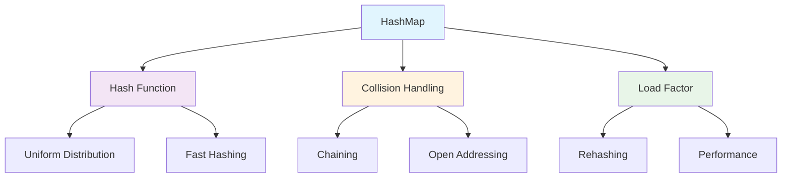
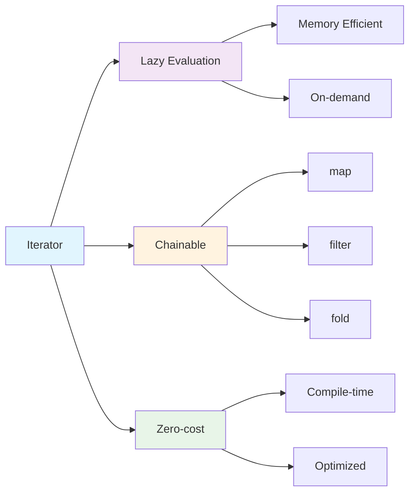

# Módulo 4: Collections e Iterators

## 🎯 Objetivos de Aprendizagem

Ao final deste módulo, você será capaz de:

- Trabalhar com Vec, HashMap e HashSet
- Usar iterators e closures eficientemente
- Aplicar algoritmos funcionais
- Implementar estruturas de dados personalizadas
- Otimizar performance com collections
- Gerenciar dados em estruturas complexas

## 📚 Conteúdo Teórico

### 4.1 Collections - Estruturas de Dados

Collections são estruturas de dados que armazenam múltiplos valores em um único local.

```mermaid
graph TD
    A[Collections] --> B[Vec]
    A --> C[HashMap]
    A --> D[HashSet]
    A --> E[BTreeMap]
    A --> F[BTreeSet]
    A --> G[LinkedList]
    
    B --> H[Dinâmico]
    B --> I[Indexado]
    
    C --> J[Chave-Valor]
    C --> K[O(1) lookup]
    
    D --> L[Únicos]
    D --> M[Sem ordem]
    
    style A fill:#e1f5fe
    style B fill:#f3e5f5
    style C fill:#fff3e0
    style D fill:#e8f5e8
    style E fill:#fce4ec
    style F fill:#f1f8e9
    style G fill:#fff8e1
```

### 4.2 Vec - Vector Dinâmico

```mermaid
graph LR
    A[Vec] --> B[Capacidade]
    A --> C[Elementos]
    A --> D[Operações]
    
    B --> E[Growable]
    B --> F[Memory Layout]
    
    C --> G[Indexed Access]
    C --> H[Push/Pop]
    
    D --> I[O(1) push]
    D --> J[O(1) pop]
    D --> K[O(1) index]
    
    style A fill:#e1f5fe
    style B fill:#f3e5f5
    style C fill:#fff3e0
    style D fill:#e8f5e8
```

### 4.3 HashMap - Tabela de Hash



### 4.4 Iterators - Programação Funcional



## 💻 Exemplos Práticos

### Exemplo 1: Vec - Lista Dinâmica

```rust
// exemplos/vec_examples.rs
fn main() {
    println!("=== Exemplo: Vec - Lista Dinâmica ===");
    
    // Criando um Vec
    let mut numeros = Vec::new();
    
    // Adicionando elementos
    numeros.push(1);
    numeros.push(2);
    numeros.push(3);
    println!("Vec inicial: {:?}", numeros);
    
    // Criando Vec com valores iniciais
    let mut frutas = vec!["maçã", "banana", "laranja"];
    println!("Frutas: {:?}", frutas);
    
    // Acessando elementos
    println!("Primeira fruta: {}", frutas[0]);
    println!("Última fruta: {:?}", frutas.last());
    
    // Modificando elementos
    frutas[1] = "uva";
    println!("Frutas modificadas: {:?}", frutas);
    
    // Removendo elementos
    let removido = frutas.pop();
    println!("Removido: {:?}", removido);
    println!("Frutas após remoção: {:?}", frutas);
    
    // Iterando sobre Vec
    println!("\nIterando sobre frutas:");
    for (indice, fruta) in frutas.iter().enumerate() {
        println!("  {}: {}", indice, fruta);
    }
    
    // Operações com Vec
    let mut numeros = vec![1, 2, 3, 4, 5];
    
    // Filtrar números pares
    let pares: Vec<i32> = numeros.iter()
        .filter(|&x| x % 2 == 0)
        .cloned()
        .collect();
    println!("Números pares: {:?}", pares);
    
    // Mapear para quadrados
    let quadrados: Vec<i32> = numeros.iter()
        .map(|x| x * x)
        .collect();
    println!("Quadrados: {:?}", quadrados);
    
    // Soma dos elementos
    let soma: i32 = numeros.iter().sum();
    println!("Soma: {}", soma);
    
    // Encontrar elemento
    let encontrado = numeros.iter().find(|&&x| x > 3);
    println!("Primeiro elemento > 3: {:?}", encontrado);
    
    // Capacidade e tamanho
    println!("Tamanho: {}", numeros.len());
    println!("Capacidade: {}", numeros.capacity());
    
    // Redimensionar
    numeros.resize(10, 0);
    println!("Após resize: {:?}", numeros);
    
    // Limpar
    numeros.clear();
    println!("Após clear: {:?}", numeros);
}
```

### Exemplo 2: HashMap - Tabela de Hash

```rust
// exemplos/hashmap_examples.rs
use std::collections::HashMap;

fn main() {
    println!("=== Exemplo: HashMap - Tabela de Hash ===");
    
    // Criando um HashMap
    let mut contatos = HashMap::new();
    
    // Inserindo elementos
    contatos.insert("Alice", "123-456-7890");
    contatos.insert("Bob", "098-765-4321");
    contatos.insert("Charlie", "555-123-4567");
    
    println!("Contatos: {:?}", contatos);
    
    // Acessando elementos
    match contatos.get("Alice") {
        Some(telefone) => println!("Telefone da Alice: {}", telefone),
        None => println!("Alice não encontrada"),
    }
    
    // Verificando se existe
    if contatos.contains_key("Bob") {
        println!("Bob está nos contatos");
    }
    
    // Iterando sobre HashMap
    println!("\nTodos os contatos:");
    for (nome, telefone) in &contatos {
        println!("  {}: {}", nome, telefone);
    }
    
    // Atualizando valores
    contatos.insert("Alice", "999-888-7777"); // Substitui
    contatos.entry("David").or_insert("111-222-3333"); // Insere se não existe
    
    println!("\nContatos atualizados: {:?}", contatos);
    
    // Removendo elementos
    let removido = contatos.remove("Bob");
    println!("Removido: {:?}", removido);
    println!("Contatos após remoção: {:?}", contatos);
    
    // Contando ocorrências
    let mut contador = HashMap::new();
    let texto = "hello world";
    
    for char in texto.chars() {
        if char != ' ' {
            let count = contador.entry(char).or_insert(0);
            *count += 1;
        }
    }
    
    println!("\nContagem de caracteres em '{}': {:?}", texto, contador);
    
    // HashMap com tipos customizados
    let mut notas = HashMap::new();
    notas.insert("Matemática", 85);
    notas.insert("Física", 92);
    notas.insert("Química", 78);
    
    // Calculando média
    let soma: i32 = notas.values().sum();
    let media = soma as f64 / notas.len() as f64;
    println!("\nMédia das notas: {:.2}", media);
    
    // Encontrando nota mais alta
    let nota_max = notas.values().max();
    println!("Nota mais alta: {:?}", nota_max);
    
    // Filtrando notas acima da média
    let notas_acima_media: Vec<(&str, &i32)> = notas.iter()
        .filter(|(_, &nota)| nota as f64 > media)
        .collect();
    println!("Notas acima da média: {:?}", notas_acima_media);
}
```

### Exemplo 3: HashSet - Conjunto Único

```rust
// exemplos/hashset_examples.rs
use std::collections::HashSet;

fn main() {
    println!("=== Exemplo: HashSet - Conjunto Único ===");
    
    // Criando um HashSet
    let mut cores = HashSet::new();
    
    // Adicionando elementos
    cores.insert("vermelho");
    cores.insert("verde");
    cores.insert("azul");
    cores.insert("vermelho"); // Duplicado - não será adicionado
    
    println!("Cores: {:?}", cores);
    
    // Verificando se contém
    if cores.contains("verde") {
        println!("Verde está no conjunto");
    }
    
    // Criando HashSet com valores iniciais
    let mut numeros = HashSet::from([1, 2, 3, 4, 5]);
    println!("Números: {:?}", numeros);
    
    // Operações de conjunto
    let pares = HashSet::from([2, 4, 6, 8, 10]);
    let impares = HashSet::from([1, 3, 5, 7, 9]);
    
    // União
    let todos: HashSet<_> = pares.union(&impares).collect();
    println!("União (todos): {:?}", todos);
    
    // Interseção
    let numeros_pares = HashSet::from([1, 2, 3, 4, 5, 6]);
    let multiplos_3 = HashSet::from([3, 6, 9, 12]);
    let interseccao: HashSet<_> = numeros_pares.intersection(&multiplos_3).collect();
    println!("Interseção: {:?}", interseccao);
    
    // Diferença
    let diferenca: HashSet<_> = numeros_pares.difference(&multiplos_3).collect();
    println!("Diferença: {:?}", diferenca);
    
    // Verificando subconjunto
    let conjunto_pequeno = HashSet::from([2, 4]);
    let conjunto_grande = HashSet::from([1, 2, 3, 4, 5]);
    
    if conjunto_pequeno.is_subset(&conjunto_grande) {
        println!("{:?} é subconjunto de {:?}", conjunto_pequeno, conjunto_grande);
    }
    
    // Removendo elementos
    numeros.remove(&3);
    println!("Números após remover 3: {:?}", numeros);
    
    // Limpando
    numeros.clear();
    println!("Após clear: {:?}", numeros);
    
    // Usando HashSet para remover duplicatas
    let lista_com_duplicatas = vec![1, 2, 2, 3, 3, 3, 4, 4, 4, 4];
    let sem_duplicatas: HashSet<_> = lista_com_duplicatas.into_iter().collect();
    println!("Sem duplicatas: {:?}", sem_duplicatas);
}
```

### Exemplo 4: Iterators - Programação Funcional

```rust
// exemplos/iterator_examples.rs
fn main() {
    println!("=== Exemplo: Iterators - Programação Funcional ===");
    
    let numeros = vec![1, 2, 3, 4, 5, 6, 7, 8, 9, 10];
    
    // Iterator básico
    println!("Números originais: {:?}", numeros);
    
    // map - transformar elementos
    let quadrados: Vec<i32> = numeros.iter()
        .map(|x| x * x)
        .collect();
    println!("Quadrados: {:?}", quadrados);
    
    // filter - filtrar elementos
    let pares: Vec<i32> = numeros.iter()
        .filter(|&x| x % 2 == 0)
        .cloned()
        .collect();
    println!("Números pares: {:?}", pares);
    
    // filter_map - filtrar e transformar
    let strings = vec!["1", "2", "abc", "4", "def"];
    let numeros_validos: Vec<i32> = strings.iter()
        .filter_map(|s| s.parse().ok())
        .collect();
    println!("Números válidos: {:?}", numeros_validos);
    
    // take - pegar primeiros N elementos
    let primeiros_5: Vec<i32> = numeros.iter()
        .take(5)
        .cloned()
        .collect();
    println!("Primeiros 5: {:?}", primeiros_5);
    
    // skip - pular primeiros N elementos
    let apos_3: Vec<i32> = numeros.iter()
        .skip(3)
        .cloned()
        .collect();
    println!("Após pular 3: {:?}", primeiros_5);
    
    // take_while - pegar enquanto condição for verdadeira
    let menores_que_6: Vec<i32> = numeros.iter()
        .take_while(|&&x| x < 6)
        .cloned()
        .collect();
    println!("Menores que 6: {:?}", menores_que_6);
    
    // skip_while - pular enquanto condição for verdadeira
    let apos_menor_que_5: Vec<i32> = numeros.iter()
        .skip_while(|&&x| x < 5)
        .cloned()
        .collect();
    println!("Após menores que 5: {:?}", apos_menor_que_5);
    
    // fold - reduzir a um valor
    let soma: i32 = numeros.iter().fold(0, |acc, &x| acc + x);
    println!("Soma: {}", soma);
    
    let produto: i32 = numeros.iter().fold(1, |acc, &x| acc * x);
    println!("Produto: {}", produto);
    
    // reduce - similar ao fold, mas sem valor inicial
    let max = numeros.iter().reduce(|acc, &x| if x > *acc { &x } else { acc });
    println!("Máximo: {:?}", max);
    
    // any - verificar se algum elemento satisfaz condição
    let tem_par = numeros.iter().any(|&x| x % 2 == 0);
    println!("Tem número par: {}", tem_par);
    
    // all - verificar se todos elementos satisfazem condição
    let todos_positivos = numeros.iter().all(|&x| x > 0);
    println!("Todos positivos: {}", todos_positivos);
    
    // find - encontrar primeiro elemento que satisfaz condição
    let primeiro_maior_que_5 = numeros.iter().find(|&&x| x > 5);
    println!("Primeiro maior que 5: {:?}", primeiro_maior_que_5);
    
    // position - encontrar posição do primeiro elemento
    let posicao_do_7 = numeros.iter().position(|&x| x == 7);
    println!("Posição do 7: {:?}", posicao_do_7);
    
    // enumerate - adicionar índices
    println!("Com índices:");
    for (i, &num) in numeros.iter().enumerate() {
        println!("  {}: {}", i, num);
    }
    
    // zip - combinar dois iterators
    let letras = vec!['a', 'b', 'c', 'd'];
    let combinado: Vec<(char, i32)> = letras.iter()
        .zip(numeros.iter())
        .map(|(&l, &n)| (l, n))
        .collect();
    println!("Combinado: {:?}", combinado);
    
    // chain - concatenar iterators
    let mais_numeros = vec![11, 12, 13];
    let todos_numeros: Vec<i32> = numeros.iter()
        .chain(mais_numeros.iter())
        .cloned()
        .collect();
    println!("Todos os números: {:?}", todos_numeros);
    
    // collect em diferentes tipos
    let conjunto: std::collections::HashSet<i32> = numeros.iter().cloned().collect();
    println!("Como HashSet: {:?}", conjunto);
    
    // Demonstração de lazy evaluation
    println!("\nLazy evaluation:");
    let iterator_lazy = numeros.iter()
        .map(|x| {
            println!("  Processando: {}", x);
            x * 2
        })
        .filter(|&x| x > 10);
    
    // Nada é executado ainda
    println!("Iterator criado, mas nada executado ainda");
    
    // Agora sim, quando coletamos
    let resultado: Vec<i32> = iterator_lazy.collect();
    println!("Resultado final: {:?}", resultado);
}
```

## 🎯 Tutorial Prático: Sistema de Gerenciamento de Dados

### Passo 1: Configuração do Projeto

```bash
cargo new sistema_gerenciamento_dados
cd sistema_gerenciamento_dados
```

### Passo 2: Estrutura do Projeto

```
src/
├── main.rs
├── data_manager.rs
├── algorithms.rs
└── utils.rs
```

### Passo 3: Implementação do Sistema

```rust
// src/main.rs
mod data_manager;
mod algorithms;
mod utils;

use std::io;
use data_manager::DataManager;

fn main() {
    println!("=== Sistema de Gerenciamento de Dados ===");
    
    let mut manager = DataManager::new();
    
    // Adicionar dados de exemplo
    manager.add_student("Alice", 85, "Matemática");
    manager.add_student("Bob", 92, "Física");
    manager.add_student("Charlie", 78, "Química");
    manager.add_student("Alice", 88, "Física"); // Alice em outra matéria
    
    loop {
        mostrar_menu();
        
        let escolha = ler_escolha();
        
        match escolha {
            1 => adicionar_dados(&mut manager),
            2 => listar_todos_dados(&manager),
            3 => buscar_por_nome(&manager),
            4 => estatisticas(&manager),
            5 => algoritmos_avancados(&manager),
            6 => {
                println!("Obrigado por usar o sistema!");
                break;
            }
            _ => println!("Opção inválida!"),
        }
    }
}

fn mostrar_menu() {
    println!("\n=== MENU ===");
    println!("1. Adicionar dados");
    println!("2. Listar todos os dados");
    println!("3. Buscar por nome");
    println!("4. Estatísticas");
    println!("5. Algoritmos avançados");
    println!("6. Sair");
    print!("Escolha uma opção: ");
}

fn ler_escolha() -> u32 {
    let mut entrada = String::new();
    io::stdin()
        .read_line(&mut entrada)
        .expect("Falha ao ler entrada");
    
    entrada.trim().parse().unwrap_or(0)
}

fn adicionar_dados(manager: &mut DataManager) {
    println!("Digite o nome:");
    let nome = ler_string();
    
    println!("Digite a nota:");
    let nota = ler_numero();
    
    println!("Digite a matéria:");
    let materia = ler_string();
    
    manager.add_student(&nome, nota, &materia);
    println!("Dados adicionados com sucesso!");
}

fn listar_todos_dados(manager: &DataManager) {
    println!("\n=== TODOS OS DADOS ===");
    for registro in manager.list_all() {
        println!("{}", registro);
    }
}

fn buscar_por_nome(manager: &DataManager) {
    println!("Digite o nome para buscar:");
    let nome = ler_string();
    
    let resultados = manager.search_by_name(&nome);
    if resultados.is_empty() {
        println!("Nenhum registro encontrado para '{}'", nome);
    } else {
        println!("\n=== RESULTADOS ===");
        for registro in resultados {
            println!("{}", registro);
        }
    }
}

fn estatisticas(manager: &DataManager) {
    println!("\n=== ESTATÍSTICAS ===");
    let stats = manager.get_statistics();
    println!("Total de registros: {}", stats.total_records);
    println!("Nota média: {:.2}", stats.average_grade);
    println!("Nota mais alta: {}", stats.highest_grade);
    println!("Nota mais baixa: {}", stats.lowest_grade);
    println!("Matérias únicas: {}", stats.unique_subjects);
    println!("Estudantes únicos: {}", stats.unique_students);
}

fn algoritmos_avancados(manager: &DataManager) {
    println!("\n=== ALGORITMOS AVANÇADOS ===");
    
    let dados = manager.get_all_data();
    
    // Ordenação por nota
    let mut ordenados = dados.clone();
    algorithms::quicksort(&mut ordenados);
    println!("Dados ordenados por nota:");
    for registro in &ordenados {
        println!("  {}", registro);
    }
    
    // Busca binária
    if let Some(posicao) = algorithms::binary_search(&ordenados, 85) {
        println!("\nNota 85 encontrada na posição: {}", posicao);
    } else {
        println!("\nNota 85 não encontrada");
    }
    
    // Agrupamento por matéria
    let agrupados = algorithms::group_by_subject(&dados);
    println!("\nAgrupamento por matéria:");
    for (materia, registros) in agrupados {
        println!("  {}: {} registros", materia, registros.len());
    }
}

fn ler_string() -> String {
    let mut entrada = String::new();
    io::stdin()
        .read_line(&mut entrada)
        .expect("Falha ao ler entrada");
    entrada.trim().to_string()
}

fn ler_numero() -> u32 {
    let mut entrada = String::new();
    io::stdin()
        .read_line(&mut entrada)
        .expect("Falha ao ler entrada");
    entrada.trim().parse().unwrap_or(0)
}
```

```rust
// src/data_manager.rs
use std::collections::{HashMap, HashSet};

#[derive(Debug, Clone)]
pub struct StudentRecord {
    pub name: String,
    pub grade: u32,
    pub subject: String,
}

impl std::fmt::Display for StudentRecord {
    fn fmt(&self, f: &mut std::fmt::Formatter<'_>) -> std::fmt::Result {
        write!(f, "{} - {} (Nota: {})", self.name, self.subject, self.grade)
    }
}

pub struct DataManager {
    records: Vec<StudentRecord>,
    name_index: HashMap<String, Vec<usize>>,
    subject_index: HashMap<String, Vec<usize>>,
}

#[derive(Debug)]
pub struct Statistics {
    pub total_records: usize,
    pub average_grade: f64,
    pub highest_grade: u32,
    pub lowest_grade: u32,
    pub unique_subjects: usize,
    pub unique_students: usize,
}

impl DataManager {
    pub fn new() -> Self {
        DataManager {
            records: Vec::new(),
            name_index: HashMap::new(),
            subject_index: HashMap::new(),
        }
    }
    
    pub fn add_student(&mut self, name: &str, grade: u32, subject: &str) {
        let record = StudentRecord {
            name: name.to_string(),
            grade,
            subject: subject.to_string(),
        };
        
        let index = self.records.len();
        self.records.push(record);
        
        // Atualizar índices
        self.name_index
            .entry(name.to_string())
            .or_insert_with(Vec::new)
            .push(index);
            
        self.subject_index
            .entry(subject.to_string())
            .or_insert_with(Vec::new)
            .push(index);
    }
    
    pub fn list_all(&self) -> &Vec<StudentRecord> {
        &self.records
    }
    
    pub fn get_all_data(&self) -> Vec<StudentRecord> {
        self.records.clone()
    }
    
    pub fn search_by_name(&self, name: &str) -> Vec<StudentRecord> {
        match self.name_index.get(name) {
            Some(indices) => {
                indices.iter()
                    .map(|&i| self.records[i].clone())
                    .collect()
            }
            None => Vec::new(),
        }
    }
    
    pub fn search_by_subject(&self, subject: &str) -> Vec<StudentRecord> {
        match self.subject_index.get(subject) {
            Some(indices) => {
                indices.iter()
                    .map(|&i| self.records[i].clone())
                    .collect()
            }
            None => Vec::new(),
        }
    }
    
    pub fn get_statistics(&self) -> Statistics {
        if self.records.is_empty() {
            return Statistics {
                total_records: 0,
                average_grade: 0.0,
                highest_grade: 0,
                lowest_grade: 0,
                unique_subjects: 0,
                unique_students: 0,
            };
        }
        
        let total_records = self.records.len();
        let sum: u32 = self.records.iter().map(|r| r.grade).sum();
        let average_grade = sum as f64 / total_records as f64;
        
        let grades: Vec<u32> = self.records.iter().map(|r| r.grade).collect();
        let highest_grade = *grades.iter().max().unwrap();
        let lowest_grade = *grades.iter().min().unwrap();
        
        let unique_subjects: HashSet<String> = self.records.iter()
            .map(|r| r.subject.clone())
            .collect();
            
        let unique_students: HashSet<String> = self.records.iter()
            .map(|r| r.name.clone())
            .collect();
        
        Statistics {
            total_records,
            average_grade,
            highest_grade,
            lowest_grade,
            unique_subjects: unique_subjects.len(),
            unique_students: unique_students.len(),
        }
    }
    
    pub fn get_top_students(&self, n: usize) -> Vec<StudentRecord> {
        let mut sorted_records = self.records.clone();
        sorted_records.sort_by(|a, b| b.grade.cmp(&a.grade));
        sorted_records.into_iter().take(n).collect()
    }
    
    pub fn get_subject_averages(&self) -> HashMap<String, f64> {
        let mut subject_totals: HashMap<String, (u32, u32)> = HashMap::new();
        
        for record in &self.records {
            let entry = subject_totals.entry(record.subject.clone()).or_insert((0, 0));
            entry.0 += record.grade;
            entry.1 += 1;
        }
        
        subject_totals.iter()
            .map(|(subject, (total, count))| {
                (subject.clone(), *total as f64 / *count as f64)
            })
            .collect()
    }
}
```

```rust
// src/algorithms.rs
use std::collections::HashMap;
use crate::data_manager::StudentRecord;

pub fn quicksort(records: &mut [StudentRecord]) {
    if records.len() <= 1 {
        return;
    }
    
    let pivot = partition(records);
    quicksort(&mut records[..pivot]);
    quicksort(&mut records[pivot + 1..]);
}

fn partition(records: &mut [StudentRecord]) -> usize {
    let len = records.len();
    let pivot_index = len - 1;
    let mut i = 0;
    
    for j in 0..pivot_index {
        if records[j].grade <= records[pivot_index].grade {
            records.swap(i, j);
            i += 1;
        }
    }
    
    records.swap(i, pivot_index);
    i
}

pub fn binary_search(records: &[StudentRecord], target_grade: u32) -> Option<usize> {
    let mut left = 0;
    let mut right = records.len();
    
    while left < right {
        let mid = left + (right - left) / 2;
        
        if records[mid].grade == target_grade {
            return Some(mid);
        } else if records[mid].grade < target_grade {
            left = mid + 1;
        } else {
            right = mid;
        }
    }
    
    None
}

pub fn group_by_subject(records: &[StudentRecord]) -> HashMap<String, Vec<StudentRecord>> {
    let mut groups = HashMap::new();
    
    for record in records {
        groups.entry(record.subject.clone())
            .or_insert_with(Vec::new)
            .push(record.clone());
    }
    
    groups
}

pub fn merge_sort(records: &mut [StudentRecord]) {
    if records.len() <= 1 {
        return;
    }
    
    let mid = records.len() / 2;
    merge_sort(&mut records[..mid]);
    merge_sort(&mut records[mid..]);
    merge(records, mid);
}

fn merge(records: &mut [StudentRecord], mid: usize) {
    let left = records[..mid].to_vec();
    let right = records[mid..].to_vec();
    
    let mut i = 0;
    let mut j = 0;
    let mut k = 0;
    
    while i < left.len() && j < right.len() {
        if left[i].grade <= right[j].grade {
            records[k] = left[i].clone();
            i += 1;
        } else {
            records[k] = right[j].clone();
            j += 1;
        }
        k += 1;
    }
    
    while i < left.len() {
        records[k] = left[i].clone();
        i += 1;
        k += 1;
    }
    
    while j < right.len() {
        records[k] = right[j].clone();
        j += 1;
        k += 1;
    }
}

pub fn linear_search(records: &[StudentRecord], target_name: &str) -> Option<usize> {
    for (i, record) in records.iter().enumerate() {
        if record.name == target_name {
            return Some(i);
        }
    }
    None
}

pub fn bubble_sort(records: &mut [StudentRecord]) {
    let n = records.len();
    
    for i in 0..n {
        for j in 0..n - i - 1 {
            if records[j].grade > records[j + 1].grade {
                records.swap(j, j + 1);
            }
        }
    }
}

#[cfg(test)]
mod tests {
    use super::*;
    
    #[test]
    fn test_quicksort() {
        let mut records = vec![
            StudentRecord { name: "A".to_string(), grade: 3, subject: "Math".to_string() },
            StudentRecord { name: "B".to_string(), grade: 1, subject: "Math".to_string() },
            StudentRecord { name: "C".to_string(), grade: 2, subject: "Math".to_string() },
        ];
        
        quicksort(&mut records);
        
        assert_eq!(records[0].grade, 1);
        assert_eq!(records[1].grade, 2);
        assert_eq!(records[2].grade, 3);
    }
    
    #[test]
    fn test_binary_search() {
        let records = vec![
            StudentRecord { name: "A".to_string(), grade: 1, subject: "Math".to_string() },
            StudentRecord { name: "B".to_string(), grade: 2, subject: "Math".to_string() },
            StudentRecord { name: "C".to_string(), grade: 3, subject: "Math".to_string() },
        ];
        
        assert_eq!(binary_search(&records, 2), Some(1));
        assert_eq!(binary_search(&records, 4), None);
    }
}
```

```rust
// src/utils.rs
use std::collections::HashSet;
use crate::data_manager::StudentRecord;

pub fn remove_duplicates(records: Vec<StudentRecord>) -> Vec<StudentRecord> {
    let mut seen = HashSet::new();
    let mut result = Vec::new();
    
    for record in records {
        let key = format!("{}-{}-{}", record.name, record.grade, record.subject);
        if seen.insert(key) {
            result.push(record);
        }
    }
    
    result
}

pub fn calculate_median(records: &[StudentRecord]) -> f64 {
    if records.is_empty() {
        return 0.0;
    }
    
    let mut grades: Vec<u32> = records.iter().map(|r| r.grade).collect();
    grades.sort();
    
    let len = grades.len();
    if len % 2 == 0 {
        (grades[len / 2 - 1] + grades[len / 2]) as f64 / 2.0
    } else {
        grades[len / 2] as f64
    }
}

pub fn calculate_mode(records: &[StudentRecord]) -> u32 {
    if records.is_empty() {
        return 0;
    }
    
    let mut grade_counts = std::collections::HashMap::new();
    
    for record in records {
        let count = grade_counts.entry(record.grade).or_insert(0);
        *count += 1;
    }
    
    grade_counts.iter()
        .max_by_key(|(_, &count)| count)
        .map(|(&grade, _)| grade)
        .unwrap_or(0)
}

pub fn filter_by_grade_range(records: &[StudentRecord], min: u32, max: u32) -> Vec<StudentRecord> {
    records.iter()
        .filter(|record| record.grade >= min && record.grade <= max)
        .cloned()
        .collect()
}

pub fn get_unique_subjects(records: &[StudentRecord]) -> Vec<String> {
    let subjects: HashSet<String> = records.iter()
        .map(|r| r.subject.clone())
        .collect();
    
    let mut result: Vec<String> = subjects.into_iter().collect();
    result.sort();
    result
}

#[cfg(test)]
mod tests {
    use super::*;
    
    #[test]
    fn test_remove_duplicates() {
        let records = vec![
            StudentRecord { name: "A".to_string(), grade: 85, subject: "Math".to_string() },
            StudentRecord { name: "A".to_string(), grade: 85, subject: "Math".to_string() },
            StudentRecord { name: "B".to_string(), grade: 90, subject: "Physics".to_string() },
        ];
        
        let result = remove_duplicates(records);
        assert_eq!(result.len(), 2);
    }
    
    #[test]
    fn test_calculate_median() {
        let records = vec![
            StudentRecord { name: "A".to_string(), grade: 80, subject: "Math".to_string() },
            StudentRecord { name: "B".to_string(), grade: 90, subject: "Math".to_string() },
            StudentRecord { name: "C".to_string(), grade: 85, subject: "Math".to_string() },
        ];
        
        assert_eq!(calculate_median(&records), 85.0);
    }
}
```

## 🎯 Atividades Práticas

### Atividade 1: Sistema de Vendas

Implemente um sistema de vendas com collections:

**Requisitos:**
- Produtos com HashMap
- Carrinho de compras com Vec
- Clientes únicos com HashSet
- Relatórios com iterators

### Atividade 2: Análise de Dados

Crie um sistema de análise de dados:

**Funcionalidades:**
- Leitura de arquivos CSV
- Agrupamento por categorias
- Estatísticas descritivas
- Visualização de tendências

### Atividade 3: Cache Inteligente

Desenvolva um sistema de cache:

**Características:**
- LRU com HashMap
- TTL com BTreeMap
- Estatísticas de hit/miss
- Algoritmos de eviction

## 📝 Exercícios de Fixação

1. **Pergunta:** Qual a diferença entre Vec e HashMap?
   - Resposta: Vec é uma lista indexada sequencial, HashMap é uma tabela de hash com chave-valor

2. **Pergunta:** Como funciona o lazy evaluation em iterators?
   - Resposta: Os iterators só executam quando você chama collect() ou usa em um loop, economizando memória

3. **Pergunta:** Quando usar HashSet vs Vec?
   - Resposta: HashSet para elementos únicos e busca rápida, Vec para elementos ordenados e acesso por índice

4. **Pergunta:** O que é a complexidade O(1) em HashMap?
   - Resposta: É o tempo constante para inserção, remoção e busca, independente do tamanho da coleção

## 🔗 Próximos Passos

No próximo módulo, você aprenderá a:

- Tratar erros com Result e Option
- Implementar error handling robusto
- Criar tipos de erro customizados
- Propagar erros de forma segura

## 📚 Recursos Adicionais

- [Collections - The Rust Book](https://doc.rust-lang.org/book/ch08-00-common-collections.html)
- [Iterators - The Rust Book](https://doc.rust-lang.org/book/ch13-00-functional-features.html)
- [HashMap Documentation](https://doc.rust-lang.org/std/collections/struct.HashMap.html)

---

**Professor:** Jackson Sá  
**ETEC Bento Quirino - Campinas/SP**
