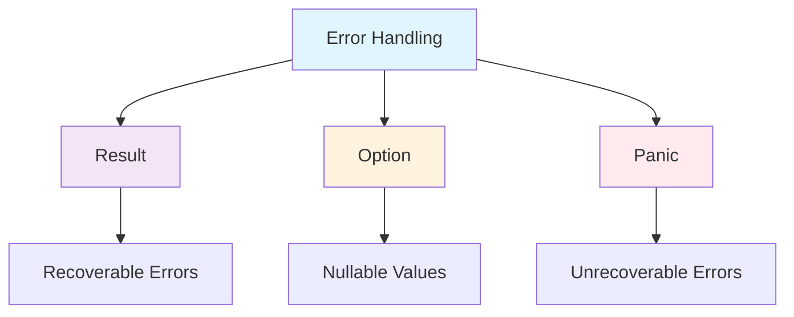

# Módulo 5: Error Handling e Result

## 🎯 Objetivos de Aprendizagem

Ao final deste módulo, você será capaz de:

- ✅ Dominar Result<T, E> e Option<T>
- ✅ Implementar error handling robusto
- ✅ Criar tipos de erro customizados
- ✅ Propagar erros de forma segura
- ✅ Usar ? operator eficientemente

## 📋 **Pré-requisitos**

### **Obrigatórios**
- ✅ **Conhecimento básico de programação** - Variáveis, funções, estruturas de controle
- ✅ **Rust (versão 1.70 ou superior)** - [Instalar Rust](https://rustup.rs/)
- ✅ **Cargo (gerenciador de pacotes)** - Instalado automaticamente com Rust
- ✅ **Editor de código** - [VS Code com rust-analyzer](https://marketplace.visualstudio.com/items?itemName=rust-lang.rust-analyzer) recomendado
- ✅ **Git** - Para controle de versão
- ✅ **Conclusão do Módulo 4** - [Collections e Iterators](../modulo-04-collections-iterators/README.md)

### **Recomendados**
- ✅ **Familiaridade com linha de comando** - Terminal/CMD básico
- ✅ **Conceitos básicos de programação funcional** - Funções, imutabilidade
- ✅ **Experiência com outras linguagens** - C/C++, Python, JavaScript, etc.
- ✅ **Conceitos de sistemas operacionais** - Memória, processos, threads

### **Recursos de Preparação**
- [**Rustlings**](https://github.com/rust-lang/rustlings) - Exercícios interativos para iniciantes
- [**The Rust Book**](https://doc.rust-lang.org/book/) - Documentação oficial completa
- [**Rust by Example**](https://doc.rust-lang.org/rust-by-example/) - Exemplos práticos
- [**Rust Playground**](https://play.rust-lang.org/) - Ambiente online para experimentar

## 📚 **Recursos de Aprendizado**

### **Documentação Oficial**
- [**The Rust Book - Error Handling**](https://doc.rust-lang.org/book/ch09-00-error-handling.html)
- [**Rust by Example - Error Handling**](https://doc.rust-lang.org/rust-by-example/error.html)
- [**Rustlings - Error Handling**](https://github.com/rust-lang/rustlings) - Exercícios interativos
- [**Rust Reference - Error Handling**](https://doc.rust-lang.org/reference/errors.html)

### **Comunidades e Fóruns**
- [**Reddit r/rust**](https://reddit.com/r/rust) - Comunidade ativa
- [**Rust Users Forum**](https://users.rust-lang.org/) - Fórum oficial
- [**Stack Overflow**](https://stackoverflow.com/questions/tagged/rust) - Perguntas e respostas
- [**Rust Discord**](https://discord.gg/rust-lang) - Chat em tempo real

## 📖 **Índice do Módulo**

- [**Objetivos de Aprendizagem**](#-objetivos-de-aprendizagem)
- [**Pré-requisitos**](#-pré-requisitos)
- [**Recursos de Aprendizado**](#-recursos-de-aprendizado)
- [**Conteúdo Teórico**](#-conteúdo-teórico)
- [**Exemplos Práticos**](#-exemplos-práticos)
- [**Tutorial Prático**](#-tutorial-prático-sistema-de-arquivos)
- [**Atividades Práticas**](#-atividades-práticas)
- [**Exercícios de Fixação**](#-exercícios-de-fixação)
- [**Próximos Passos**](#-próximos-passos)
- [**Navegação**](#-navegação)

## 📚 Conteúdo Teórico

### 5.1 Result vs Panic



### 5.2 Error Propagation

```rust
// exemplos/error_handling.rs
use std::fs::File;
use std::io::{self, Read};
use std::num::ParseIntError;

// Função que pode falhar
fn ler_arquivo(caminho: &str) -> Result<String, io::Error> {
    let mut arquivo = File::open(caminho)?;
    let mut conteudo = String::new();
    arquivo.read_to_string(&mut conteudo)?;
    Ok(conteudo)
}

// Função que converte string para número
fn parsear_numero(s: &str) -> Result<i32, ParseIntError> {
    s.parse::<i32>()
}

// Função que combina operações que podem falhar
fn processar_arquivo(caminho: &str) -> Result<i32, Box<dyn std::error::Error>> {
    let conteudo = ler_arquivo(caminho)?;
    let numero = parsear_numero(&conteudo.trim())?;
    Ok(numero * 2)
}

fn main() {
    // Usando match para tratar Result
    match processar_arquivo("numero.txt") {
        Ok(valor) => println!("Resultado: {}", valor),
        Err(e) => println!("Erro: {}", e),
    }
    
    // Usando unwrap_or para valor padrão
    let resultado = processar_arquivo("numero.txt").unwrap_or(0);
    println!("Resultado com padrão: {}", resultado);
    
    // Usando if let
    if let Ok(valor) = processar_arquivo("numero.txt") {
        println!("Sucesso: {}", valor);
    }
}
```

## 🎯 Tutorial Prático: Sistema de Arquivos

### Implementação Completa

```rust
// src/main.rs
mod file_manager;
mod error_types;

use std::io;
use file_manager::FileManager;
use error_types::{FileError, FileResult};

fn main() {
    println!("=== Sistema de Arquivos ===");
    
    let mut manager = FileManager::new();
    
    loop {
        mostrar_menu();
        let escolha = ler_escolha();
        
        match escolha {
            1 => criar_arquivo(&mut manager),
            2 => ler_arquivo(&manager),
            3 => escrever_arquivo(&mut manager),
            4 => listar_arquivos(&manager),
            5 => deletar_arquivo(&mut manager),
            6 => {
                println!("Saindo...");
                break;
            }
            _ => println!("Opção inválida!"),
        }
    }
}

fn mostrar_menu() {
    println!("\n=== MENU ===");
    println!("1. Criar arquivo");
    println!("2. Ler arquivo");
    println!("3. Escrever em arquivo");
    println!("4. Listar arquivos");
    println!("5. Deletar arquivo");
    println!("6. Sair");
    print!("Escolha: ");
}

fn ler_escolha() -> u32 {
    let mut entrada = String::new();
    io::stdin().read_line(&mut entrada).expect("Erro ao ler entrada");
    entrada.trim().parse().unwrap_or(0)
}

fn criar_arquivo(manager: &mut FileManager) {
    println!("Nome do arquivo:");
    let nome = ler_string();
    println!("Conteúdo inicial:");
    let conteudo = ler_string();
    
    match manager.criar_arquivo(&nome, &conteudo) {
        Ok(()) => println!("Arquivo criado com sucesso!"),
        Err(e) => println!("Erro: {}", e),
    }
}

fn ler_arquivo(manager: &FileManager) {
    println!("Nome do arquivo:");
    let nome = ler_string();
    
    match manager.ler_arquivo(&nome) {
        Ok(conteudo) => println!("Conteúdo:\n{}", conteudo),
        Err(e) => println!("Erro: {}", e),
    }
}

fn escrever_arquivo(manager: &mut FileManager) {
    println!("Nome do arquivo:");
    let nome = ler_string();
    println!("Conteúdo para adicionar:");
    let conteudo = ler_string();
    
    match manager.escrever_arquivo(&nome, &conteudo) {
        Ok(()) => println!("Arquivo escrito com sucesso!"),
        Err(e) => println!("Erro: {}", e),
    }
}

fn listar_arquivos(manager: &FileManager) {
    match manager.listar_arquivos() {
        Ok(arquivos) => {
            println!("Arquivos disponíveis:");
            for arquivo in arquivos {
                println!("  {}", arquivo);
            }
        }
        Err(e) => println!("Erro: {}", e),
    }
}

fn deletar_arquivo(manager: &mut FileManager) {
    println!("Nome do arquivo:");
    let nome = ler_string();
    
    match manager.deletar_arquivo(&nome) {
        Ok(()) => println!("Arquivo deletado com sucesso!"),
        Err(e) => println!("Erro: {}", e),
    }
}

fn ler_string() -> String {
    let mut entrada = String::new();
    io::stdin().read_line(&mut entrada).expect("Erro ao ler entrada");
    entrada.trim().to_string()
}
```

```rust
// src/error_types.rs
use std::fmt;
use std::io;

#[derive(Debug)]
pub enum FileError {
    IoError(io::Error),
    FileNotFound(String),
    PermissionDenied(String),
    InvalidName(String),
}

impl fmt::Display for FileError {
    fn fmt(&self, f: &mut fmt::Formatter) -> fmt::Result {
        match self {
            FileError::IoError(e) => write!(f, "Erro de I/O: {}", e),
            FileError::FileNotFound(name) => write!(f, "Arquivo não encontrado: {}", name),
            FileError::PermissionDenied(name) => write!(f, "Permissão negada para: {}", name),
            FileError::InvalidName(name) => write!(f, "Nome inválido: {}", name),
        }
    }
}

impl std::error::Error for FileError {}

impl From<io::Error> for FileError {
    fn from(error: io::Error) -> Self {
        FileError::IoError(error)
    }
}

pub type FileResult<T> = Result<T, FileError>;
```

```rust
// src/file_manager.rs
use std::collections::HashMap;
use std::fs::{self, File};
use std::io::Write;
use crate::error_types::{FileError, FileResult};

pub struct FileManager {
    arquivos: HashMap<String, String>,
}

impl FileManager {
    pub fn new() -> Self {
        FileManager {
            arquivos: HashMap::new(),
        }
    }
    
    pub fn criar_arquivo(&mut self, nome: &str, conteudo: &str) -> FileResult<()> {
        if nome.is_empty() || nome.contains('/') {
            return Err(FileError::InvalidName(nome.to_string()));
        }
        
        self.arquivos.insert(nome.to_string(), conteudo.to_string());
        
        // Salvar no disco
        let mut arquivo = File::create(nome)?;
        arquivo.write_all(conteudo.as_bytes())?;
        
        Ok(())
    }
    
    pub fn ler_arquivo(&self, nome: &str) -> FileResult<String> {
        // Tentar ler da memória primeiro
        if let Some(conteudo) = self.arquivos.get(nome) {
            return Ok(conteudo.clone());
        }
        
        // Tentar ler do disco
        let conteudo = fs::read_to_string(nome)?;
        Ok(conteudo)
    }
    
    pub fn escrever_arquivo(&mut self, nome: &str, conteudo: &str) -> FileResult<()> {
        if !self.arquivos.contains_key(nome) {
            return Err(FileError::FileNotFound(nome.to_string()));
        }
        
        self.arquivos.insert(nome.to_string(), conteudo.to_string());
        
        // Salvar no disco
        let mut arquivo = File::create(nome)?;
        arquivo.write_all(conteudo.as_bytes())?;
        
        Ok(())
    }
    
    pub fn listar_arquivos(&self) -> FileResult<Vec<String>> {
        let mut arquivos: Vec<String> = self.arquivos.keys().cloned().collect();
        arquivos.sort();
        Ok(arquivos)
    }
    
    pub fn deletar_arquivo(&mut self, nome: &str) -> FileResult<()> {
        if !self.arquivos.contains_key(nome) {
            return Err(FileError::FileNotFound(nome.to_string()));
        }
        
        self.arquivos.remove(nome);
        fs::remove_file(nome)?;
        
        Ok(())
    }
}
```

## 🎯 Atividades Práticas

### Atividade 1: Validador de Dados
Implemente um sistema que valide dados de entrada com tratamento de erros robusto.

### Atividade 2: Cliente HTTP
Crie um cliente HTTP que trate diferentes tipos de erro de rede.

### Atividade 3: Parser de Configuração
Desenvolva um parser que trate erros de sintaxe e validação.

## 📝 Exercícios de Fixação

1. **Pergunta:** Quando usar Result vs Option?
   - Resposta: Result para operações que podem falhar com erro específico, Option para valores que podem não existir

2. **Pergunta:** O que faz o operador ??
   - Resposta: Propaga erros automaticamente, retornando o erro se houver ou desempacotando o valor se for Ok

3. **Pergunta:** Como criar tipos de erro customizados?
   - Resposta: Implementando a trait std::error::Error e Display para formatação

## 🔗 Próximos Passos

No próximo módulo, você aprenderá a:

- Dominar threads e channels
- Usar Mutex e Arc para dados compartilhados
- Implementar async/await
- Criar sistemas concorrentes seguros

## 🧭 **Navegação**

### **📚 Material de Apoio**
- [**README Principal**](../../README.md) - Visão geral do curso
- [**Tutoriais Detalhados**](../../TUTORIAIS.md) - Guia completo de tutoriais
- [**Módulo 4: Collections**](../modulo-04-collections-iterators/README.md) - Módulo anterior
- [**Módulo 6: Concorrência**](../modulo-06-concorrencia/README.md) - Próximo módulo
- [**Módulo Embarcados**](../modulo-embarcados/README.md) - Desenvolvimento IoT

### **🔗 Links Úteis**
- [Comunidade Rust Brasil](https://github.com/rust-br)
- [Documentação Oficial](https://doc.rust-lang.org/)
- [Rust Playground](https://play.rust-lang.org/)
- [Crates.io](https://crates.io/)

### **📖 Documentação Oficial**
- [The Rust Book](https://doc.rust-lang.org/book/)
- [Rust by Example](https://doc.rust-lang.org/rust-by-example/)
- [Rustlings](https://github.com/rust-lang/rustlings)
- [Cargo Book](https://doc.rust-lang.org/cargo/)

---

**Professor:** Jackson Sá  
**ETEC Bento Quirino - Campinas/SP**
