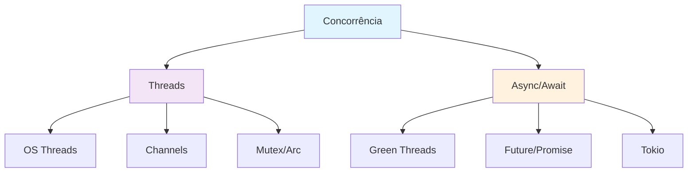

# Módulo 6: Concorrência e Threads

## 🎯 Objetivos de Aprendizagem

Ao final deste módulo, você será capaz de:

- ✅ Dominar threads e channels
- ✅ Usar Mutex e Arc para dados compartilhados
- ✅ Implementar async/await
- ✅ Criar sistemas concorrentes seguros

## 📋 **Pré-requisitos**

### **Obrigatórios**
- ✅ **Conhecimento básico de programação** - Variáveis, funções, estruturas de controle
- ✅ **Rust (versão 1.70 ou superior)** - [Instalar Rust](https://rustup.rs/)
- ✅ **Cargo (gerenciador de pacotes)** - Instalado automaticamente com Rust
- ✅ **Editor de código** - [VS Code com rust-analyzer](https://marketplace.visualstudio.com/items?itemName=rust-lang.rust-analyzer) recomendado
- ✅ **Git** - Para controle de versão
- ✅ **Conclusão do Módulo 5** - [Error Handling e Result](../modulo-05-error-handling/README.md)

### **Recomendados**
- ✅ **Familiaridade com linha de comando** - Terminal/CMD básico
- ✅ **Conceitos básicos de programação funcional** - Funções, imutabilidade
- ✅ **Experiência com outras linguagens** - C/C++, Python, JavaScript, etc.
- ✅ **Conceitos de sistemas operacionais** - Memória, processos, threads

### **Recursos de Preparação**
- [**Rustlings**](https://github.com/rust-lang/rustlings) - Exercícios interativos para iniciantes
- [**The Rust Book**](https://doc.rust-lang.org/book/) - Documentação oficial completa
- [**Rust by Example**](https://doc.rust-lang.org/rust-by-example/) - Exemplos práticos
- [**Rust Playground**](https://play.rust-lang.org/) - Ambiente online para experimentar

## 📚 **Recursos de Aprendizado**

### **Documentação Oficial**
- [**The Rust Book - Concurrency**](https://doc.rust-lang.org/book/ch16-00-concurrency.html)
- [**Rust by Example - Concurrency**](https://doc.rust-lang.org/rust-by-example/std_misc.html)
- [**Rustlings - Concurrency**](https://github.com/rust-lang/rustlings) - Exercícios interativos
- [**Tokio Documentation**](https://tokio.rs/) - Async runtime para Rust

### **Comunidades e Fóruns**
- [**Reddit r/rust**](https://reddit.com/r/rust) - Comunidade ativa
- [**Rust Users Forum**](https://users.rust-lang.org/) - Fórum oficial
- [**Stack Overflow**](https://stackoverflow.com/questions/tagged/rust) - Perguntas e respostas
- [**Rust Discord**](https://discord.gg/rust-lang) - Chat em tempo real

## 📖 **Índice do Módulo**

- [**Objetivos de Aprendizagem**](#-objetivos-de-aprendizagem)
- [**Pré-requisitos**](#-pré-requisitos)
- [**Recursos de Aprendizado**](#-recursos-de-aprendizado)
- [**Conteúdo Teórico**](#-conteúdo-teórico)
- [**Exemplos Práticos**](#-exemplos-práticos)
- [**Tutorial Prático**](#-tutorial-prático-servidor-web-simples)
- [**Atividades Práticas**](#-atividades-práticas)
- [**Exercícios de Fixação**](#-exercícios-de-fixação)
- [**Próximos Passos**](#-próximos-passos)
- [**Navegação**](#-navegação)

## 📚 Conteúdo Teórico

### 6.1 Threads vs Async



### 6.2 Exemplo Prático: Servidor Web

```rust
// exemplos/servidor_web.rs
use std::thread;
use std::net::{TcpListener, TcpStream};
use std::io::{Read, Write};
use std::sync::{Arc, Mutex};
use std::collections::HashMap;

type SharedData = Arc<Mutex<HashMap<String, String>>>;

fn main() {
    let listener = TcpListener::bind("127.0.0.1:8080").unwrap();
    let shared_data: SharedData = Arc::new(Mutex::new(HashMap::new()));
    
    println!("Servidor rodando em http://127.0.0.1:8080");
    
    for stream in listener.incoming() {
        let stream = stream.unwrap();
        let data = Arc::clone(&shared_data);
        
        thread::spawn(move || {
            handle_connection(stream, data);
        });
    }
}

fn handle_connection(mut stream: TcpStream, data: SharedData) {
    let mut buffer = [0; 1024];
    stream.read(&mut buffer).unwrap();
    
    let request = String::from_utf8_lossy(&buffer[..]);
    let response = process_request(&request, &data);
    
    stream.write(response.as_bytes()).unwrap();
    stream.flush().unwrap();
}

fn process_request(request: &str, data: &SharedData) -> String {
    if request.contains("GET /") {
        let data_guard = data.lock().unwrap();
        let count = data_guard.len();
        format!(
            "HTTP/1.1 200 OK\r\n\r\n<h1>Servidor Rust</h1><p>Requisições: {}</p>",
            count
        )
    } else {
        "HTTP/1.1 404 NOT FOUND\r\n\r\n".to_string()
    }
}
```

## 🎯 Tutorial Prático: Sistema de Chat

### Implementação Completa

```rust
// src/main.rs
mod chat_server;
mod client_handler;

use chat_server::ChatServer;

fn main() {
    println!("=== Servidor de Chat Rust ===");
    
    let server = ChatServer::new("127.0.0.1:8080");
    server.run();
}
```

```rust
// src/chat_server.rs
use std::net::{TcpListener, TcpStream};
use std::thread;
use std::sync::{Arc, Mutex};
use std::collections::HashMap;
use std::io::{Read, Write};

pub struct ChatServer {
    address: String,
    clients: Arc<Mutex<HashMap<String, TcpStream>>>,
}

impl ChatServer {
    pub fn new(address: &str) -> Self {
        ChatServer {
            address: address.to_string(),
            clients: Arc::new(Mutex::new(HashMap::new())),
        }
    }
    
    pub fn run(&self) {
        let listener = TcpListener::bind(&self.address).unwrap();
        println!("Servidor rodando em {}", self.address);
        
        for stream in listener.incoming() {
            let stream = stream.unwrap();
            let clients = Arc::clone(&self.clients);
            
            thread::spawn(move || {
                Self::handle_client(stream, clients);
            });
        }
    }
    
    fn handle_client(mut stream: TcpStream, clients: Arc<Mutex<HashMap<String, TcpStream>>>) {
        let mut buffer = [0; 1024];
        
        loop {
            match stream.read(&mut buffer) {
                Ok(0) => break,
                Ok(size) => {
                    let message = String::from_utf8_lossy(&buffer[..size]);
                    println!("Mensagem recebida: {}", message);
                    
                    // Broadcast para outros clientes
                    Self::broadcast_message(&message, &clients, &stream);
                }
                Err(_) => break,
            }
        }
    }
    
    fn broadcast_message(message: &str, clients: &Arc<Mutex<HashMap<String, TcpStream>>>, sender: &TcpStream) {
        let mut clients_guard = clients.lock().unwrap();
        
        for (name, client_stream) in clients_guard.iter_mut() {
            if !std::ptr::eq(client_stream, sender) {
                let _ = client_stream.write(message.as_bytes());
                let _ = client_stream.flush();
            }
        }
    }
}
```

## 🎯 Atividades Práticas

### Atividade 1: Sistema de Download
Implemente um sistema de download paralelo com threads.

### Atividade 2: Cache Distribuído
Crie um sistema de cache que funcione entre múltiplas threads.

### Atividade 3: Processador de Imagens
Desenvolva um processador que use múltiplas threads para melhor performance.

## 📝 Exercícios de Fixação

1. **Pergunta:** Qual a diferença entre threads e async/await?
   - Resposta: Threads usam OS threads (mais pesados), async/await usa green threads (mais leves)

2. **Pergunta:** Quando usar Mutex vs Arc?
   - Resposta: Mutex para sincronização, Arc para compartilhamento de ownership entre threads

3. **Pergunta:** O que são data races?
   - Resposta: Acesso simultâneo a dados mutáveis sem sincronização, que Rust previne em tempo de compilação

## 🔗 Próximos Passos

No próximo módulo, você aprenderá a:

- Definir e implementar traits
- Trabalhar com generics
- Criar código reutilizável
- Aplicar polimorfismo

## 🧭 **Navegação**

### **📚 Material de Apoio**
- [**README Principal**](../../README.md) - Visão geral do curso
- [**Tutoriais Detalhados**](../../TUTORIAIS.md) - Guia completo de tutoriais
- [**Módulo 5: Error Handling**](../modulo-05-error-handling/README.md) - Módulo anterior
- [**Módulo 7: Traits/Generics**](../modulo-07-traits-generics/README.md) - Próximo módulo
- [**Módulo Embarcados**](../modulo-embarcados/README.md) - Desenvolvimento IoT

### **🔗 Links Úteis**
- [Comunidade Rust Brasil](https://github.com/rust-br)
- [Documentação Oficial](https://doc.rust-lang.org/)
- [Rust Playground](https://play.rust-lang.org/)
- [Crates.io](https://crates.io/)

### **📖 Documentação Oficial**
- [The Rust Book](https://doc.rust-lang.org/book/)
- [Rust by Example](https://doc.rust-lang.org/rust-by-example/)
- [Rustlings](https://github.com/rust-lang/rustlings)
- [Cargo Book](https://doc.rust-lang.org/cargo/)

---

**Professor:** Jackson Sá  
**ETEC Bento Quirino - Campinas/SP**
