# Módulo 6: Concorrência e Threads

## 🎯 Objetivos de Aprendizagem

- Dominar threads e channels
- Usar Mutex e Arc para dados compartilhados
- Implementar async/await
- Criar sistemas concorrentes seguros

## 📚 Conteúdo Teórico

### 6.1 Threads vs Async

```mermaid
graph TD
    A[Concorrência] --> B[Threads]
    A --> C[Async/Await]
    
    B --> D[OS Threads]
    B --> E[Channels]
    B --> F[Mutex/Arc]
    
    C --> G[Green Threads]
    C --> H[Future/Promise]
    C --> I[Tokio]
    
    style A fill:#e1f5fe
    style B fill:#f3e5f5
    style C fill:#fff3e0
```



### 6.2 Exemplo Prático: Servidor Web

```rust
// exemplos/servidor_web.rs
use std::thread;
use std::net::{TcpListener, TcpStream};
use std::io::{Read, Write};
use std::sync::{Arc, Mutex};
use std::collections::HashMap;

type SharedData = Arc<Mutex<HashMap<String, String>>>;

fn main() {
    let listener = TcpListener::bind("127.0.0.1:8080").unwrap();
    let shared_data: SharedData = Arc::new(Mutex::new(HashMap::new()));
    
    println!("Servidor rodando em http://127.0.0.1:8080");
    
    for stream in listener.incoming() {
        let stream = stream.unwrap();
        let data = Arc::clone(&shared_data);
        
        thread::spawn(move || {
            handle_connection(stream, data);
        });
    }
}

fn handle_connection(mut stream: TcpStream, data: SharedData) {
    let mut buffer = [0; 1024];
    stream.read(&mut buffer).unwrap();
    
    let request = String::from_utf8_lossy(&buffer[..]);
    let response = process_request(&request, &data);
    
    stream.write(response.as_bytes()).unwrap();
    stream.flush().unwrap();
}

fn process_request(request: &str, data: &SharedData) -> String {
    if request.contains("GET /") {
        let data_guard = data.lock().unwrap();
        let count = data_guard.len();
        format!(
            "HTTP/1.1 200 OK\r\n\r\n<h1>Servidor Rust</h1><p>Requisições: {}</p>",
            count
        )
    } else {
        "HTTP/1.1 404 NOT FOUND\r\n\r\n".to_string()
    }
}
```

## 🎯 Tutorial Prático: Sistema de Chat

### Implementação Completa

```rust
// src/main.rs
mod chat_server;
mod client_handler;

use chat_server::ChatServer;

fn main() {
    println!("=== Servidor de Chat Rust ===");
    
    let server = ChatServer::new("127.0.0.1:8080");
    server.run();
}
```

```rust
// src/chat_server.rs
use std::net::{TcpListener, TcpStream};
use std::thread;
use std::sync::{Arc, Mutex};
use std::collections::HashMap;
use std::io::{Read, Write};

pub struct ChatServer {
    address: String,
    clients: Arc<Mutex<HashMap<String, TcpStream>>>,
}

impl ChatServer {
    pub fn new(address: &str) -> Self {
        ChatServer {
            address: address.to_string(),
            clients: Arc::new(Mutex::new(HashMap::new())),
        }
    }
    
    pub fn run(&self) {
        let listener = TcpListener::bind(&self.address).unwrap();
        println!("Servidor rodando em {}", self.address);
        
        for stream in listener.incoming() {
            let stream = stream.unwrap();
            let clients = Arc::clone(&self.clients);
            
            thread::spawn(move || {
                Self::handle_client(stream, clients);
            });
        }
    }
    
    fn handle_client(mut stream: TcpStream, clients: Arc<Mutex<HashMap<String, TcpStream>>>) {
        let mut buffer = [0; 1024];
        
        loop {
            match stream.read(&mut buffer) {
                Ok(0) => break,
                Ok(size) => {
                    let message = String::from_utf8_lossy(&buffer[..size]);
                    println!("Mensagem recebida: {}", message);
                    
                    // Broadcast para outros clientes
                    Self::broadcast_message(&message, &clients, &stream);
                }
                Err(_) => break,
            }
        }
    }
    
    fn broadcast_message(message: &str, clients: &Arc<Mutex<HashMap<String, TcpStream>>>, sender: &TcpStream) {
        let mut clients_guard = clients.lock().unwrap();
        
        for (name, client_stream) in clients_guard.iter_mut() {
            if !std::ptr::eq(client_stream, sender) {
                let _ = client_stream.write(message.as_bytes());
                let _ = client_stream.flush();
            }
        }
    }
}
```

## 🎯 Atividades Práticas

### Atividade 1: Sistema de Download
Implemente um sistema de download paralelo com threads.

### Atividade 2: Cache Distribuído
Crie um sistema de cache que funcione entre múltiplas threads.

### Atividade 3: Processador de Imagens
Desenvolva um processador que use múltiplas threads para melhor performance.

---

**Professor:** Jackson Sá  
**ETEC Bento Quirino - Campinas/SP**
