# Módulo 7: Traits e Generics

## 🎯 Objetivos de Aprendizagem

- Dominar traits e suas implementações
- Usar generics para código reutilizável
- Implementar trait bounds
- Criar bibliotecas genéricas

## 📚 Conteúdo Teórico

### 7.1 Traits - Interfaces Rust

```mermaid
graph TD
    A[Traits] --> B[Definição]
    A --> C[Implementação]
    A --> D[Trait Bounds]
    
    B --> E[Comportamento]
    B --> F[Contrato]
    
    C --> G[impl for]
    C --> H[Default Methods]
    
    D --> I[Generics]
    D --> J[Polymorphism]
    
    style A fill:#e1f5fe
    style B fill:#f3e5f5
    style C fill:#fff3e0
    style D fill:#e8f5e8
```



### 7.2 Exemplo Prático: Biblioteca de Algoritmos

```rust
// exemplos/traits_generics.rs
trait Sortable {
    fn sort(&mut self);
    fn is_sorted(&self) -> bool;
}

trait Searchable<T> {
    fn search(&self, target: &T) -> Option<usize>;
}

impl<T: PartialOrd> Sortable for Vec<T> {
    fn sort(&mut self) {
        self.sort_by(|a, b| a.partial_cmp(b).unwrap());
    }
    
    fn is_sorted(&self) -> bool {
        self.windows(2).all(|w| w[0] <= w[1])
    }
}

impl<T: PartialEq> Searchable<T> for Vec<T> {
    fn search(&self, target: &T) -> Option<usize> {
        self.iter().position(|x| x == target)
    }
}

fn main() {
    let mut numeros = vec![3, 1, 4, 1, 5, 9, 2, 6];
    
    println!("Antes: {:?}", numeros);
    numeros.sort();
    println!("Depois: {:?}", numeros);
    
    println!("Está ordenado: {}", numeros.is_sorted());
    
    if let Some(pos) = numeros.search(&5) {
        println!("5 encontrado na posição: {}", pos);
    }
}
```

## 🎯 Tutorial Prático: Biblioteca de Algoritmos

### Implementação Completa

```rust
// src/main.rs
mod algorithms;
mod data_structures;

use algorithms::{Sorter, Searcher};
use data_structures::{LinkedList, BinaryTree};

fn main() {
    println!("=== Biblioteca de Algoritmos ===");
    
    // Testando algoritmos de ordenação
    let mut dados = vec![64, 34, 25, 12, 22, 11, 90];
    println!("Dados originais: {:?}", dados);
    
    dados.quick_sort();
    println!("Após QuickSort: {:?}", dados);
    
    // Testando busca
    if let Some(pos) = dados.binary_search(&25) {
        println!("25 encontrado na posição: {}", pos);
    }
    
    // Testando estruturas de dados
    let mut lista = LinkedList::new();
    lista.push(1);
    lista.push(2);
    lista.push(3);
    println!("Lista: {:?}", lista);
    
    let mut arvore = BinaryTree::new();
    arvore.insert(5);
    arvore.insert(3);
    arvore.insert(7);
    println!("Árvore: {:?}", arvore);
}
```

```rust
// src/algorithms.rs
pub trait Sorter {
    fn quick_sort(&mut self);
    fn bubble_sort(&mut self);
}

pub trait Searcher<T> {
    fn linear_search(&self, target: &T) -> Option<usize>;
    fn binary_search(&self, target: &T) -> Option<usize>;
}

impl<T: PartialOrd + Clone> Sorter for Vec<T> {
    fn quick_sort(&mut self) {
        if self.len() <= 1 {
            return;
        }
        
        let pivot = self.len() / 2;
        let pivot_val = self[pivot].clone();
        
        let mut left = Vec::new();
        let mut right = Vec::new();
        
        for (i, item) in self.iter().enumerate() {
            if i != pivot {
                if *item <= pivot_val {
                    left.push(item.clone());
                } else {
                    right.push(item.clone());
                }
            }
        }
        
        left.quick_sort();
        right.quick_sort();
        
        self.clear();
        self.extend(left);
        self.push(pivot_val);
        self.extend(right);
    }
    
    fn bubble_sort(&mut self) {
        let n = self.len();
        for i in 0..n {
            for j in 0..n - i - 1 {
                if self[j] > self[j + 1] {
                    self.swap(j, j + 1);
                }
            }
        }
    }
}

impl<T: PartialEq> Searcher<T> for Vec<T> {
    fn linear_search(&self, target: &T) -> Option<usize> {
        for (i, item) in self.iter().enumerate() {
            if item == target {
                return Some(i);
            }
        }
        None
    }
    
    fn binary_search(&self, target: &T) -> Option<usize> {
        let mut left = 0;
        let mut right = self.len();
        
        while left < right {
            let mid = left + (right - left) / 2;
            
            if self[mid] == *target {
                return Some(mid);
            } else if self[mid] < *target {
                left = mid + 1;
            } else {
                right = mid;
            }
        }
        
        None
    }
}
```

```rust
// src/data_structures.rs
use std::fmt;

#[derive(Debug)]
pub struct LinkedList<T> {
    head: Option<Box<Node<T>>>,
}

#[derive(Debug)]
struct Node<T> {
    data: T,
    next: Option<Box<Node<T>>>,
}

impl<T> LinkedList<T> {
    pub fn new() -> Self {
        LinkedList { head: None }
    }
    
    pub fn push(&mut self, data: T) {
        let new_node = Box::new(Node {
            data,
            next: self.head.take(),
        });
        self.head = Some(new_node);
    }
    
    pub fn pop(&mut self) -> Option<T> {
        self.head.take().map(|node| {
            self.head = node.next;
            node.data
        })
    }
}

#[derive(Debug)]
pub struct BinaryTree<T> {
    root: Option<Box<TreeNode<T>>>,
}

#[derive(Debug)]
struct TreeNode<T> {
    data: T,
    left: Option<Box<TreeNode<T>>>,
    right: Option<Box<TreeNode<T>>>,
}

impl<T: PartialOrd> BinaryTree<T> {
    pub fn new() -> Self {
        BinaryTree { root: None }
    }
    
    pub fn insert(&mut self, data: T) {
        if let Some(root) = &mut self.root {
            root.insert(data);
        } else {
            self.root = Some(Box::new(TreeNode {
                data,
                left: None,
                right: None,
            }));
        }
    }
}

impl<T: PartialOrd> TreeNode<T> {
    fn insert(&mut self, data: T) {
        if data < self.data {
            if let Some(left) = &mut self.left {
                left.insert(data);
            } else {
                self.left = Some(Box::new(TreeNode {
                    data,
                    left: None,
                    right: None,
                }));
            }
        } else {
            if let Some(right) = &mut self.right {
                right.insert(data);
            } else {
                self.right = Some(Box::new(TreeNode {
                    data,
                    left: None,
                    right: None,
                }));
            }
        }
    }
}
```

## 🎯 Atividades Práticas

### Atividade 1: Biblioteca de Matemática
Crie uma biblioteca com traits para operações matemáticas.

### Atividade 2: Sistema de Serialização
Implemente traits para serialização de diferentes tipos.

### Atividade 3: Framework de Testes
Desenvolva um framework de testes usando traits.

---

**Professor:** Jackson Sá  
**ETEC Bento Quirino - Campinas/SP**
