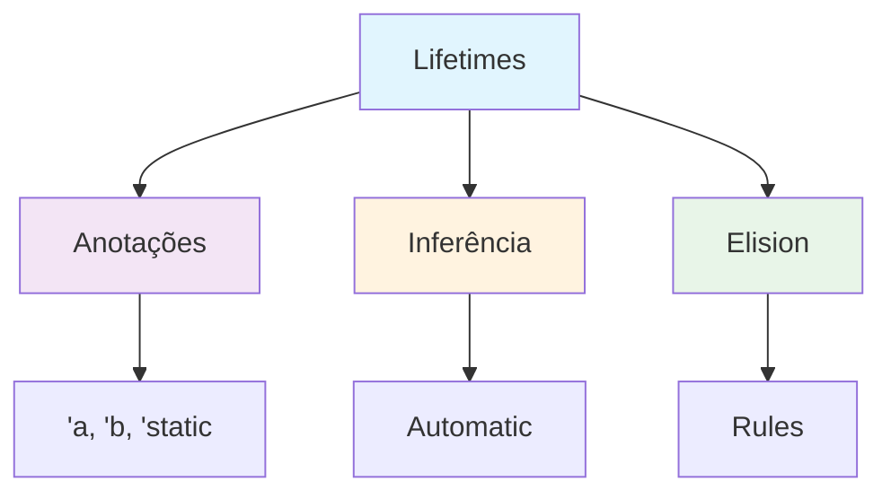

# Módulo 8: Lifetimes e Advanced Types

## 🎯 Objetivos de Aprendizagem

Ao final deste módulo, você será capaz de:

- ✅ Dominar lifetime annotations
- ✅ Usar smart pointers (Box, Rc, RefCell)
- ✅ Implementar sistemas de cache eficientes
- ✅ Otimizar performance com tipos avançados

## 📋 **Pré-requisitos**

### **Obrigatórios**
- ✅ **Conhecimento básico de programação** - Variáveis, funções, estruturas de controle
- ✅ **Rust (versão 1.70 ou superior)** - [Instalar Rust](https://rustup.rs/)
- ✅ **Cargo (gerenciador de pacotes)** - Instalado automaticamente com Rust
- ✅ **Editor de código** - [VS Code com rust-analyzer](https://marketplace.visualstudio.com/items?itemName=rust-lang.rust-analyzer) recomendado
- ✅ **Git** - Para controle de versão
- ✅ **Conclusão do Módulo 7** - [Traits e Generics](../modulo-07-traits-generics/README.md)

### **Recomendados**
- ✅ **Familiaridade com linha de comando** - Terminal/CMD básico
- ✅ **Conceitos básicos de programação funcional** - Funções, imutabilidade
- ✅ **Experiência com outras linguagens** - C/C++, Python, JavaScript, etc.
- ✅ **Conceitos de sistemas operacionais** - Memória, processos, threads

### **Recursos de Preparação**
- [**Rustlings**](https://github.com/rust-lang/rustlings) - Exercícios interativos para iniciantes
- [**The Rust Book**](https://doc.rust-lang.org/book/) - Documentação oficial completa
- [**Rust by Example**](https://doc.rust-lang.org/rust-by-example/) - Exemplos práticos
- [**Rust Playground**](https://play.rust-lang.org/) - Ambiente online para experimentar

## 📚 **Recursos de Aprendizado**

### **Documentação Oficial**
- [**The Rust Book - Lifetimes**](https://doc.rust-lang.org/book/ch10-03-lifetime-syntax.html)
- [**Rust by Example - Lifetimes**](https://doc.rust-lang.org/rust-by-example/scope/lifetime.html)
- [**Rustlings - Lifetimes**](https://github.com/rust-lang/rustlings) - Exercícios interativos
- [**Rust Reference - Lifetimes**](https://doc.rust-lang.org/reference/lifetime.html)

### **Comunidades e Fóruns**
- [**Reddit r/rust**](https://reddit.com/r/rust) - Comunidade ativa
- [**Rust Users Forum**](https://users.rust-lang.org/) - Fórum oficial
- [**Stack Overflow**](https://stackoverflow.com/questions/tagged/rust) - Perguntas e respostas
- [**Rust Discord**](https://discord.gg/rust-lang) - Chat em tempo real

## 📖 **Índice do Módulo**

- [**Objetivos de Aprendizagem**](#-objetivos-de-aprendizagem)
- [**Pré-requisitos**](#-pré-requisitos)
- [**Recursos de Aprendizado**](#-recursos-de-aprendizado)
- [**Conteúdo Teórico**](#-conteúdo-teórico)
- [**Exemplos Práticos**](#-exemplos-práticos)
- [**Tutorial Prático**](#-tutorial-prático-sistema-de-cache)
- [**Atividades Práticas**](#-atividades-práticas)
- [**Exercícios de Fixação**](#-exercícios-de-fixação)
- [**Próximos Passos**](#-próximos-passos)
- [**Navegação**](#-navegação)

## 📚 Conteúdo Teórico

### 8.1 Lifetimes - Gerenciamento de Referências



### 8.2 Smart Pointers

```rust
// exemplos/lifetimes_advanced.rs
use std::rc::Rc;
use std::cell::RefCell;
use std::collections::HashMap;

// Lifetime annotation
fn longest<'a>(x: &'a str, y: &'a str) -> &'a str {
    if x.len() > y.len() { x } else { y }
}

// Struct com lifetime
struct Excerpt<'a> {
    part: &'a str,
}

// Smart pointers
struct Node<T> {
    value: T,
    children: Vec<Rc<RefCell<Node<T>>>>,
    parent: Option<Rc<RefCell<Node<T>>>>,
}

impl<T> Node<T> {
    fn new(value: T) -> Rc<RefCell<Self>> {
        Rc::new(RefCell::new(Node {
            value,
            children: Vec::new(),
            parent: None,
        }))
    }
    
    fn add_child(&mut self, child: Rc<RefCell<Node<T>>>) {
        child.borrow_mut().parent = Some(Rc::new(RefCell::new(self)));
        self.children.push(child);
    }
}

fn main() {
    // Lifetime example
    let string1 = String::from("abcd");
    let string2 = "xyz";
    let result = longest(string1.as_str(), string2);
    println!("A string mais longa é {}", result);
    
    // Excerpt example
    let novel = String::from("Call me Ishmael. Some years ago...");
    let first_sentence = novel.split('.').next().expect("Could not find a '.'");
    let excerpt = Excerpt { part: first_sentence };
    println!("Excerpt: {}", excerpt.part);
    
    // Smart pointers example
    let root = Node::new(1);
    let child1 = Node::new(2);
    let child2 = Node::new(3);
    
    {
        let mut root_borrow = root.borrow_mut();
        root_borrow.add_child(child1.clone());
        root_borrow.add_child(child2.clone());
    }
    
    println!("Root value: {}", root.borrow().value);
    println!("Children count: {}", root.borrow().children.len());
}
```

## 🎯 Tutorial Prático: Sistema de Cache

### Implementação Completa

```rust
// src/main.rs
mod cache;
mod lru_cache;

use cache::Cache;
use lru_cache::LRUCache;

fn main() {
    println!("=== Sistema de Cache ===");
    
    let mut cache = LRUCache::new(3);
    
    cache.put("key1", "value1");
    cache.put("key2", "value2");
    cache.put("key3", "value3");
    
    println!("Cache após inserções: {:?}", cache);
    
    if let Some(value) = cache.get("key1") {
        println!("Valor encontrado: {}", value);
    }
    
    cache.put("key4", "value4"); // Remove key1 (LRU)
    
    println!("Cache após inserir key4: {:?}", cache);
}
```

```rust
// src/cache.rs
use std::collections::HashMap;
use std::rc::Rc;

pub trait Cache<K, V> {
    fn get(&self, key: &K) -> Option<&V>;
    fn put(&mut self, key: K, value: V);
    fn remove(&mut self, key: &K) -> Option<V>;
    fn clear(&mut self);
    fn size(&self) -> usize;
}

pub struct SimpleCache<K, V> {
    data: HashMap<K, V>,
    max_size: usize,
}

impl<K, V> SimpleCache<K, V>
where
    K: std::hash::Hash + Eq + Clone,
{
    pub fn new(max_size: usize) -> Self {
        SimpleCache {
            data: HashMap::new(),
            max_size,
        }
    }
}

impl<K, V> Cache<K, V> for SimpleCache<K, V>
where
    K: std::hash::Hash + Eq + Clone,
{
    fn get(&self, key: &K) -> Option<&V> {
        self.data.get(key)
    }
    
    fn put(&mut self, key: K, value: V) {
        if self.data.len() >= self.max_size {
            // Remove o primeiro elemento (FIFO)
            if let Some(first_key) = self.data.keys().next().cloned() {
                self.data.remove(&first_key);
            }
        }
        self.data.insert(key, value);
    }
    
    fn remove(&mut self, key: &K) -> Option<V> {
        self.data.remove(key)
    }
    
    fn clear(&mut self) {
        self.data.clear();
    }
    
    fn size(&self) -> usize {
        self.data.len()
    }
}
```

```rust
// src/lru_cache.rs
use std::collections::HashMap;
use std::rc::Rc;

use crate::cache::Cache;

struct LRUNode<K, V> {
    key: K,
    value: V,
    prev: Option<Rc<RefCell<LRUNode<K, V>>>>,
    next: Option<Rc<RefCell<LRUNode<K, V>>>>,
}

pub struct LRUCache<K, V> {
    capacity: usize,
    cache: HashMap<K, Rc<RefCell<LRUNode<K, V>>>>,
    head: Option<Rc<RefCell<LRUNode<K, V>>>>,
    tail: Option<Rc<RefCell<LRUNode<K, V>>>>,
}

impl<K, V> LRUCache<K, V>
where
    K: std::hash::Hash + Eq + Clone,
{
    pub fn new(capacity: usize) -> Self {
        LRUCache {
            capacity,
            cache: HashMap::new(),
            head: None,
            tail: None,
        }
    }
    
    fn add_to_head(&mut self, node: Rc<RefCell<LRUNode<K, V>>>) {
        if let Some(head) = &self.head {
            head.borrow_mut().prev = Some(node.clone());
        }
        
        node.borrow_mut().prev = None;
        node.borrow_mut().next = self.head.clone();
        self.head = Some(node);
        
        if self.tail.is_none() {
            self.tail = self.head.clone();
        }
    }
    
    fn remove_node(&mut self, node: Rc<RefCell<LRUNode<K, V>>>) {
        let prev = node.borrow().prev.clone();
        let next = node.borrow().next.clone();
        
        if let Some(prev) = prev {
            prev.borrow_mut().next = next.clone();
        } else {
            self.head = next.clone();
        }
        
        if let Some(next) = next {
            next.borrow_mut().prev = prev;
        } else {
            self.tail = prev;
        }
    }
}

impl<K, V> Cache<K, V> for LRUCache<K, V>
where
    K: std::hash::Hash + Eq + Clone,
{
    fn get(&self, key: &K) -> Option<&V> {
        if let Some(node) = self.cache.get(key) {
            // Move to head (would need &mut self)
            Some(&node.borrow().value)
        } else {
            None
        }
    }
    
    fn put(&mut self, key: K, value: V) {
        if let Some(node) = self.cache.get(&key) {
            // Update existing node
            node.borrow_mut().value = value;
            // Move to head (simplified)
            return;
        }
        
        if self.cache.len() >= self.capacity {
            // Remove tail
            if let Some(tail) = &self.tail {
                let tail_key = tail.borrow().key.clone();
                self.cache.remove(&tail_key);
                self.remove_node(tail.clone());
            }
        }
        
        // Add new node
        let new_node = Rc::new(RefCell::new(LRUNode {
            key: key.clone(),
            value,
            prev: None,
            next: None,
        }));
        
        self.add_to_head(new_node.clone());
        self.cache.insert(key, new_node);
    }
    
    fn remove(&mut self, key: &K) -> Option<V> {
        if let Some(node) = self.cache.remove(key) {
            self.remove_node(node.clone());
            Some(node.borrow().value)
        } else {
            None
        }
    }
    
    fn clear(&mut self) {
        self.cache.clear();
        self.head = None;
        self.tail = None;
    }
    
    fn size(&self) -> usize {
        self.cache.len()
    }
}
```

## 🎯 Atividades Práticas

### Atividade 1: Gerenciador de Memória
Implemente um gerenciador de memória com smart pointers.

### Atividade 2: Sistema de Referências
Crie um sistema que gerencie referências circulares.

### Atividade 3: Cache Distribuído
Desenvolva um cache que funcione entre múltiplas threads.

## 📝 Exercícios de Fixação

1. **Pergunta:** O que são lifetimes em Rust?
   - Resposta: Lifetimes são anotações que especificam por quanto tempo uma referência é válida

2. **Pergunta:** Qual a diferença entre Box, Rc e RefCell?
   - Resposta: Box para heap allocation, Rc para shared ownership, RefCell para interior mutability

3. **Pergunta:** Quando usar 'static lifetime?
   - Resposta: Para referências que vivem durante toda a execução do programa

## 🔗 Próximos Passos

No próximo módulo, você aprenderá a:

- Dominar Cargo como gerenciador de projetos
- Criar e publicar crates
- Gerenciar dependências
- Implementar testes e documentação

## 🧭 **Navegação**

### **📚 Material de Apoio**
- [**README Principal**](../../README.md) - Visão geral do curso
- [**Tutoriais Detalhados**](../../TUTORIAIS.md) - Guia completo de tutoriais
- [**Módulo 7: Traits/Generics**](../modulo-07-traits-generics/README.md) - Módulo anterior
- [**Módulo 9: Cargo/Crates**](../modulo-09-cargo-crates/README.md) - Próximo módulo
- [**Módulo Embarcados**](../modulo-embarcados/README.md) - Desenvolvimento IoT

### **🔗 Links Úteis**
- [Comunidade Rust Brasil](https://github.com/rust-br)
- [Documentação Oficial](https://doc.rust-lang.org/)
- [Rust Playground](https://play.rust-lang.org/)
- [Crates.io](https://crates.io/)

### **📖 Documentação Oficial**
- [The Rust Book](https://doc.rust-lang.org/book/)
- [Rust by Example](https://doc.rust-lang.org/rust-by-example/)
- [Rustlings](https://github.com/rust-lang/rustlings)
- [Cargo Book](https://doc.rust-lang.org/cargo/)

---

**Professor:** Jackson Sá  
**ETEC Bento Quirino - Campinas/SP**
