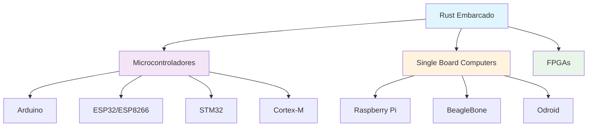
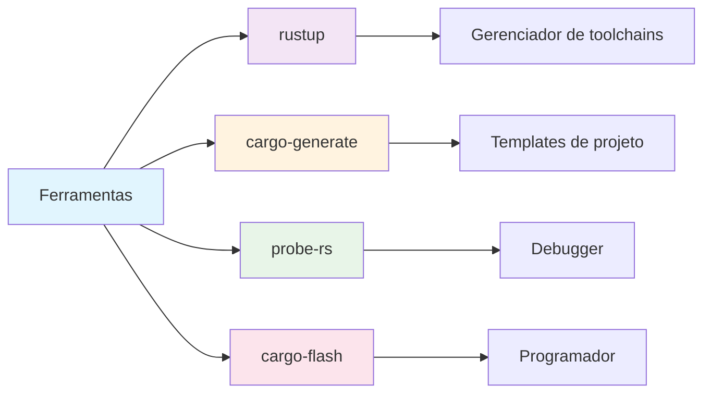

# Módulo Especial: Rust para Embarcados - Arduino, ESP32 e Raspberry Pi

## 🎯 Objetivos de Aprendizagem

Ao final deste módulo, você será capaz de:

- ✅ Configurar o ambiente Rust para desenvolvimento embarcado
- ✅ Programar microcontroladores Arduino com Rust
- ✅ Desenvolver aplicações para ESP32 e ESP8266
- ✅ Criar projetos para Raspberry Pi
- ✅ Trabalhar com sensores e atuadores
- ✅ Implementar comunicação IoT
- ✅ Dominar conceitos de sistemas embarcados

## 📋 **Pré-requisitos**

### **Obrigatórios**
- ✅ **Conhecimento básico de programação** - Variáveis, funções, estruturas de controle
- ✅ **Rust (versão 1.70 ou superior)** - [Instalar Rust](https://rustup.rs/)
- ✅ **Cargo (gerenciador de pacotes)** - Instalado automaticamente com Rust
- ✅ **Editor de código** - [VS Code com rust-analyzer](https://marketplace.visualstudio.com/items?itemName=rust-lang.rust-analyzer) recomendado
- ✅ **Git** - Para controle de versão
- ✅ **Conclusão do Módulo 10** - [Projetos Práticos](../modulo-10-projetos-praticos/README.md)

### **Recomendados**
- ✅ **Familiaridade com linha de comando** - Terminal/CMD básico
- ✅ **Conceitos básicos de programação funcional** - Funções, imutabilidade
- ✅ **Experiência com outras linguagens** - C/C++, Python, JavaScript, etc.
- ✅ **Conceitos de sistemas operacionais** - Memória, processos, threads
- ✅ **Conhecimento básico de eletrônica** - Circuitos, sensores, atuadores

### **Recursos de Preparação**
- [**Rustlings**](https://github.com/rust-lang/rustlings) - Exercícios interativos para iniciantes
- [**The Rust Book**](https://doc.rust-lang.org/book/) - Documentação oficial completa
- [**Rust by Example**](https://doc.rust-lang.org/rust-by-example/) - Exemplos práticos
- [**Rust Playground**](https://play.rust-lang.org/) - Ambiente online para experimentar

## 📚 **Recursos de Aprendizado**

### **Documentação Oficial**
- [**Embedded Rust Book**](https://docs.rust-embedded.org/book/) - Guia oficial para Rust embarcado
- [**Rust by Example - Embedded**](https://doc.rust-lang.org/rust-by-example/std_misc.html)
- [**Rustlings - Embedded**](https://github.com/rust-lang/rustlings) - Exercícios interativos
- [**Embedded HAL**](https://docs.rs/embedded-hal/latest/embedded_hal/) - Abstração de hardware

### **Comunidades e Fóruns**
- [**Reddit r/rust**](https://reddit.com/r/rust) - Comunidade ativa
- [**Rust Users Forum**](https://users.rust-lang.org/) - Fórum oficial
- [**Stack Overflow**](https://stackoverflow.com/questions/tagged/rust) - Perguntas e respostas
- [**Rust Discord**](https://discord.gg/rust-lang) - Chat em tempo real

## 📖 **Índice do Módulo**

- [**Objetivos de Aprendizagem**](#-objetivos-de-aprendizagem)
- [**Pré-requisitos**](#-pré-requisitos)
- [**Recursos de Aprendizado**](#-recursos-de-aprendizado)
- [**Conteúdo Teórico**](#-conteúdo-teórico)
- [**Exemplos Práticos**](#-exemplos-práticos)
- [**Tutorial Prático**](#-tutorial-prático-sistema-iot-completo)
- [**Atividades Práticas**](#-atividades-práticas)
- [**Exercícios de Fixação**](#-exercícios-de-fixação)
- [**Próximos Passos**](#-próximos-passos)
- [**Navegação**](#-navegação)

## 📚 Conteúdo Teórico

### 1. Introdução ao Rust Embarcado

Rust é ideal para sistemas embarcados devido a:

- **Segurança de memória** sem overhead
- **Performance** comparável a C/C++
- **Concorrência** segura
- **Zero-cost abstractions**
- **Ecosystem** robusto para embarcados



### 2. Ferramentas e Ecossistema



### 3. Arquiteturas Suportadas

- **ARM Cortex-M** (STM32, nRF52, etc.)
- **RISC-V** (ESP32-C3, etc.)
- **AVR** (Arduino Uno, Mega)
- **x86** (Raspberry Pi, etc.)

## 💻 Exemplos Práticos

### Exemplo 1: Arduino Uno - LED Piscando

```rust
// exemplos/arduino_blink.rs
#![no_std]
#![no_main]

use arduino_hal::prelude::*;
use panic_halt as _;

#[arduino_hal::entry]
fn main() -> ! {
    let dp = arduino_hal::Peripherals::take().unwrap();
    let pins = arduino_hal::pins!(dp);
    
    let mut led = pins.d13.into_output();
    
    loop {
        led.toggle().void_unwrap();
        arduino_hal::delay_ms(1000);
    }
}
```

### Exemplo 2: ESP32 - WiFi e HTTP Server

```rust
// exemplos/esp32_wifi_server.rs
use esp_idf_hal::prelude::*;
use esp_idf_sys as _;
use esp_idf_hal::gpio::*;
use esp_idf_hal::peripherals::Peripherals;
use esp_idf_svc::eventloop::EspSystemEventLoop;
use esp_idf_svc::nvs::EspDefaultNvsPartition;
use esp_idf_svc::wifi::*;
use esp_idf_svc::http::server::*;
use std::sync::Arc;
use std::thread;

fn main() -> anyhow::Result<()> {
    esp_idf_sys::link_patches();
    
    let peripherals = Peripherals::take().unwrap();
    let sys_loop = EspSystemEventLoop::take()?;
    let nvs = EspDefaultNvsPartition::take()?;
    
    let mut wifi = EspWifi::new(peripherals.modem, sys_loop, Some(nvs))?;
    
    wifi.set_configuration(&Configuration::Client(ClientConfiguration {
        ssid: "SEU_WIFI".into(),
        password: "SUA_SENHA".into(),
        ..Default::default()
    }))?;
    
    wifi.start()?;
    wifi.connect()?;
    
    while !wifi.is_connected()? {
        thread::sleep_ms(100);
    }
    
    let ip_info = wifi.wifi().sta_netif().get_ip_info()?;
    println!("IP: {:?}", ip_info);
    
    let mut server = EspHttpServer::new(&Default::default())?;
    
    server.fn_handler("/", Method::Get, |req| {
        Ok(Response::new(200, "text/html", "Hello from ESP32!".as_bytes()))
    })?;
    
    server.fn_handler("/led", Method::Post, |req| {
        let body = req.into_body();
        println!("Received: {:?}", body);
        Ok(Response::new(200, "text/plain", "LED toggled!".as_bytes()))
    })?;
    
    println!("Server running on http://{:?}", ip_info.ip);
    
    loop {
        thread::sleep_ms(1000);
    }
}
```

### Exemplo 3: Raspberry Pi - GPIO e Sensor

```rust
// exemplos/raspberry_pi_sensor.rs
use rppal::gpio::{Gpio, Level, Mode};
use std::thread;
use std::time::Duration;

fn main() -> Result<(), Box<dyn std::error::Error>> {
    let gpio = Gpio::new()?;
    
    // LED no pino 18
    let mut led = gpio.get(18)?.into_output();
    
    // Botão no pino 24
    let button = gpio.get(24)?.into_input_pullup();
    
    // Sensor de temperatura DHT22 no pino 4
    let dht_pin = gpio.get(4)?;
    
    println!("Sistema iniciado!");
    println!("Pressione o botão para alternar o LED");
    
    let mut led_state = false;
    
    loop {
        // Verificar botão
        if button.read() == Level::Low {
            led_state = !led_state;
            led.write(if led_state { Level::High } else { Level::Low });
            println!("LED: {}", if led_state { "LIGADO" } else { "DESLIGADO" });
            
            // Debounce
            thread::sleep(Duration::from_millis(200));
        }
        
        // Ler sensor de temperatura (simulado)
        let temperature = read_temperature(&dht_pin)?;
        println!("Temperatura: {:.1}°C", temperature);
        
        thread::sleep(Duration::from_secs(1));
    }
}

fn read_temperature(_pin: &rppal::gpio::IoPin) -> Result<f32, Box<dyn std::error::Error>> {
    // Simulação de leitura de temperatura
    Ok(22.5 + (std::time::SystemTime::now()
        .duration_since(std::time::UNIX_EPOCH)?
        .as_secs() % 10) as f32)
}
```

## 🎯 Tutorial Prático: Sistema IoT Completo

### Passo 1: Configuração do Ambiente

```bash
# Instalar Rust
curl --proto '=https' --tlsv1.2 -sSf https://sh.rustup.rs | sh

# Instalar ferramentas para embarcados
rustup target add thumbv7em-none-eabihf  # ARM Cortex-M4
rustup target add riscv32imc-unknown-none-elf  # RISC-V
rustup target add avr-unknown-gnu-atmega328p  # Arduino

# Instalar ferramentas adicionais
cargo install cargo-generate
cargo install probe-rs --locked
cargo install cargo-flash
```

### Passo 2: Projeto ESP32 - Sensor de Temperatura

```toml
# Cargo.toml
[package]
name = "esp32-temperature-sensor"
version = "0.1.0"
edition = "2021"

[dependencies]
esp-idf-hal = "0.12"
esp-idf-sys = "0.12"
esp-idf-svc = "0.12"
serde = { version = "1.0", features = ["derive"] }
serde_json = "1.0"
anyhow = "1.0"

[[bin]]
name = "main"
test = false
bench = false
```

```rust
// src/main.rs
use esp_idf_hal::prelude::*;
use esp_idf_sys as _;
use esp_idf_hal::adc::*;
use esp_idf_hal::gpio::*;
use esp_idf_hal::peripherals::Peripherals;
use esp_idf_svc::eventloop::EspSystemEventLoop;
use esp_idf_svc::nvs::EspDefaultNvsPartition;
use esp_idf_svc::wifi::*;
use esp_idf_svc::http::server::*;
use serde_json::json;
use std::thread;
use std::time::SystemTime;

struct TemperatureSensor {
    adc: AdcDriver<'static, ADC1>,
    pin: AdcChannelDriver<'static, {adc_attenuation_t_ADC_ATTEN_DB_11}, Gpio32>,
}

impl TemperatureSensor {
    fn new(peripherals: &mut Peripherals) -> Result<Self, Box<dyn std::error::Error>> {
        let adc = AdcDriver::new(peripherals.adc1, &AdcConfig::new().calibration(true))?;
        let pin = AdcChannelDriver::new(peripherals.pins.gpio32)?;
        
        Ok(TemperatureSensor { adc, pin })
    }
    
    fn read_temperature(&mut self) -> Result<f32, Box<dyn std::error::Error>> {
        let raw_value = self.adc.read(&mut self.pin)?;
        // Conversão ADC para temperatura (exemplo)
        let voltage = (raw_value as f32 / 4095.0) * 3.3;
        let temperature = (voltage - 0.5) * 100.0; // LM35 sensor
        Ok(temperature)
    }
}

fn main() -> anyhow::Result<()> {
    esp_idf_sys::link_patches();
    
    let mut peripherals = Peripherals::take().unwrap();
    let sys_loop = EspSystemEventLoop::take()?;
    let nvs = EspDefaultNvsPartition::take()?;
    
    // Configurar WiFi
    let mut wifi = EspWifi::new(peripherals.modem, sys_loop, Some(nvs))?;
    wifi.set_configuration(&Configuration::Client(ClientConfiguration {
        ssid: "SEU_WIFI".into(),
        password: "SUA_SENHA".into(),
        ..Default::default()
    }))?;
    
    wifi.start()?;
    wifi.connect()?;
    
    while !wifi.is_connected()? {
        thread::sleep_ms(100);
    }
    
    let ip_info = wifi.wifi().sta_netif().get_ip_info()?;
    println!("Conectado! IP: {:?}", ip_info.ip);
    
    // Configurar sensor
    let mut sensor = TemperatureSensor::new(&mut peripherals)?;
    
    // Configurar servidor HTTP
    let mut server = EspHttpServer::new(&Default::default())?;
    
    server.fn_handler("/", Method::Get, |_req| {
        Ok(Response::new(200, "text/html", HTML_PAGE.as_bytes()))
    })?;
    
    server.fn_handler("/api/temperature", Method::Get, |_req| {
        // Em uma aplicação real, você passaria o sensor como referência
        let temperature = 22.5; // Simulado
        let data = json!({
            "temperature": temperature,
            "timestamp": SystemTime::now()
                .duration_since(SystemTime::UNIX_EPOCH)
                .unwrap()
                .as_secs()
        });
        
        Ok(Response::new(
            200,
            "application/json",
            data.to_string().as_bytes()
        ))
    })?;
    
    println!("Servidor iniciado em http://{:?}", ip_info.ip);
    
    loop {
        let temperature = sensor.read_temperature()?;
        println!("Temperatura: {:.1}°C", temperature);
        thread::sleep_ms(5000);
    }
}

const HTML_PAGE: &str = r#"
<!DOCTYPE html>
<html>
<head>
    <title>Sensor de Temperatura ESP32</title>
    <meta charset="UTF-8">
    <meta name="viewport" content="width=device-width, initial-scale=1.0">
</head>
<body>
    <h1>Sensor de Temperatura ESP32</h1>
    <div id="temperature">Carregando...</div>
    <button onclick="updateTemperature()">Atualizar</button>
    
    <script>
        function updateTemperature() {
            fetch('/api/temperature')
                .then(response => response.json())
                .then(data => {
                    document.getElementById('temperature').innerHTML = 
                        `Temperatura: ${data.temperature}°C`;
                });
        }
        
        updateTemperature();
        setInterval(updateTemperature, 5000);
    </script>
</body>
</html>
"#;
```

### Passo 3: Arduino - Controle de Motor

```rust
// exemplos/arduino_motor_control.rs
#![no_std]
#![no_main]

use arduino_hal::prelude::*;
use panic_halt as _;

struct MotorController {
    enable_pin: Pin<Output>,
    direction_pin: Pin<Output>,
    step_pin: Pin<Output>,
}

impl MotorController {
    fn new(pins: arduino_hal::Pins) -> Self {
        MotorController {
            enable_pin: pins.d8.into_output(),
            direction_pin: pins.d9.into_output(),
            step_pin: pins.d10.into_output(),
        }
    }
    
    fn enable(&mut self) {
        self.enable_pin.set_low().void_unwrap();
    }
    
    fn disable(&mut self) {
        self.enable_pin.set_high().void_unwrap();
    }
    
    fn set_direction(&mut self, clockwise: bool) {
        if clockwise {
            self.direction_pin.set_high().void_unwrap();
        } else {
            self.direction_pin.set_low().void_unwrap();
        }
    }
    
    fn step(&mut self) {
        self.step_pin.set_high().void_unwrap();
        arduino_hal::delay_us(2);
        self.step_pin.set_low().void_unwrap();
        arduino_hal::delay_us(2);
    }
    
    fn move_steps(&mut self, steps: u16, clockwise: bool) {
        self.enable();
        self.set_direction(clockwise);
        
        for _ in 0..steps {
            self.step();
            arduino_hal::delay_ms(1);
        }
        
        self.disable();
    }
}

#[arduino_hal::entry]
fn main() -> ! {
    let dp = arduino_hal::Peripherals::take().unwrap();
    let pins = arduino_hal::pins!(dp);
    
    let mut motor = MotorController::new(pins);
    let mut button = pins.d2.into_pull_up_input();
    
    loop {
        // Verificar botão
        if button.is_low().void_unwrap() {
            // Mover motor 200 passos no sentido horário
            motor.move_steps(200, true);
            arduino_hal::delay_ms(1000);
            
            // Mover motor 200 passos no sentido anti-horário
            motor.move_steps(200, false);
            arduino_hal::delay_ms(1000);
        }
        
        arduino_hal::delay_ms(10);
    }
}
```

### Passo 4: Raspberry Pi - Sistema de Monitoramento

```rust
// exemplos/raspberry_pi_monitoring.rs
use rppal::gpio::{Gpio, Level, Mode};
use rppal::i2c::I2c;
use std::thread;
use std::time::Duration;
use std::fs::OpenOptions;
use std::io::Write;

struct SensorSystem {
    gpio: Gpio,
    i2c: I2c,
    led_pin: rppal::gpio::OutputPin,
    button_pin: rppal::gpio::InputPin,
}

impl SensorSystem {
    fn new() -> Result<Self, Box<dyn std::error::Error>> {
        let gpio = Gpio::new()?;
        let mut i2c = I2c::new()?;
        
        // Configurar I2C para sensor BMP280
        i2c.set_slave_address(0x76)?;
        
        let led_pin = gpio.get(18)?.into_output();
        let button_pin = gpio.get(24)?.into_input_pullup();
        
        Ok(SensorSystem {
            gpio,
            i2c,
            led_pin,
            button_pin,
        })
    }
    
    fn read_temperature(&mut self) -> Result<f32, Box<dyn std::error::Error>> {
        // Simulação de leitura de temperatura
        Ok(22.5 + (std::time::SystemTime::now()
            .duration_since(std::time::UNIX_EPOCH)?
            .as_secs() % 10) as f32)
    }
    
    fn read_pressure(&mut self) -> Result<f32, Box<dyn std::error::Error>> {
        // Simulação de leitura de pressão
        Ok(1013.25 + (std::time::SystemTime::now()
            .duration_since(std::time::UNIX_EPOCH)?
            .as_secs() % 5) as f32)
    }
    
    fn log_data(&self, temperature: f32, pressure: f32) -> Result<(), Box<dyn std::error::Error>> {
        let mut file = OpenOptions::new()
            .create(true)
            .append(true)
            .open("sensor_data.log")?;
        
        let timestamp = std::time::SystemTime::now()
            .duration_since(std::time::UNIX_EPOCH)?
            .as_secs();
        
        writeln!(file, "{}, {:.2}, {:.2}", timestamp, temperature, pressure)?;
        Ok(())
    }
    
    fn run(&mut self) -> Result<(), Box<dyn std::error::Error>> {
        println!("Sistema de monitoramento iniciado!");
        
        let mut led_state = false;
        let mut last_button_state = Level::High;
        
        loop {
            // Ler sensores
            let temperature = self.read_temperature()?;
            let pressure = self.read_pressure()?;
            
            // Log dos dados
            self.log_data(temperature, pressure)?;
            
            // Verificar botão
            let button_state = self.button_pin.read();
            if button_state == Level::Low && last_button_state == Level::High {
                led_state = !led_state;
                self.led_pin.write(if led_state { Level::High } else { Level::Low });
                println!("LED: {}", if led_state { "LIGADO" } else { "DESLIGADO" });
            }
            last_button_state = button_state;
            
            // Exibir dados
            println!("Temperatura: {:.1}°C, Pressão: {:.1} hPa", temperature, pressure);
            
            thread::sleep(Duration::from_secs(1));
        }
    }
}

fn main() -> Result<(), Box<dyn std::error::Error>> {
    let mut system = SensorSystem::new()?;
    system.run()?;
    Ok(())
}
```

## 🎯 Atividades Práticas

### Atividade 1: Estação Meteorológica

Implemente uma estação meteorológica completa:

**Requisitos:**
- ESP32 como controlador principal
- Sensores: temperatura, umidade, pressão
- Display LCD ou OLED
- Transmissão de dados via WiFi
- Interface web para visualização

### Atividade 2: Sistema de Irrigação Automática

Crie um sistema de irrigação inteligente:

**Funcionalidades:**
- Arduino ou ESP32
- Sensor de umidade do solo
- Bomba de água controlada
- Programação de horários
- Monitoramento remoto

### Atividade 3: Robô Seguidor de Linha

Desenvolva um robô autônomo:

**Características:**
- Arduino como controlador
- Sensores infravermelhos
- Motores DC com driver
- Algoritmo PID
- Interface de controle

## 📝 Exercícios de Fixação

1. **Pergunta:** Por que Rust é ideal para sistemas embarcados?
   - Resposta: Porque oferece segurança de memória sem overhead, performance comparável a C/C++, e concorrência segura

2. **Pergunta:** Qual a diferença entre `#![no_std]` e `#![no_main]`?
   - Resposta: `no_std` remove a biblioteca padrão, `no_main` remove a função main padrão

3. **Pergunta:** Como funciona o sistema de ownership em sistemas embarcados?
   - Resposta: O mesmo que em Rust normal, mas com atenção especial para recursos limitados de memória

4. **Pergunta:** O que é o embedded-hal?
   - Resposta: É uma abstração de hardware que permite escrever código portável entre diferentes microcontroladores

## 🔗 Próximos Passos

Após dominar este módulo, você poderá:

- Desenvolver sistemas IoT completos
- Criar aplicações para diferentes plataformas embarcadas
- Implementar comunicação entre dispositivos
- Otimizar código para recursos limitados

## 📚 Recursos Adicionais

- [The Embedded Rust Book](https://docs.rust-embedded.org/book/)
- [esp-rs Documentation](https://esp-rs.github.io/book/)
- [Arduino Rust Examples](https://github.com/Rahix/avr-hal)
- [Raspberry Pi Rust Guide](https://github.com/golemparts/rppal)

## 🛠️ Ferramentas Recomendadas

### IDEs e Editores
- **VS Code** com extensões Rust e ESP-IDF
- **CLion** com plugin Rust
- **Arduino IDE** com suporte a Rust

### Hardware
- **ESP32 DevKit** para projetos WiFi
- **Arduino Uno/Mega** para projetos básicos
- **Raspberry Pi 4** para projetos avançados
- **Sensores**: DHT22, BMP280, HC-SR04, etc.

### Debugging
- **probe-rs** para debug de microcontroladores
- **OpenOCD** para debug avançado
- **Logic Analyzer** para análise de sinais

## 🧭 **Navegação**

### **📚 Material de Apoio**
- [**README Principal**](../README.md) - Visão geral do curso
- [**Tutoriais Detalhados**](../TUTORIAIS.md) - Guia completo de tutoriais
- [**Módulo 10: Projetos**](../modulo-10-projetos-praticos/README.md) - Módulo anterior
- [**Módulo 1: Fundamentos**](../modulo-01-fundamentos-rust/README.md) - Comece aqui

### **🔗 Links Úteis**
- [Comunidade Rust Brasil](https://github.com/rust-br)
- [Documentação Oficial](https://doc.rust-lang.org/)
- [Rust Playground](https://play.rust-lang.org/)
- [Crates.io](https://crates.io/)

### **📖 Documentação Oficial**
- [The Rust Book](https://doc.rust-lang.org/book/)
- [Rust by Example](https://doc.rust-lang.org/rust-by-example/)
- [Rustlings](https://github.com/rust-lang/rustlings)
- [Cargo Book](https://doc.rust-lang.org/cargo/)

---

**Professor:** Jackson Sá  
**ETEC Bento Quirino - Campinas/SP**
